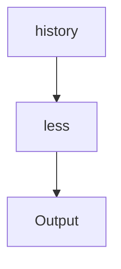
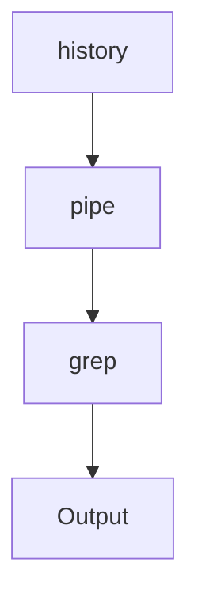
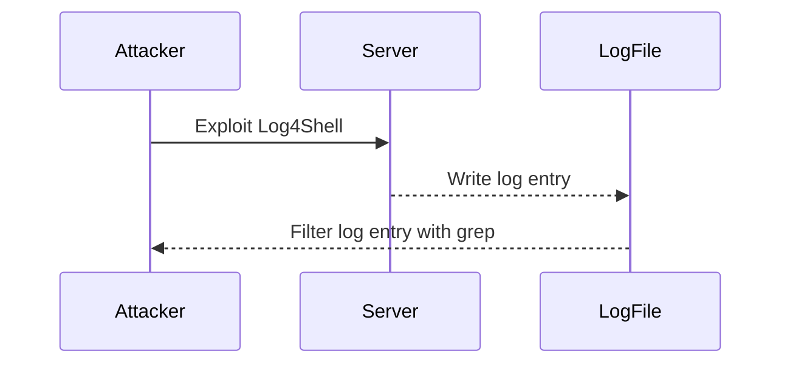

## Chaining Commands with Input/Output Redirection

In the realm of DevOps, efficient command-line usage is crucial for managing systems effectively. One powerful technique is chaining commands together using pipes (`|`) and input/output redirection. This allows you to process large amounts of data in a streamlined manner, making your workflow more productive and manageable.

### Understanding Pipes and Less Program

Pipes (`|`) are used to pass the output of one command as the input to another command. This is particularly useful when dealing with large outputs that would otherwise clutter your terminal. The `less` program is a pager that allows you to view the output of a command one screen at a time, making it easier to navigate through extensive data.

#### Example: Viewing Command History with `less`

Consider a scenario where you have executed numerous commands on your operating system, and you want to review your command history. Instead of printing all the commands at once, you can use the `history` command piped to `less`.

```bash
history | less
```

This command will display your command history in a paginated format, allowing you to scroll through the output using the spacebar for the next page and `b` for the previous page. Press `q` to exit the `less` program.

#### Diagram: Command Flow with `less`



### Filtering Command Output with `grep`

Another common use case is filtering specific lines from the output of a command. The `grep` command is often used for this purpose. Suppose you want to find all commands that were executed using `sudo` (superuser permissions).

```bash
history | grep sudo
```

This command will search through your command history and display only the lines containing the string `sudo`.

#### Diagram: Command Flow with `grep`



### Complete Example: Filtering Command History

Let's walk through a complete example to illustrate the process:

1. **Generate Sample Command History**:
   ```bash
   echo "sudo apt update" >> ~/.bash_history
   echo "sudo apt upgrade" >> ~/.bash_history
   echo "ls" >> ~/.bash_history
   echo "sudo rm -rf /tmp" >> ~/.bash_history
   ```

2. **View Command History with `less`**:
   ```bash
   history | less
   ```

3. **Filter Command History with `grep`**:
   ```bash
   history | grep sudo
   ```

#### Full Raw HTTP Message Example

While this example does not involve HTTP messages, it is important to understand how to handle command output in a similar structured manner. Here is a hypothetical example of how you might structure a command output in a similar format:

```http
HTTP/1.1 200 OK
Content-Type: text/plain

sudo apt update
sudo apt upgrade
ls
sudo rm -rf /tmp
```

### Common Pitfalls and Best Practices

#### Pitfall: Overloading the Terminal

One common pitfall is overloading the terminal with too much output, leading to confusion and inefficiency. Using tools like `less` and `grep` helps mitigate this issue by providing a more manageable way to view and filter output.

#### Best Practice: Use Aliases for Common Commands

To streamline your workflow, consider creating aliases for commonly used command chains. For example, you can create an alias to view your command history with `less`:

```bash
alias hist_less='history | less'
```

Now, you can simply type `hist_less` to view your command history in a paginated format.

### Real-World Examples and Recent Breaches

#### Example: CVE-2021-44228 (Log4Shell)

The Log4Shell vulnerability (CVE-2021-44228) is a critical security flaw in the Apache Log4j library. Attackers can exploit this vulnerability to execute arbitrary code on affected servers. In such scenarios, monitoring and filtering log files becomes crucial.

Using `grep` to filter log entries can help identify potential exploitation attempts:

```bash
cat /var/log/syslog | grep "log4j"
```

#### Diagram: Attack Chain with Log4Shell



### How to Prevent / Defend

#### Detection

To detect potential exploitation attempts, monitor log files for suspicious activity. Use tools like `grep` to filter log entries and identify patterns indicative of an attack.

#### Prevention

1. **Update Software**: Ensure that all software, including logging libraries, is up to date with the latest security patches.
2. **Secure Configuration**: Harden server configurations to minimize the attack surface.
3. **Regular Audits**: Conduct regular security audits to identify and address vulnerabilities.

#### Secure Coding Fixes

Compare the vulnerable and secure versions of a script:

**Vulnerable Script**:
```bash
echo "sudo apt update" >> ~/.bash_history
```

**Secure Script**:
```bash
echo "sudo apt update" >> ~/.bash_history
history | less
```

### Hands-On Labs

For practical experience with these concepts, consider the following labs:

- **PortSwigger Web Security Academy**: Offers interactive labs to practice web security techniques.
- **OWASP Juice Shop**: A deliberately insecure web application for practicing security skills.
- **DVWA (Damn Vulnerable Web Application)**: A PHP/MySQL web application that is riddled with vulnerabilities.

These labs provide a safe environment to experiment with command chaining and input/output redirection in a real-world context.

By mastering these techniques, you can significantly enhance your efficiency and security in DevOps environments.

---
<!-- nav -->
[[05-Chaining Commands with Input Output Redirection|Chaining Commands with Input Output Redirection]] | [[DevOps/DevOps Bootcamp/11-Miscellaneous/03-Chaining Commands with Input Output Redirection/00-Overview|Overview]] | [[07-Command Chaining with Input and Output Redirection|Command Chaining with Input and Output Redirection]]
