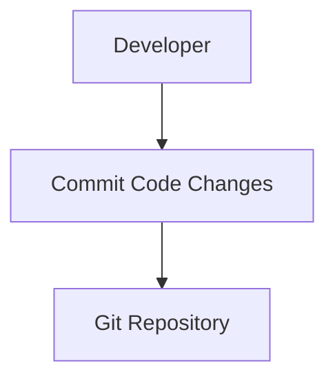
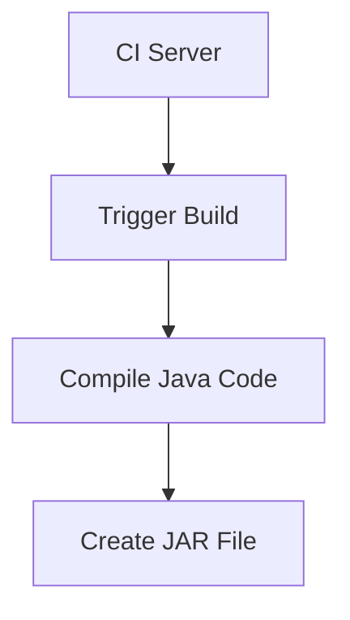
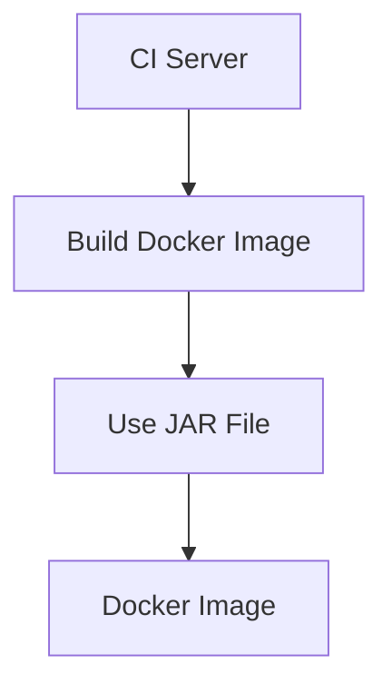
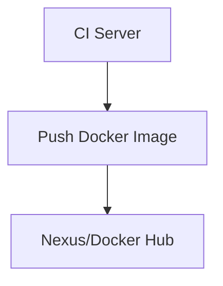
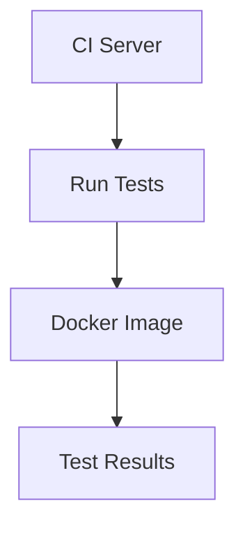
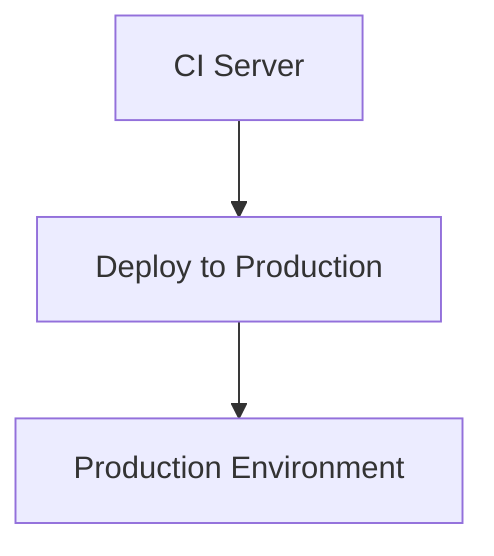

## Introduction to Continuous Integration and Deployment (CI/CD)

Continuous Integration and Deployment (CI/CD) is a critical practice in modern software development that automates the integration and deployment processes. This ensures that code changes are automatically tested and deployed to production environments, reducing the likelihood of human error and speeding up the development cycle. In this chapter, we will delve deep into the concepts, mechanics, and practical applications of CI/CD workflows, focusing on how they streamline the development process and enhance software quality.

### Background Theory

#### What is Continuous Integration?

Continuous Integration (CI) is a development practice where developers frequently integrate their work into a shared repository. Each integration is verified by an automated build and test process, ensuring that the codebase remains stable and functional. The primary goal of CI is to catch and address issues early in the development cycle, making it easier to resolve them.

#### What is Continuous Deployment?

Continuous Deployment (CD) extends CI by automatically deploying validated code changes to production environments. This means that once a change passes all automated tests, it is immediately deployed to production, ensuring that the latest features and bug fixes are available to users as quickly as possible.

### Why CI/CD Matters

CI/CD practices offer several benefits:

1. **Faster Feedback Loops**: Developers receive immediate feedback on their code changes, allowing them to address issues promptly.
2. **Reduced Human Error**: Automated testing and deployment reduce the chances of human errors that can occur during manual processes.
3. **Improved Software Quality**: Regular testing ensures that the codebase remains stable and free from bugs.
4. **Increased Productivity**: Developers can focus on writing code rather than managing deployment processes.
5. **Enhanced Collaboration**: CI/CD encourages collaboration among team members by providing a shared view of the codebase and its status.

### How CI/CD Works

The CI/CD workflow typically involves the following steps:

1. **Code Commit**: Developers commit their code changes to a shared repository.
2. **Build**: An automated build process compiles the code and packages it into artifacts (e.g., JAR files, Docker images).
3. **Test**: Automated tests are run to ensure that the code changes do not introduce new bugs.
4. **Deploy**: If the tests pass, the code changes are automatically deployed to the production environment.

### Example Workflow

Let's consider a typical CI/CD workflow for a Java application packaged as a Docker image:

1. **Code Commit**: A developer commits their code changes to a Git repository.
2. **Build**: A CI server (e.g., Jenkins, GitHub Actions) triggers a build process that compiles the Java code and creates a JAR file.
3. **Docker Build**: The CI server builds a Docker image using the JAR file.
4. **Push to Repository**: The Docker image is pushed to a container registry (e.g., Nexus, Docker Hub).
5. **Test**: Automated tests are run against the Docker image to ensure it functions correctly.
6. **Deploy**: If the tests pass, the Docker image is deployed to the production environment.

### Detailed Steps and Code Examples

#### Step 1: Code Commit

Developers commit their code changes to a Git repository. This step is crucial as it ensures that all code changes are tracked and can be reviewed.



#### Step 2: Build

The CI server triggers a build process that compiles the Java code and creates a JAR file. This step ensures that the code is compiled and ready for packaging.



#### Step 3: Docker Build

The CI server builds a Docker image using the JAR file. This step packages the application into a container that can be easily deployed.



#### Step 4: Push to Repository

The Docker image is pushed to a container registry (e.g., Nexus, Docker Hub). This step ensures that the image is stored in a central location for easy access.



#### Step 5: Test

Automated tests are run against the Docker image to ensure it functions correctly. This step verifies that the code changes do not introduce new bugs.



#### Step 6: Deploy

If the tests pass, the Docker image is deployed to the production environment. This step ensures that the latest code changes are available to users.



### Real-World Examples

#### Recent CVEs and Breaches

One notable example of a breach related to CI/CD is the SolarWinds supply chain attack in 2020. Attackers compromised the SolarWinds software update mechanism, injecting malicious code into legitimate updates. This highlights the importance of securing the entire CI/CD pipeline to prevent such attacks.

#### Secure Coding Practices

To prevent such vulnerabilities, it is essential to follow secure coding practices. For example, using tools like SonarQube to scan for security vulnerabilities and ensuring that all dependencies are up-to-date and free from known vulnerabilities.

### Common Pitfalls and How to Avoid Them

#### Manual Processes

One common pitfall is relying on manual processes for building, testing, and deploying code. This increases the likelihood of human error and slows down the development cycle. To avoid this, automate as much of the process as possible using CI/CD tools.

#### Lack of Testing

Another pitfall is skipping automated testing. Without thorough testing, bugs and vulnerabilities can slip through to production. To avoid this, ensure that comprehensive automated tests are run at every stage of the CI/CD pipeline.

### How to Prevent / Defend

#### Detection

To detect vulnerabilities in the CI/CD pipeline, use tools like static code analysis (e.g., SonarQube) and dynamic analysis (e.g., OWASP ZAP). These tools can identify potential security issues and help you address them before they become problems.

#### Prevention

To prevent vulnerabilities, follow secure coding practices and ensure that all dependencies are up-to-date. Additionally, use tools like dependency checkers (e.g., Snyk) to identify and mitigate known vulnerabilities in third-party libraries.

#### Secure-Coding Fixes

Here is an example of a vulnerable code snippet and its secure counterpart:

**Vulnerable Code:**

```java
public class User {
    private String password;

    public void setPassword(String password) {
        this.password = password;
    }
}
```

**Secure Code:**

```java
import java.security.MessageDigest;

public class User {
    private String passwordHash;

    public void setPassword(String password) throws Exception {
        MessageDigest md = MessageDigest.getInstance("SHA-256");
        byte[] hash = md.digest(password.getBytes());
        this.passwordHash = bytesToHex(hash);
    }

    private String bytesToHex(byte[] bytes) {
        StringBuilder hexString = new StringBuilder();
        for (byte b : bytes) {
            String hex = Integer.toHexString(0xFF & b);
            if (hex.length() == 1) hexString.append('0');
            hexString.append(hex);
        }
        return hexString.toString();
    }
}
```

### Complete Example: Full CI/CD Pipeline

#### Full HTTP Request and Response

Here is an example of a full HTTP request and response for triggering a CI/CD pipeline:

**HTTP Request:**

```http
POST /api/v1/pipelines HTTP/1.1
Host: ci-server.example.com
Content-Type: application/json
Authorization: Bearer <token>

{
    "repository": "https://github.com/example/repo",
    "branch": "master",
    "steps": [
        {
            "type": "build",
            "command": "mvn clean package"
        },
        {
            "type": "test",
            "command": "mvn test"
        },
        {
            "type": "deploy",
            "command": "kubectl apply -f deployment.yaml"
        }
    ]
}
```

**HTTP Response:**

```http
HTTP/1.1 200 OK
Content-Type: application/json

{
    "pipeline_id": "12345",
    "status": "running",
    "steps": [
        {
            "step_id": "1",
            "type": "build",
            "status": "completed",
            "output": "Build completed successfully."
        },
        {
            "step_id": "2",
            "type": "test",
            "status": "completed",
            "output": "All tests passed."
        },
        {
            "step_id": "3",
            "type": "deploy",
            "status": "completed",
            "output": "Deployment successful."
        }
    ]
}
```

### Hands-On Labs

For hands-on practice with CI/CD workflows, consider the following labs:

- **PortSwigger Web Security Academy**: Offers interactive labs on web application security, including CI/CD pipelines.
- **OWASP Juice Shop**: A deliberately insecure web application for practicing security skills, including CI/CD.
- **DVWA (Damn Vulnerable Web Application)**: Another web application for practicing security skills, including CI/CD.
- **WebGoat**: An interactive web application for learning about web application security, including CI/CD.

These labs provide real-world scenarios and challenges to help you master CI/CD workflows and secure coding practices.

### Conclusion

In conclusion, CI/CD workflows are essential for modern software development. By automating the integration and deployment processes, you can ensure that code changes are tested and deployed efficiently and securely. Following secure coding practices and using tools to detect and prevent vulnerabilities can help you maintain a robust and reliable CI/CD pipeline.

---
<!-- nav -->
[[01-Introduction to Build Automation and Continuous IntegrationDeployment (CICD)|Introduction to Build Automation and Continuous IntegrationDeployment (CICD)]] | [[DevOps/DevOps Bootcamp/11-Miscellaneous/04-Continuous Integration And Deployment Workflow/00-Overview|Overview]] | [[DevOps/DevOps Bootcamp/11-Miscellaneous/04-Continuous Integration And Deployment Workflow/03-Practice Questions & Answers|Practice Questions & Answers]]
