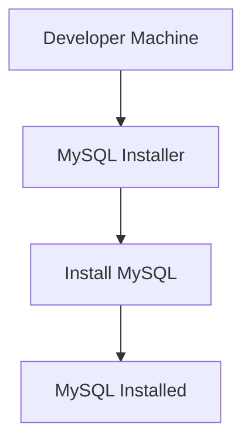

## Introduction to Database Integration in Software Development Processes

In modern software development, applications often rely on databases to store and manage persistent data. This integration is crucial for ensuring that user data remains intact across sessions and that the application can scale effectively. In this chapter, we will delve into the intricacies of integrating a database into a software development process, focusing on a typical scenario involving a Java application with a user interface (UI).

### Scenario Overview

Imagine a team of five developers working on a Java application that allows users to create, update, and delete items through a UI. All these operations need to be persisted in a database so that when users return, their data is still available. A common choice for such a database is MySQL, a widely-used relational database management system (RDBMS).

### Connecting the Application to the Database

To integrate the Java application with the MySQL database, developers need to establish a connection between the two. This involves configuring the application to communicate with the database using appropriate drivers and connection strings. Here’s a step-by-step guide on how this is typically done:

#### Step 1: Install MySQL Locally

Each developer in the team should install MySQL on their local machine. This ensures that everyone has access to a database instance for development purposes. The installation process varies depending on the operating system, but generally involves downloading the MySQL installer from the official website and following the setup instructions.



#### Step 2: Configure the Java Application

Once MySQL is installed, the next step is to configure the Java application to connect to the database. This involves adding the MySQL JDBC driver to the project dependencies and setting up the connection parameters.

##### Adding MySQL JDBC Driver

The MySQL JDBC driver is required to enable communication between the Java application and the MySQL database. This driver can be added to the project using a build tool like Maven or Gradle.

For Maven, add the following dependency to the `pom.xml` file:

```xml
<dependency>
    <groupId>mysql</groupId>
    <artifactId>mysql-connector-java</artifactId>
    <version>8.0.26</version>
</dependency>
```

For Gradle, add the following dependency to the `build.gradle` file:

```groovy
dependencies {
    implementation 'mysql:mysql-connector-java:8.0.26'
}
```

##### Setting Up Connection Parameters

Next, configure the connection parameters in the Java application. This typically involves setting up a connection string that includes the hostname, port, database name, username, and password.

Here’s an example of how to establish a connection in Java:

```java
import java.sql.Connection;
import java.sql.DriverManager;
import java.sql.SQLException;

public class DatabaseConnection {
    private static final String URL = "jdbc:mysql://localhost:3306/mydatabase";
    private static final String USER = "username";
    private static final String PASSWORD = "password";

    public static Connection getConnection() throws SQLException {
        return DriverManager.getConnection(URL, USER, PASSWORD);
    }
}
```

### Local Development Setup

When developing locally, each developer will have their own instance of the MySQL database. This setup allows developers to work independently without interfering with each other’s data.

#### Advantages of Local Development Setup

1. **Isolation**: Each developer can work with their own test data without affecting others.
2. **Flexibility**: Developers can freely experiment with new features and changes without worrying about breaking the shared environment.
3. **Ease of Resetting**: If a developer ends up in a messy state, they can easily reset their local database to a clean state.

#### Example Workflow

Let’s walk through an example workflow for a developer working on a feature that involves creating, updating, and deleting items in the database.

1. **Create a New Item**:
   - Insert a new item into the database.
   - Example SQL query:
     ```sql
     INSERT INTO items (name, description) VALUES ('Item 1', 'Description of Item 1');
     ```

2. **Update an Existing Item**:
   - Update an existing item in the database.
   - Example SQL query:
     ```sql
     UPDATE items SET description = 'Updated Description' WHERE id = 1;
     ```

3. **Delete an Item**:
   - Delete an item from the database.
   - Example SQL query:
     ```sql
     DELETE FROM items WHERE id = 1;
     ```

### Handling Data Persistence

To ensure that data is properly persisted across different stages of development, it’s important to manage the database schema and data migrations effectively.

#### Schema Management

The database schema defines the structure of the tables and relationships within the database. As the application evolves, the schema may need to change. To manage these changes, developers often use tools like Liquibase or Flyway.

##### Example Using Liquibase

Liquibase is a popular open-source tool for managing database schema changes. It uses XML or YAML files to define the changesets.

Here’s an example of a Liquibase changelog file:

```yaml
databaseChangeLog:
  - changeSet:
      id: 1
      author: developer
      changes:
        - createTable:
            tableName: items
            columns:
              - column:
                  name: id
                  type: int
                  autoIncrement: true
                  constraints:
                    primaryKey: true
              - column:
                  name: name
                  type: varchar(255)
              - column:
                  name: description
                  type: text
```

#### Data Migration

Data migration involves moving data from one environment to another, such as from development to staging or production. This is particularly important when changes are made to the schema.

##### Example Using Flyway

Flyway is another popular tool for managing database migrations. It uses SQL scripts to define the changes.

Here’s an example of a Flyway migration script:

```sql
-- V1__Initial_schema.sql
CREATE TABLE items (
    id INT AUTO_INCREMENT PRIMARY KEY,
    name VARCHAR(255),
    description TEXT
);
```

### Common Pitfalls and Best Practices

While integrating a database into a software development process offers numerous benefits, there are also several pitfalls to be aware of.

#### Common Pitfalls

1. **SQL Injection**: Improper handling of user input can lead to SQL injection attacks, where an attacker injects malicious SQL code into the database queries.
2. **Data Consistency**: Ensuring that data remains consistent across different environments can be challenging, especially during migrations.
3. **Performance Issues**: Poorly optimized queries or schema design can lead to performance bottlenecks.

#### Best Practices

1. **Use Prepared Statements**: Prepared statements help prevent SQL injection by separating the SQL logic from the user input.
2. **Version Control for Schema Changes**: Use version control systems to track changes in the database schema and ensure consistency across environments.
3. **Optimize Queries**: Regularly review and optimize database queries to improve performance.

### Real-World Examples and CVEs

#### Real-World Example: SQL Injection in WordPress

In 2018, a critical SQL injection vulnerability was discovered in the popular blogging platform WordPress. The vulnerability allowed attackers to execute arbitrary SQL commands, potentially leading to data theft or manipulation.

##### Vulnerable Code

```php
$query = "SELECT * FROM posts WHERE id = " . $_GET['id'];
```

##### Secure Code

```php
$id = intval($_GET['id']);
$query = "SELECT * FROM posts WHERE id = ?";
$stmt = $pdo->prepare($query);
$stmt->execute([$id]);
```

#### Real-World Example: Data Leakage in Healthcare Systems

In 2020, a healthcare provider suffered a data breach due to improper handling of sensitive patient information. The breach exposed personal details of thousands of patients, including names, addresses, and medical records.

##### Vulnerable Code

```java
String query = "SELECT * FROM patients WHERE id = " + patientId;
```

##### Secure Code

```java
String query = "SELECT * FROM patients WHERE id = ?";
PreparedStatement stmt = conn.prepareStatement(query);
stmt.setInt(1, patientId);
ResultSet rs = stmt.executeQuery();
```

### How to Prevent / Defend

#### Detection

1. **Logging and Monitoring**: Implement logging and monitoring to detect unusual activity or patterns that might indicate a security breach.
2. **Regular Audits**: Conduct regular security audits to identify and address vulnerabilities.

#### Prevention

1. **Input Validation**: Validate all user inputs to ensure they meet expected formats and lengths.
2. **Use ORM Frameworks**: Object-relational mapping (ORM) frameworks like Hibernate can help abstract away direct SQL interactions and reduce the risk of SQL injection.

#### Secure Coding Fixes

##### Vulnerable Pattern

```java
String query = "SELECT * FROM users WHERE username = '" + username + "' AND password = '" + password + "'";
```

##### Secure Pattern

```java
String query = "SELECT * FROM users WHERE username = ? AND password = ?";
PreparedStatement stmt = conn.prepareStatement(query);
stmt.setString(1, username);
stmt.setString(2, password);
ResultSet rs = stmt.executeQuery();
```

### Complete Example: Full HTTP Request and Response

#### HTTP Request

```http
POST /api/items HTTP/1.1
Host: localhost:8080
Content-Type: application/json

{
    "name": "Item 1",
    "description": "Description of Item 1"
}
```

#### HTTP Response

```http
HTTP/1.1 201 Created
Content-Type: application/json

{
    "id": 1,
    "name": "Item 1",
    "description": "Description of Item 1"
}
```

### Conclusion

Integrating a database into a software development process is essential for ensuring data persistence and scalability. By following best practices and being aware of common pitfalls, developers can effectively manage database interactions and maintain the security and integrity of their applications.

### Practice Labs

For hands-on practice with database integration in Java applications, consider the following resources:

- **PortSwigger Web Security Academy**: Offers interactive labs on web application security, including SQL injection.
- **OWASP Juice Shop**: A deliberately insecure web application for practicing security skills.
- **DVWA (Damn Vulnerable Web Application)**: A PHP/MySQL web application that contains numerous security vulnerabilities.

These resources provide practical experience in securing database interactions and handling common security challenges.

---
<!-- nav -->
[[DevOps/DevOps Bootcamp/11-Miscellaneous/05-Database Integration in Software Development Processes/00-Overview|Overview]] | [[02-Introduction to Database Management in Software Development Processes|Introduction to Database Management in Software Development Processes]]
