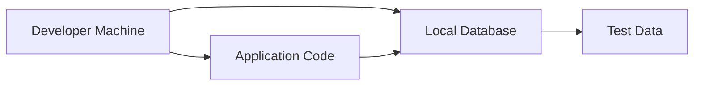
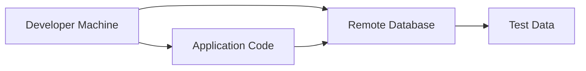

## Database Integration in Software Development Processes

### Introduction to Database Integration

In modern software development processes, integrating databases is a critical component. Databases store the persistent data that applications rely on, and ensuring that developers can work effectively with these databases is essential. There are several approaches to integrating databases into the development process, each with its own advantages and disadvantages. We will explore two primary methods: local database setup and remote database setup.

### Local Database Setup

#### What is Local Database Setup?

Local database setup involves installing and configuring a database management system (DBMS) on the developer's local machine. This approach allows developers to have full control over their database environment, including the ability to customize configurations and manage data independently.

#### Why Use Local Database Setup?

The primary advantage of using a local database setup is the flexibility it provides. Developers can easily modify the database schema, insert test data, and experiment with different configurations without affecting other team members. This is particularly useful during the initial stages of development when the database schema is likely to change frequently.

#### How Does Local Database Setup Work?

To set up a local database, developers typically follow these steps:

1. **Install the DBMS**: Download and install the chosen DBMS (e.g., MySQL, PostgreSQL, MongoDB) on their local machine.
2. **Configure the Database**: Set up the necessary configurations, such as creating a new database instance, setting user permissions, and defining connection parameters.
3. **Initialize Test Data**: Populate the database with test data either manually or through a script.

Here is an example of initializing a PostgreSQL database locally:

```sql
-- Create a new database
CREATE DATABASE myapp;

-- Connect to the new database
\c myapp

-- Create a sample table
CREATE TABLE users (
    id SERIAL PRIMARY KEY,
    username VARCHAR(50) NOT NULL,
    email VARCHAR(100) NOT NULL
);

-- Insert sample data
INSERT INTO users (username, email) VALUES ('alice', 'alice@example.com');
INSERT INTO users (username, email) VALUES ('bob', 'bob@example.com');
```

#### Disadvantages of Local Database Setup

Despite its flexibility, local database setup has several drawbacks:

1. **Installation and Configuration Overhead**: Each developer must install and configure the database locally, which can be time-consuming and error-prone.
2. **Data Consistency Issues**: Different developers might have different versions of the database schema, leading to inconsistencies.
3. **Resource Usage**: Running a database locally can consume significant resources, especially for resource-intensive operations.

### Remote Database Setup

#### What is Remote Database Setup?

Remote database setup involves using a database hosted on a remote server. Developers access this remote database via an endpoint and credentials provided by the development team or infrastructure management.

#### Why Use Remote Database Setup?

The primary advantage of using a remote database setup is the ease of access and consistency it provides. Developers can start coding immediately without having to install and configure a database locally. Additionally, a shared remote database ensures that all developers are working with the same schema and data, reducing inconsistencies.

#### How Does Remote Database Setup Work?

To set up a remote database, the following steps are typically followed:

1. **Provision the Database**: Set up the database on a remote server, either through a cloud provider (e.g., AWS RDS, Azure SQL Database) or a dedicated server.
2. **Configure Access**: Define the necessary access controls, such as user permissions and network security groups.
3. **Provide Credentials**: Share the database endpoint and credentials with the development team.

Here is an example of connecting to a remote PostgreSQL database:

```sql
-- Connect to the remote database
psql -h <remote-host> -U <username> -d <database-name>

-- Example credentials
psql -h db.example.com -U myuser -d myapp
```

#### Disadvantages of Remote Database Setup

While remote database setup offers convenience, it also has several drawbacks:

1. **Impact on Other Developers**: Changes made to the remote database can affect other developers, leading to potential conflicts and issues.
2. **Network Dependency**: Access to the database depends on network connectivity, which can introduce latency and reliability concerns.
3. **Security Risks**: Exposing the database to remote access increases the risk of unauthorized access and data breaches.

### Real-World Examples and Recent Breaches

Recent breaches and vulnerabilities related to database integration highlight the importance of proper security measures. For example, the 2021 breach of the popular video game platform Steam exposed millions of user accounts due to a misconfigured database. This incident underscores the need for robust security practices, including proper access controls and encryption.

Another notable example is the 2020 breach of the healthcare provider LabCorp, where sensitive patient data was compromised due to a misconfigured database. These incidents emphasize the importance of securing database access and ensuring that sensitive data is protected.

### How to Prevent / Defend Against Database Integration Risks

#### Detection

To detect potential issues with database integration, developers should implement monitoring and logging mechanisms. Tools like ELK Stack (Elasticsearch, Logstash, Kibana) can help monitor database activity and identify suspicious behavior.

#### Prevention

Preventing database integration risks involves several key strategies:

1. **Access Controls**: Implement strict access controls to ensure that only authorized users can access the database. Use role-based access control (RBAC) to define specific permissions for different roles.
2. **Encryption**: Encrypt sensitive data both at rest and in transit to protect against unauthorized access.
3. **Regular Audits**: Conduct regular audits of database configurations and access logs to identify and address potential security issues.

#### Secure Coding Fixes

Here is an example of a vulnerable database configuration and its secure counterpart:

**Vulnerable Configuration:**

```json
{
  "database": {
    "host": "localhost",
    "port": 5432,
    "username": "myuser",
    "password": "mypassword"
  }
}
```

**Secure Configuration:**

```json
{
  "database": {
    "host": "localhost",
    "port": 5432,
    "username": "myuser",
    "password": "${DB_PASSWORD}"
  }
}
```

In the secure configuration, the password is stored as an environment variable (`${DB_PASSWORD}`), which is more secure than hardcoding it in the configuration file.

### Mermaid Diagrams

#### Local Database Setup Architecture



#### Remote Database Setup Architecture



### Conclusion

Integrating databases into software development processes is crucial for ensuring that applications can interact with persistent data effectively. Both local and remote database setups have their advantages and disadvantages, and the choice between them depends on the specific requirements of the project. By understanding the principles behind each approach and implementing robust security measures, developers can ensure that their applications are both functional and secure.

### Practice Labs

For hands-on practice with database integration in software development processes, consider the following labs:

- **PortSwigger Web Security Academy**: Offers modules on database security and integration.
- **OWASP Juice Shop**: Provides a vulnerable web application for practicing secure coding and database integration.
- **DVWA (Damn Vulnerable Web Application)**: Another vulnerable web application for learning about database security.

These labs provide practical experience with real-world scenarios and help reinforce the concepts covered in this chapter.

---
<!-- nav -->
[[02-Introduction to Database Management in Software Development Processes|Introduction to Database Management in Software Development Processes]] | [[DevOps/DevOps Bootcamp/11-Miscellaneous/05-Database Integration in Software Development Processes/00-Overview|Overview]] | [[04-Properties Files and Configuration Management in Software Development|Properties Files and Configuration Management in Software Development]]
