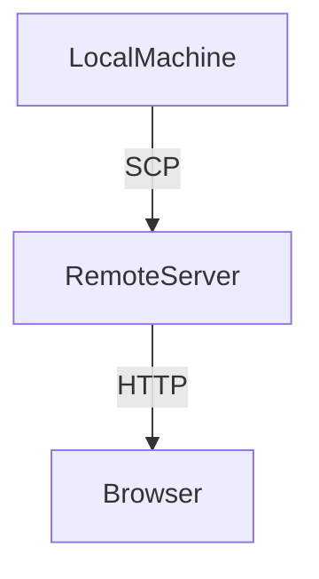
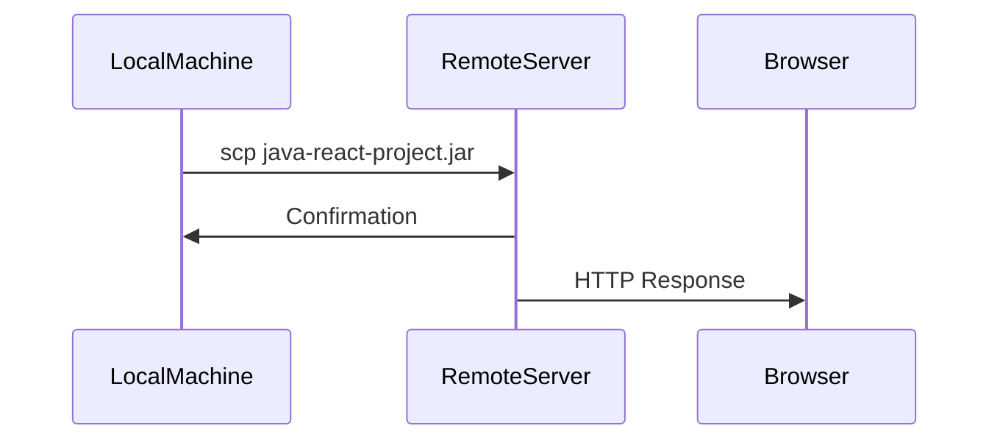

## Introduction to Deploying Java Applications to Remote Servers

Deploying a Java application to a remote server is a fundamental task in DevOps. This process involves building the application locally, transferring the compiled JAR file to the remote server, and then executing it. In this chapter, we will cover the entire process step-by-step, including the necessary background theory, practical examples, and security considerations.

### Background Theory

#### What is a JAR File?

A JAR (Java Archive) file is a package file format used to aggregate many Java class files and associated metadata and resources (text, images, etc.) into one file to simplify distribution. A JAR file is essentially a ZIP file with a `.jar` extension and a manifest file named `META-INF/MANIFEST.MF`.

#### Why Use a JAR File?

Using a JAR file simplifies the deployment process because it packages all the necessary classes and resources into a single file. This makes it easier to distribute and manage the application.

#### What is Gradle?

Gradle is an open-source build automation system that builds upon the concepts of Apache Ant and Apache Maven. It uses a domain-specific language (DSL) based on the Groovy programming language. Gradle provides a flexible model that allows developers to define custom tasks and dependencies.

### Building the Java Application

To deploy a Java application, we first need to build it locally. We will use a Gradle project for this example.

#### Cloning the Repository

The first step is to clone the repository containing the Java and React project. This can be done using the `git clone` command:

```bash
git clone https://github.com/techworld-with-nana/java-react-project.git
```

This command clones the repository into your local machine.

#### Executing the Gradle Build Command

Once the repository is cloned, navigate to the project directory and execute the Gradle build command:

```bash
cd java-react-project
./gradlew build
```

This command runs the build process defined in the `build.gradle` file. After the build completes, a `build` directory will be created, which contains the compiled JAR file.

### Transferring the JAR File to the Remote Server

After building the JAR file, the next step is to transfer it to the remote server. We will use the Secure Copy Protocol (SCP) for this purpose.

#### What is SCP?

SCP is a protocol for securely transferring files between computers on a network. It uses SSH for data transfer and provides the same authentication and encryption as SSH.

#### Using SCP to Transfer Files

To transfer the JAR file to the remote server, use the following SCP command:

```bash
scp build/libs/java-react-project.jar root@<remote-server-ip>:/path/to/destination
```

Replace `<remote-server-ip>` with the actual IP address of the remote server and `/path/to/destination` with the desired path on the remote server.

### Running the Java Application on the Remote Server

Once the JAR file is transferred to the remote server, you can run the application using the `java` command.

#### Running the JAR File

SSH into the remote server and run the JAR file:

```bash
ssh root@<remote-server-ip>
java -jar /path/to/destination/java-react-project.jar
```

This command starts the Java application on the remote server.

### Accessing the Application from a Browser

The application should now be accessible from a browser. Open a web browser and navigate to the appropriate URL, typically `http://<remote-server-ip>:<port>`.

### Security Considerations

Deploying applications to remote servers involves several security considerations. Here are some key points to keep in mind:

#### Secure Communication

Ensure that all communication between the local machine and the remote server is encrypted. SCP and SSH provide secure communication channels.

#### Authentication

Use strong authentication methods, such as public key authentication, to secure access to the remote server.

#### Firewall Configuration

Configure the firewall on the remote server to allow only necessary traffic. For example, if the application listens on port 8080, ensure that only traffic on this port is allowed.

#### Regular Updates

Keep the operating system and all software on the remote server up to date with the latest security patches.

### Real-World Examples

#### Recent Breaches and CVEs

One notable breach involving Java applications is the Log4j vulnerability (CVE-2021-44228). This vulnerability allowed attackers to execute arbitrary code on affected systems. To mitigate such vulnerabilities, ensure that all dependencies are up to date and follow secure coding practices.

### How to Prevent / Defend

#### Detection

Regularly monitor the server logs for any suspicious activity. Tools like `fail2ban` can help detect and block unauthorized access attempts.

#### Prevention

1. **Secure Configuration**: Harden the server configuration by disabling unnecessary services and configuring firewalls.
2. **Secure Coding Practices**: Follow secure coding guidelines to prevent common vulnerabilities like SQL injection and cross-site scripting (XSS).

#### Secure Code Fix

Here is an example of a vulnerable code snippet and its secure counterpart:

**Vulnerable Code:**
```java
String userInput = request.getParameter("username");
Statement stmt = connection.createStatement();
ResultSet rs = stmt.executeQuery("SELECT * FROM users WHERE username = '" + userInput + "'");
```

**Secure Code:**
```java
String userInput = request.getParameter("username");
PreparedStatement pstmt = connection.prepareStatement("SELECT * FROM users WHERE username = ?");
pstmt.setString(1, userInput);
ResultSet rs = pstmt.executeQuery();
```

### Complete Example

#### Full HTTP Request and Response

When accessing the application from a browser, the HTTP request and response might look like this:

**HTTP Request:**
```http
GET /api/users HTTP/1.1
Host: <remote-server-ip>:8080
User-Agent: Mozilla/5.0 (Windows NT 10.0; Win64; x64) AppleWebKit/537.36 (KHTML, like Gecko) Chrome/91.0.4472.124 Safari/537.36
Accept: */*
```

**HTTP Response:**
```http
HTTP/1.1 200 OK
Date: Mon, 15 Aug 2023 12:00:00 GMT
Server: Apache/2.4.41 (Ubuntu)
Content-Type: application/json
Content-Length: 123

{
  "users": [
    { "id": 1, "name": "Alice" },
    { "id": 2, "name": "Bob" }
  ]
}
```

### Mermaid Diagrams

#### Network Topology



#### Sequence Diagram



### Hands-On Labs

For hands-on practice, consider the following labs:

- **PortSwigger Web Security Academy**: Offers a variety of labs related to web application security.
- **OWASP Juice Shop**: A deliberately insecure web application for security training.
- **DVWA (Damn Vulnerable Web Application)**: Another popular web application for security testing.

These labs provide practical experience in deploying and securing Java applications.

### Conclusion

Deploying a Java application to a remote server involves several steps, from building the application to transferring and running it. Understanding the underlying concepts and following secure practices ensures a robust and secure deployment. By following the steps outlined in this chapter, you can successfully deploy and manage Java applications in a remote environment.

---
<!-- nav -->
[[DevOps/DevOps Bootcamp/11-Miscellaneous/06-Deploying Java Application to Remote Server/00-Overview|Overview]] | [[02-Deploying a Java Application to a Remote Server|Deploying a Java Application to a Remote Server]]
