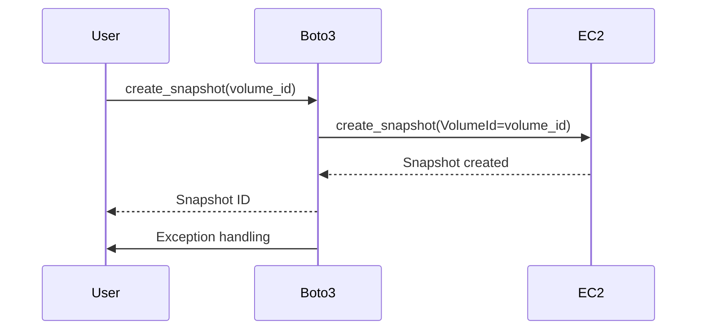
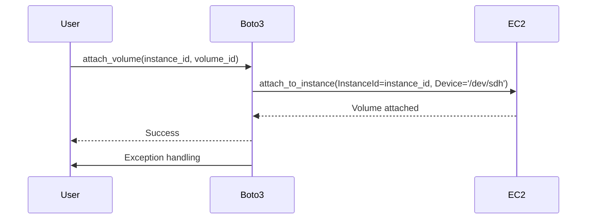

## Introduction to Error Handling in Automated Backup Systems

Automated backup systems are crucial for ensuring data integrity and availability in modern IT environments. These systems often rely on cloud services like Amazon Web Services (AWS) to create snapshots and manage volumes. However, as with any automated process, things can go wrong. Understanding how to handle these errors effectively is essential to prevent data loss, server downtime, and other critical issues.

### Background Theory

Error handling is a fundamental aspect of software development. It involves identifying, diagnosing, and resolving issues that arise during program execution. In the context of automated backup systems, errors can occur at various stages, including:

1. **Snapshot Creation**: Issues may arise due to insufficient permissions, resource constraints, or network problems.
2. **Volume Attachment**: Problems can occur if the volume is already attached elsewhere or if the instance is in an unexpected state.
3. **Volume Creation from Snapshot**: Errors might happen if the snapshot is corrupted or if there are storage limitations.
4. **Instance State**: Issues can arise if the EC2 instance itself has problems, such as being in a stopped state or having insufficient resources.

### Importance of Error Handling

Effective error handling ensures that your automated backup system remains robust and reliable. Without proper error handling, even minor issues can escalate into major problems, leading to data loss or service interruptions. By catching and handling errors appropriately, you can maintain the integrity of your data and ensure continuous operation of your services.

### Real-World Examples

Recent breaches and vulnerabilities have highlighted the importance of robust error handling in automated systems. For instance:

- **CVE-2021-20225**: This vulnerability in AWS Elastic Load Balancing (ELB) could cause unexpected behavior if certain errors were not properly handled. This could lead to service disruptions and data inconsistencies.
- **Breaches in Cloud Storage**: Several high-profile breaches have occurred due to misconfigured access controls and lack of proper error handling mechanisms. Ensuring that errors are caught and logged can help in quickly identifying and mitigating such issues.

### Complete Code Example

Let's walk through a complete example of how to handle errors in an automated backup system using Python and AWS SDK (Boto3).

#### Step 1: Create a Snapshot

```python
import boto3
from botocore.exceptions import ClientError

def create_snapshot(volume_id):
    ec2 = boto3.resource('ec2')
    try:
        snapshot = ec2.create_snapshot(VolumeId=volume_id)
        print(f"Snapshot created: {snapshot.id}")
        return snapshot.id
    except ClientError as e:
        print(f"Failed to create snapshot: {e}")
        return None
```

#### Step 2: Attach Volume to Instance

```python
def attach_volume(instance_id, volume_id):
    ec2 = boto3.resource('ec2')
    try:
        volume = ec2.Volume(volume_id)
        volume.attach_to_instance(InstanceId=instance_id, Device='/dev/sdh')
        print(f"Volume {volume_id} attached to instance {instance_id}")
    except ClientError as e:
        print(f"Failed to attach volume: {e}")
```

#### Step 3: Create Volume from Snapshot

```python
def create_volume_from_snapshot(snapshot_id):
    ec2 = boto3.resource('ec2')
    try:
        volume = ec2.create_volume(SnapshotId=snapshot_id, AvailabilityZone='us-west-2a')
        print(f"Volume created from snapshot: {volume.id}")
        return volume.id
    except ClientError as e:
        print(f"Failed to create volume from snapshot: {e}")
        return None
```

### Mermaid Diagrams

#### Sequence Diagram for Snapshot Creation



#### Sequence Diagram for Volume Attachment



### Pitfalls and Common Mistakes

1. **Ignoring Exceptions**: Simply ignoring exceptions can lead to silent failures, making it difficult to diagnose issues.
2. **Insufficient Logging**: Not logging errors can make it challenging to trace the root cause of problems.
3. **Improper Resource Management**: Failing to release resources (like volumes) can lead to resource leaks and potential security risks.

### How to Prevent / Defend

#### Detection

- **Logging**: Ensure that all errors are logged with sufficient details. Use centralized logging solutions like ELK Stack or Splunk.
- **Monitoring**: Implement monitoring tools to track the health of your backup system. Tools like AWS CloudWatch can provide real-time insights.

#### Prevention

- **Secure Coding Practices**: Follow secure coding guidelines to minimize the risk of errors. Use libraries and frameworks that are well-maintained and have good security practices.
- **Access Controls**: Ensure that your AWS resources have appropriate access controls. Use IAM roles and policies to restrict access to necessary resources only.

#### Secure-Coding Fixes

##### Vulnerable Code

```python
def create_snapshot(volume_id):
    ec2 = boto3.resource('ec2')
    snapshot = ec2.create_snapshot(VolumeId=volume_id)
    print(f"Snapshot created: {snapshot.id}")
    return snapshot.id
```

##### Secure Code

```python
def create_snapshot(volume_id):
    ec2 = boto3.resource('ec2')
    try:
        snapshot = ec2.create_snapshot(VolumeId=volume_id)
        print(f"Snapshot created: {snapshot.id}")
        return snapshot.id
    except ClientError as e:
        print(f"Failed to create snapshot: {e}")
        return None
```

### Configuration Hardening

#### IAM Policy Example

```json
{
    "Version": "2012-10-17",
    "Statement": [
        {
            "Effect": "Allow",
            "Action": [
                "ec2:CreateSnapshot",
                "ec2:AttachVolume",
                "ec2:CreateVolume"
            ],
            "Resource": "*"
        }
    ]
}
```

#### Nginx Configuration Example

```nginx
server {
    listen 80;
    server_name example.com;

    location /backup {
        auth_basic "Restricted";
        auth_basic_user_file /etc/nginx/.htpasswd;
        proxy_pass http://localhost:8080;
    }
}
```

### Practice Labs

For hands-on practice with error handling in automated backup systems, consider the following labs:

- **PortSwigger Web Security Academy**: Offers modules on error handling and logging.
- **OWASP Juice Shop**: Provides scenarios where you can practice handling errors in a web application environment.
- **DVWA (Damn Vulnerable Web Application)**: Useful for practicing secure coding and error handling in web applications.

By thoroughly understanding and implementing effective error handling strategies, you can ensure that your automated backup systems remain robust and reliable, minimizing the risk of data loss and service interruptions.

---
<!-- nav -->
[[DevOps/DevOps Bootcamp/11-Miscellaneous/09-Error Handling in Automated Backup Systems/00-Overview|Overview]] | [[02-Error Handling in Automated Backup Systems|Error Handling in Automated Backup Systems]]
