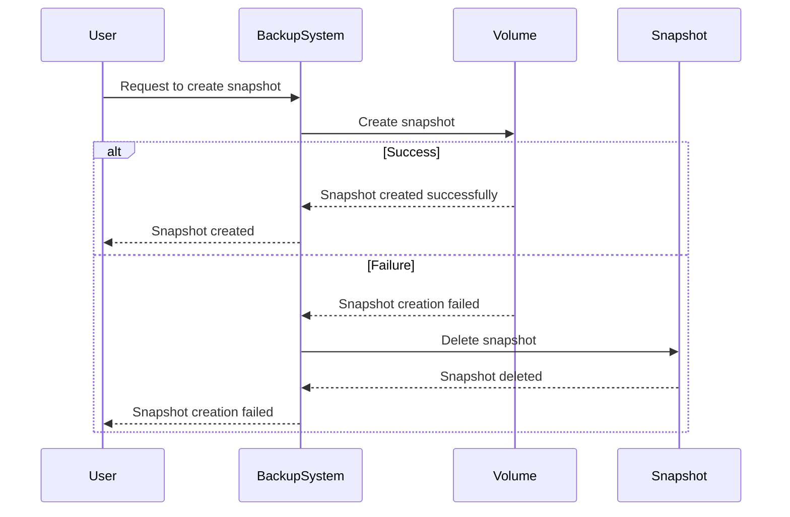

## Error Handling in Automated Backup Systems

### Introduction to Error Handling

Error handling is a critical aspect of developing robust automated backup systems. When dealing with complex operations such as creating snapshots or updating server configurations, unexpected issues can arise, leading to partial success or failure. Proper error handling ensures that the system remains in a consistent state and prevents potential data loss or corruption.

#### Why Error Handling Matters

In the context of automated backups, error handling is essential because:

1. **Data Integrity**: Ensures that backups are usable and can be restored correctly.
2. **System Consistency**: Maintains the integrity of the system state, preventing partial updates or incomplete operations.
3. **User Experience**: Provides meaningful feedback to users or operators about what went wrong and how to proceed.

### Example Scenario: Snapshot Creation

Consider a scenario where an automated backup system is tasked with creating a snapshot of a volume. If the snapshot creation process fails partially, the resulting snapshot may be unusable. This situation can lead to several issues:

1. **Unusable Snapshots**: A corrupted snapshot cannot be used for restoration, potentially leading to data loss.
2. **Resource Waste**: Unusable snapshots consume storage space unnecessarily.
3. **Operational Complexity**: Operators may struggle to identify which snapshots are valid and which are not.

#### Handling Partial Failures

To handle partial failures effectively, the system should:

1. **Detect Errors**: Identify when a snapshot creation process fails.
2. **Clean Up**: Automatically delete the partially created snapshot to avoid resource waste.
3. **Log Details**: Record detailed logs to help diagnose the issue.

### Implementation in Python

Python provides powerful mechanisms for error handling through the `try-except` block. This construct allows developers to catch and handle exceptions gracefully, ensuring that the system remains in a consistent state.

#### Syntax Overview

The basic structure of a `try-except` block in Python is as follows:

```python
try:
    # Code that might raise an exception
except ExceptionType:
    # Code to handle the exception
```

For example, consider a function that attempts to create a snapshot and handles potential errors:

```python
def create_snapshot(volume_id):
    try:
        # Simulate snapshot creation
        print(f"Creating snapshot for volume {volume_id}")
        # Simulate an error
        if volume_id == "bad_volume":
            raise ValueError("Snapshot creation failed")
        print("Snapshot created successfully")
    except ValueError as e:
        print(f"Error: {e}")
        # Clean up by deleting the partially created snapshot
        delete_snapshot(volume_id)
        print("Partially created snapshot deleted")

def delete_snapshot(volume_id):
    print(f"Deleting snapshot for volume {volume_id}")

# Example usage
create_snapshot("good_volume")
create_snapshot("bad_volume")
```

### Detailed Example: Snapshot Creation and Cleanup

Let's delve deeper into the example provided above. We will simulate the creation of a snapshot and handle potential errors using the `try-except` block.

#### Step-by-Step Mechanics

1. **Try Block**:
   - Attempt to create a snapshot for a given volume.
   - If the volume ID is `"bad_volume"`, raise a `ValueError` to simulate a failure.

2. **Except Block**:
   - Catch the `ValueError` and print an error message.
   - Call the `delete_snapshot` function to clean up the partially created snapshot.

3. **Delete Snapshot Function**:
   - Simulate the deletion of the snapshot by printing a message.

#### Full Example Code

```python
def create_snapshot(volume_id):
    try:
        # Simulate snapshot creation
        print(f"Creating snapshot for volume {volume_id}")
        # Simulate an error
        if volume_id == "bad_volume":
            raise ValueError("Snapshot creation failed")
        print("Snapshot created successfully")
    except ValueError as e:
        print(f"Error: {e}")
        # Clean up by deleting the partially created snapshot
        delete_snapshot(volume_id)
        print("Partially created snapshot deleted")

def delete_snapshot(volume_id):
    print(f"Deleting snapshot for volume {volume_id}")

# Example usage
create_snapshot("good_volume")
create_snapshot("bad_volume")
```

### Real-World Examples and Breaches

#### Recent CVEs and Breaches

Several real-world examples highlight the importance of proper error handling in automated backup systems:

1. **CVE-2021-44228 (Log4j)**: Although not directly related to backup systems, this vulnerability underscores the importance of logging and error handling. Improper error handling can lead to security vulnerabilities and data leaks.
2. **AWS S3 Bucket Exposure**: In 2021, several high-profile breaches occurred due to misconfigured S3 buckets. Proper error handling and validation could have prevented unauthorized access.

### Mermaid Diagrams

#### Sequence Diagram for Snapshot Creation

A sequence diagram can help visualize the interaction between different components during snapshot creation and error handling.



### Common Pitfalls and Best Practices

#### Common Pitfalls

1. **Ignoring Exceptions**: Simply catching exceptions without handling them properly can lead to silent failures.
2. **Partial Cleanup**: Failing to clean up partially created resources can result in resource waste and operational complexity.
3. **Insufficient Logging**: Lack of detailed logging makes it difficult to diagnose and resolve issues.

#### Best Practices

1. **Catch Specific Exceptions**: Catch specific exceptions rather than generic ones to ensure precise error handling.
2. **Clean Up Resources**: Always clean up partially created resources to maintain system consistency.
3. **Detailed Logging**: Log detailed information about errors to facilitate diagnosis and resolution.

### How to Prevent / Defend

#### Detection

1. **Monitoring Tools**: Use monitoring tools to detect and alert on errors and partial failures.
2. **Logging**: Implement comprehensive logging to capture detailed information about errors and their causes.

#### Prevention

1. **Automated Testing**: Regularly test backup processes to ensure they handle errors gracefully.
2. **Code Reviews**: Conduct code reviews to ensure proper error handling practices are followed.

#### Secure Coding Fixes

Compare the vulnerable code with the secure version:

**Vulnerable Code**

```python
def create_snapshot(volume_id):
    # Simulate snapshot creation
    print(f"Creating snapshot for volume {volume_id}")
    # Simulate an error
    if volume_id == "bad_volume":
        raise ValueError("Snapshot creation failed")
    print("Snapshot created successfully")
```

**Secure Code**

```python
def create_snapshot(volume_id):
    try:
        # Simulate snapshot creation
        print(f"Creating snapshot for volume {volume_id}")
        # Simulate an error
        if volume_id == "bad_volume":
            raise ValueError("Snapshot creation failed")
        print("Snapshot created successfully")
    except ValueError as e:
        print(f"Error: {e}")
        # Clean up by deleting the partially created snapshot
        delete_snapshot(volume_id)
        print("Partially created snapshot deleted")

def delete_snapshot(volume_id):
    print(f"Deleting snapshot for volume {[volume_id]}")
```

### Conclusion

Proper error handling is crucial for maintaining the integrity and reliability of automated backup systems. By implementing robust error handling mechanisms, developers can ensure that partial failures are handled gracefully, preventing data loss and operational complexity. Using tools like `try-except` in Python and following best practices can significantly enhance the resilience of backup systems.

### Practice Labs

For hands-on practice with error handling in automated backup systems, consider the following labs:

- **PortSwigger Web Security Academy**: Focuses on web application security but includes modules on error handling and logging.
- **OWASP Juice Shop**: A deliberately insecure web application for practicing security testing and error handling.
- **DVWA (Damn Vulnerable Web Application)**: Another web application for practicing security testing and error handling.

These labs provide practical experience in identifying and handling errors in real-world scenarios.

---
<!-- nav -->
[[01-Introduction to Error Handling in Automated Backup Systems|Introduction to Error Handling in Automated Backup Systems]] | [[DevOps/DevOps Bootcamp/11-Miscellaneous/09-Error Handling in Automated Backup Systems/00-Overview|Overview]] | [[DevOps/DevOps Bootcamp/11-Miscellaneous/09-Error Handling in Automated Backup Systems/03-Practice Questions & Answers|Practice Questions & Answers]]
