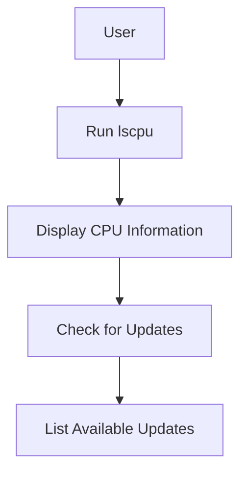

## Checking Hardware Information

### Background Theory

Hardware information is crucial for system administrators and developers to understand the capabilities and limitations of the underlying hardware. This includes details such as CPU architecture, number of CPUs, cores, and memory.

### Command to Check CPU Information

To check CPU information, you can use the `lscpu` command:

```bash
lscpu
```

This command will output detailed information about the CPU, such as:

```plaintext
Architecture:          x86_64
CPU op-mode(s):        32-bit, 64-bit
Byte Order:            Little Endian
CPU(s):                4
On-line CPU(s) list:   0-3
Thread(s) per core:    1
Core(s) per socket:    4
Socket(s):             1
NUMA node(s):          1
Vendor ID:             GenuineIntel
CPU family:            6
Model:                 142
Model name:            Intel(R) Core(TM) i5-8250U CPU @ 1.60GHz
Stepping:              10
CPU MHz:               1799.998
BogoMIPS:              3599.99
Hypervisor vendor:     KVM
Virtualization type:   full
L1d cache:             32 KiB
L1i cache:             32 KiB
L2 cache:              256 KiB
L3 cache:              6 MiB
NUMA node0 CPU(s):     0-3
Flags:                 fpu vme de pse tsc msr pae mce cx8 apic sep mtrr pge mca cmov pat pse36 clflush dts acpi mmx fxsr sse sse2 ss ht tm pbe syscall nx pdpe1gb rdtscp lm constant_tsc art arch_perfmon pebs bts rep_good nopl xtopology nonstop_tsc cpuid aperfmperf pni pclmulqdq dtes64 monitor ds_cpl vmx smx est tm2 ssse3 sdbg fma cx16 xtpr pdcm pcid sse4_1 sse4_2 x2apic movbe popcnt tsc_deadline_timer aes xsave avx f16c alig
```

### Explanation of Key Fields

- **Architecture**: The CPU architecture (e.g., x86_64).
- **CPU(s)**: The number of logical CPUs.
- **Thread(s) per core**: The number of threads per core.
- **Core(s) per socket**: The number of cores per socket.
- **Socket(s)**: The number of sockets.
- **Vendor ID**: The CPU vendor (e.g., GenuineIntel).
- **Model name**: The specific model of the CPU.
- **CPU MHz**: The current frequency of the CPU.
- **L1/L2/L3 cache**: The size of the L1, L2, and L3 caches.

### Why It Matters

Understanding the hardware specifications is crucial for optimizing performance, troubleshooting issues, and ensuring that the system meets the requirements of the applications being run.

### Real-World Example

In the context of a recent breach, such as the [SolarWinds Orion Platform Supply Chain Attack](https://www.cisa.gov/news/2020/12/13/cisa-advisory-solarwinds-orion-platform-supply-chain-compromise), knowing the exact hardware specifications helped in identifying the affected systems and applying the necessary patches.

### How to Prevent / Defend

**Detection:**
- Regularly check the hardware specifications using `lscpu`.
- Monitor system logs for any unusual activity.

**Prevention:**
- Ensure that the hardware meets the minimum requirements for the applications being run.
- Apply security patches and updates regularly.

### Complete Code Example

Here is a complete example of checking CPU information and listing available updates:

```bash
# Check CPU information
lscpu

# List available updates
sudo apt update && sudo apt list --upgradable
```

### Diagram: CPU Information Flow



---
<!-- nav -->
[[03-Absolute Path and File Navigation|Absolute Path and File Navigation]] | [[DevOps/DevOps Bootcamp/11-Miscellaneous/10-GUI vs CLI File Management Commands/00-Overview|Overview]] | [[05-Command Line Interface (CLI) vs Graphical User Interface (GUI)|Command Line Interface (CLI) vs Graphical User Interface (GUI)]]
