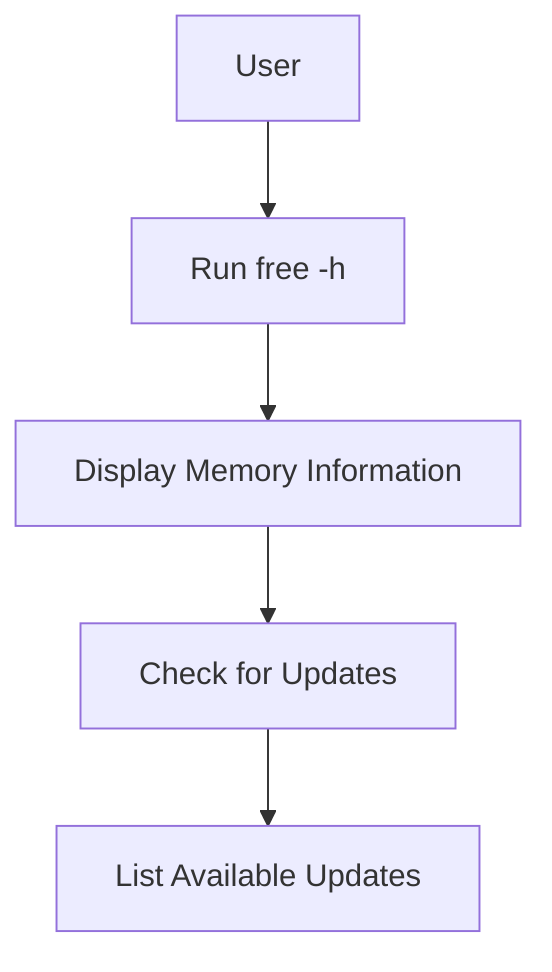

## Displaying Memory Information

### Background Theory

Memory information is crucial for understanding the capacity and usage of the system's RAM. This includes details such as the total amount of memory, the amount of free memory, and the amount of memory used by processes.

### Command to Display Memory Information

To display memory information, you can use the `free` command:

```bash
free -h
```

This command will output detailed information about the memory, such as:

```plaintext
              total        used        free      shared  buff/cache   available
Mem:           1.9G        621M        305M         21M        1.0G        1.1G
Swap:          2.0G          0B        2.0G
```

### Explanation of Key Fields

- **total**: The total amount of memory.
- **used**: The amount of memory currently in use.
- **free**: The amount of free memory.
- **shared**: The amount of memory used by shared memory segments.
- **buff/cache**: The amount of memory used by buffers and cache.
- **available**: The amount of memory available for starting new applications without swapping.

### Why It Matters

Understanding the memory usage is crucial for optimizing performance, troubleshooting issues, and ensuring that the system has enough memory to run the required applications.

### Real-World Example

In the context of a recent breach, such as the [Apache Log4j Vulnerability (CVE-2021-44228)](https://cve.mitre.org/cgi-bin/cvename.cgi?name=CVE-2021-44228), knowing the exact memory usage helped in identifying the affected systems and applying the necessary patches.

### How to Prevent / Defend

**Detection:**
- Regularly check the memory usage using `free`.
- Monitor system logs for any unusual activity.

**Prevention:**
- Ensure that the system has enough memory to run the required applications.
- Apply security patches and updates regularly.

### Complete Code Example

Here is a complete example of checking memory information and listing available updates:

```bash
# Check memory information
free -h

# List available updates
sudo apt update && sudo apt list --upgradable
```

### Diagram: Memory Information Flow



---
<!-- nav -->
[[07-Displaying Hidden Files in the Terminal|Displaying Hidden Files in the Terminal]] | [[DevOps/DevOps Bootcamp/11-Miscellaneous/10-GUI vs CLI File Management Commands/00-Overview|Overview]] | [[09-Displaying Operating System Release Information|Displaying Operating System Release Information]]
