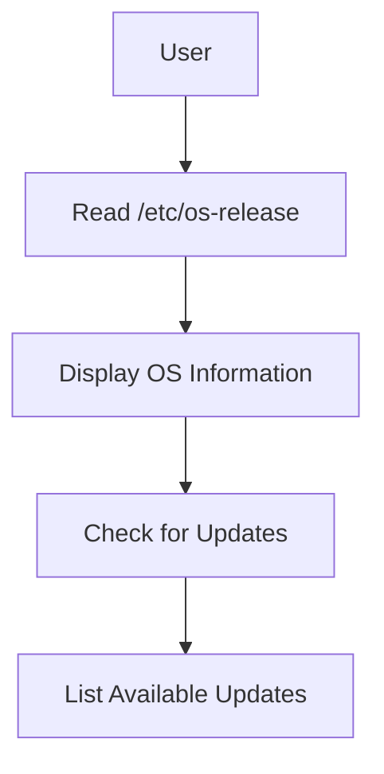

## Displaying Operating System Release Information

### Background Theory

The `/etc/os-release` file contains details about the operating system installed on a Linux system. This file is typically used by package managers and other system tools to determine the current distribution and version. Understanding the contents of this file is crucial for system administrators and developers who need to ensure compatibility across different versions of Linux distributions.

### Command to Display OS Release Information

To display the operating system release information, you can read the contents of the `/etc/os-release` file using the `cat` command:

```bash
cat /etc/os-release
```

This command will output the contents of the file, which might look something like this:

```plaintext
NAME="Ubuntu"
VERSION="22.04.1 LTS (Jammy Jellyfish)"
ID=ubuntu
ID_LIKE=debian
PRETTY_NAME="Ubuntu 22.04.1 LTS"
VERSION_ID="22.04"
HOME_URL="https://www.ubuntu.com/"
SUPPORT_URL="https://help.ubuntu.com/"
BUG_REPORT_URL="https://bugs.launchpad.net/ubuntu/"
PRIVACY_POLICY_URL="https://www.ubuntu.com/legal/terms-and-policies/privacy-policy"
VERSION_CODENAME=jammy
UBUNTU_CODENAME=jammy
```

### Explanation of Key Fields

- **NAME**: The name of the distribution (e.g., "Ubuntu").
- **VERSION**: The version number and codename (e.g., "22.04.1 LTS (Jammy Jellyfish)").
- **ID**: A unique identifier for the distribution (e.g., "ubuntu").
- **ID_LIKE**: Identifiers for similar distributions (e.g., "debian").
- **PRETTY_NAME**: A human-readable name for the distribution (e.g., "Ubuntu 22.04.1 LTS").
- **VERSION_ID**: The version number (e.g., "22.02").
- **HOME_URL**: The homepage URL for the distribution.
- **SUPPORT_URL**: The support URL for the distribution.
- **BUG_REPORT_URL**: The URL for reporting bugs.
- **PRIVACY_POLICY_URL**: The privacy policy URL.
- **VERSION_CODENAME**: The codename for the version (e.g., "jammy").
- **UBUNTU_CODENAME**: The Ubuntu-specific codename (e.g., "jammy").

### Why It Matters

Knowing the exact version of the operating system is essential for ensuring compatibility with specific software packages, libraries, and dependencies. It also helps in identifying potential security vulnerabilities associated with specific versions of the distribution.

### Real-World Example

Consider the case of the [CVE-2021-3711](https://nvd.nist.gov/vuln/detail/CVE-2021-3711), which affected Ubuntu 20.04 LTS. By knowing the exact version of the operating system, administrators could quickly identify whether their systems were vulnerable and apply the necessary patches.

### How to Prevent / Defend

**Detection:**
- Regularly check the `/etc/os-release` file to ensure you are aware of the exact version of the operating system.
- Use tools like `apt list --upgradable` to check for available updates.

**Prevention:**
- Keep the operating system and all installed packages up to date.
- Subscribe to security bulletins for your specific distribution.

### Complete Code Example

Here is a complete example of checking the operating system release and listing available updates:

```bash
# Check the operating system release
cat /etc/os-release

# List available updates
sudo apt update && sudo apt list --upgradable
```

### Diagram: OS Release Information Flow



---
<!-- nav -->
[[08-Displaying Memory Information|Displaying Memory Information]] | [[DevOps/DevOps Bootcamp/11-Miscellaneous/10-GUI vs CLI File Management Commands/00-Overview|Overview]] | [[10-Executing Commands as Super User|Executing Commands as Super User]]
