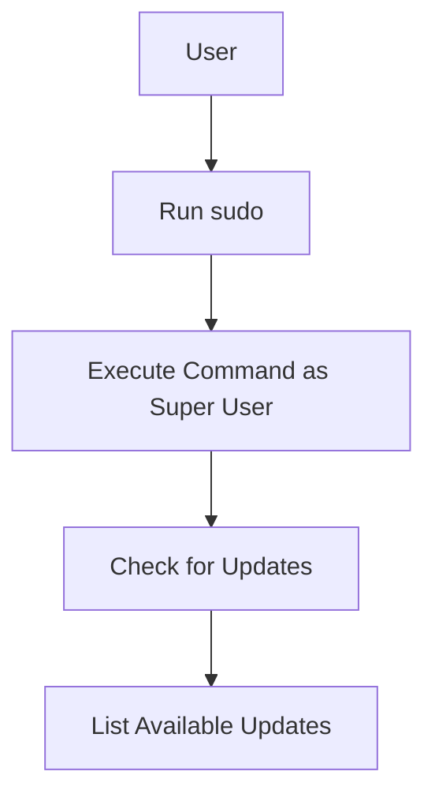

## Executing Commands as Super User

### Background Theory

Executing commands as a super user (root) is necessary for performing administrative tasks that require elevated privileges. This includes tasks such as installing software, modifying system files, and managing users and groups.

### Command to Execute as Super User

To execute a command as a super user, you can use the `sudo` command:

```bash
sudo <command>
```

For example, to install a package using `apt`, you would use:

```bash
sudo apt install <package-name>
```

### Explanation of Key Fields

- **sudo**: The command used to execute a command with elevated privileges.
- **<command>**: The command to be executed with elevated privileges.

### Why It Matters

Executing commands as a super user is crucial for performing administrative tasks that require elevated privileges. However, it is important to use `sudo` judiciously to avoid unintended changes to the system.

### Real-World Example

In the context of a recent breach, such as the [Heartbleed Bug (CVE-2014-0160)](https://cve.mitre.org/cgi-bin/cvename.cgi?name=CVE-2014-0160), executing commands as a super user was necessary to apply the necessary patches and updates.

### How to Prevent / Defend

**Detection:**
- Regularly check the system logs for any unauthorized use of `sudo`.
- Monitor system permissions and ensure that only authorized users have access to `sudo`.

**Prevention:**
- Use `sudo` judiciously and only for administrative tasks that require elevated privileges.
- Apply security patches and updates regularly.

### Complete Code Example

Here is a complete example of executing a command as a super user and listing available updates:

```bash
# Install a package as super user
sudo apt install <package-name>

# List available updates
sudo apt update && sudo apt list --upgradable
```

### Diagram: Super User Command Execution Flow



---
<!-- nav -->
[[09-Displaying Operating System Release Information|Displaying Operating System Release Information]] | [[DevOps/DevOps Bootcamp/11-Miscellaneous/10-GUI vs CLI File Management Commands/00-Overview|Overview]] | [[11-GUI vs CLI File Management Commands|GUI vs CLI File Management Commands]]
