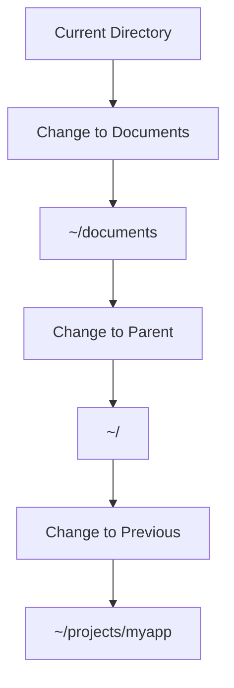
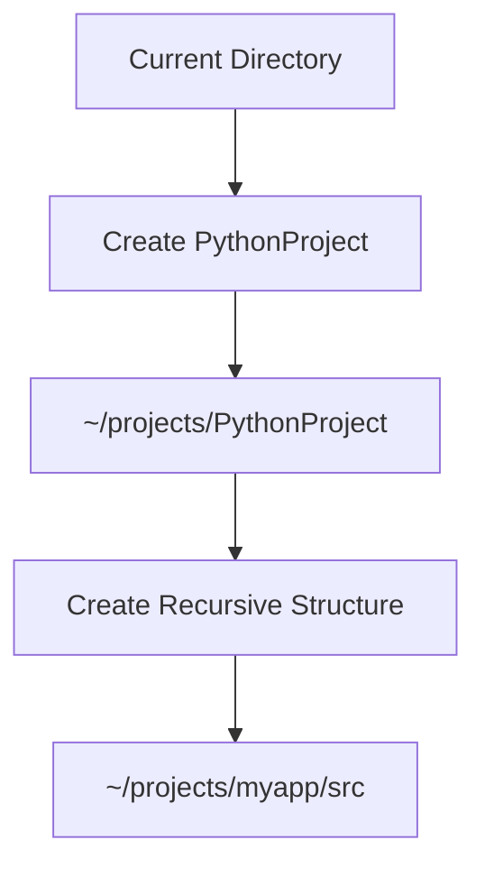
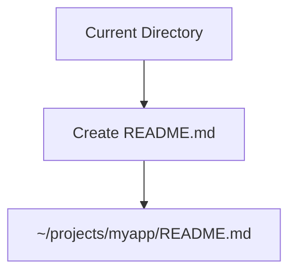

## GUI vs CLI File Management Commands

### Introduction to File Management Commands

File management commands are essential tools used to navigate, manipulate, and manage files and directories within a computer's file system. These commands can be executed through both Graphical User Interfaces (GUI) and Command Line Interfaces (CLI). Understanding the differences and capabilities of both interfaces is crucial for efficient file management, especially in a DevOps context.

### Change Directory (CD) Command

The `cd` command is one of the most fundamental commands used in CLI environments. It allows users to navigate through the file system hierarchy by changing the current working directory.

#### What is the `cd` Command?

The `cd` command stands for "change directory." It changes the current working directory to the specified directory. The syntax for the `cd` command is:

```bash
cd [directory]
```

Where `[directory]` is the name of the directory you want to move to.

#### Why Use the `cd` Command?

Using the `cd` command is essential because it enables you to quickly and efficiently navigate through the file system. This is particularly useful when working with large projects or complex directory structures.

#### How Does the `cd` Command Work?

When you execute the `cd` command followed by a directory name, the shell changes the current working directory to the specified directory. For example, if you are currently in your home directory (`~`) and you want to move to the `documents` directory, you would run:

```bash
cd documents
```

After executing this command, the current working directory will be set to `~/documents`.

#### Example of Using `cd` Command

Let's consider a scenario where you are working on a project and need to navigate to different directories. Suppose you start in your home directory (`~`):

```bash
cd ~/projects/myapp
```

This command changes the current working directory to `~/projects/myapp`.

#### Special Directories

There are several special directories that can be used with the `cd` command:

- `~`: Represents the home directory of the current user.
- `..`: Represents the parent directory of the current directory.
- `-`: Represents the previous working directory.

For example, to move back to the parent directory, you can use:

```bash
cd ..
```

To return to the previous working directory, you can use:

```bash
cd -
```

#### Mermaid Diagram for `cd` Command Flow

A mermaid diagram can help visualize the flow of the `cd` command:



### Creating Directories (MKDIR Command)

The `mkdir` command is used to create new directories within the file system. This command is essential for organizing files and maintaining a clean directory structure.

#### What is the `mkdir` Command?

The `mkdir` command stands for "make directory." It creates a new directory with the specified name. The syntax for the `mkdir` command is:

```bash
mkdir [directory]
```

Where `[directory]` is the name of the directory you want to create.

#### Why Use the `mkdir` Command?

Using the `mkdir` command is important because it allows you to create new directories for organizing files and projects. This helps maintain a clean and structured file system.

#### How Does the `mkdir` Command Work?

When you execute the `mkdir` command followed by a directory name, the shell creates a new directory with the specified name. For example, if you want to create a directory named `PythonProject`, you would run:

```bash
mkdir PythonProject
```

After executing this command, a new directory named `PythonProject` will be created in the current working directory.

#### Example of Using `mkdir` Command

Let's consider a scenario where you are working on a Python project and need to create a new directory for it. Suppose you are currently in the `~/projects` directory:

```bash
mkdir PythonProject
```

This command creates a new directory named `PythonProject` in the `~/projects` directory.

#### Recursive Directory Creation

The `mkdir` command also supports recursive directory creation using the `-p` option. This option allows you to create multiple levels of directories at once. For example, to create a directory structure like `~/projects/myapp/src`, you would run:

```bash
mkdir -p ~/projects/myapp/src
```

This command creates the entire directory structure if it does not already exist.

#### Mermaid Diagram for `mkdir` Command Flow

A mermaid diagram can help visualize the flow of the `mkdir` command:



### Creating Files in GUI and CLI

Creating files is another essential task in file management. Both GUI and CLI provide methods to create and manage files.

#### Creating Files in GUI

In a GUI environment, creating files typically involves using a file explorer or a dedicated file manager. You can create a new file by right-clicking in the desired directory and selecting "New" or "Create New File." Then, you can choose the type of file you want to create (e.g., text file, document).

For example, to create a `README.md` file in a GUI environment, you might follow these steps:

1. Open the file explorer.
2. Navigate to the desired directory.
3. Right-click and select "New" > "Text Document."
4. Rename the file to `README.md`.

#### Creating Files in CLI

In a CLI environment, creating files can be done using various commands. One common method is to use a text editor like `nano`, `vim`, or `vi`. For example, to create a `README.md` file using `nano`, you would run:

```bash
nano README.md
```

This command opens the `nano` text editor, allowing you to edit the file. After editing, you can save and exit the editor.

Another method is to use the `touch` command, which creates an empty file. For example:

```bash
touch README.md
```

This command creates an empty file named `README.md` in the current working directory.

#### Example of Creating Files in CLI

Let's consider a scenario where you are working on a project and need to create a `README.md` file. Suppose you are currently in the `~/projects/myapp` directory:

```bash
nano README.md
```

This command opens the `nano` text editor, allowing you to create and edit the `README.md` file.

Alternatively, you can use the `touch` command:

```bash
touch README.md
```

This command creates an empty file named `README.md` in the `~/projects/myapp` directory.

#### Mermaid Diagram for File Creation Flow

A mermaid diagram can help visualize the flow of file creation:



### GUI vs CLI Comparison

Both GUI and CLI have their advantages and disadvantages when it comes to file management.

#### Advantages of GUI

- **Ease of Use**: GUI environments are generally more intuitive and easier to use for beginners.
- **Visual Feedback**: GUI provides visual feedback, making it easier to understand the file structure and relationships.
- **Drag-and-Drop**: GUI allows for easy drag-and-drop operations, which can be faster for certain tasks.

#### Disadvantages of GUI

- **Limited Automation**: GUI environments are less suitable for automation and scripting.
- **Slower for Complex Tasks**: GUI can be slower for complex tasks involving multiple files and directories.

#### Advantages of CLI

- **Automation and Scripting**: CLI is ideal for automation and scripting, allowing you to perform complex tasks with a single command.
- **Speed**: CLI can be faster for navigating and managing files, especially for experienced users.
- **Flexibility**: CLI offers more flexibility and control over file management operations.

#### Disadvantages of CLI

- **Steep Learning Curve**: CLI has a steeper learning curve compared to GUI, especially for beginners.
- **Less Visual Feedback**: CLI provides less visual feedback, which can make it harder to understand the file structure.

### Real-World Examples and Security Implications

Understanding the security implications of file management commands is crucial, especially in a DevOps environment where security is paramount.

#### CVE Example: CVE-2021-44228 (Log4Shell)

CVE-2021-44228, also known as Log4Shell, is a critical vulnerability in the Apache Log4j library. This vulnerability allowed attackers to execute arbitrary code on affected systems, leading to potential data breaches and system compromises.

In the context of file management, this vulnerability highlights the importance of securing log files and ensuring that sensitive information is not exposed. Proper file permissions and access controls should be implemented to prevent unauthorized access to log files.

#### Secure Coding Practices

To prevent security vulnerabilities related to file management, it is essential to follow secure coding practices. Here are some key practices:

1. **Use Strong File Permissions**: Ensure that files and directories have appropriate permissions to restrict access to authorized users only.
2. **Validate User Input**: Validate user input to prevent injection attacks and ensure that only valid file paths are accepted.
3. **Use Secure Libraries**: Use secure libraries and frameworks that have been audited for security vulnerabilities.
4. **Regularly Update Software**: Keep software and dependencies up to date to patch known vulnerabilities.

#### Vulnerable vs. Secure Code Example

Here is an example of vulnerable code and its secure counterpart:

**Vulnerable Code:**

```python
import os

def read_file(filename):
    with open(filename, 'r') as f:
        return f.read()

filename = input("Enter filename: ")
print(read_file(filename))
```

**Secure Code:**

```python
import os

def read_file(filename):
    if not os.path.isfile(filename):
        raise ValueError("Invalid file path")
    with open(filename, 'r') as f:
        return f.read()

filename = input("Enter filename: ")
try:
    print(read_file(filename))
except ValueError as e:
    print(e)
```

In the secure code, we validate the file path before attempting to read it, preventing potential injection attacks.

### How to Prevent / Defend Against File Management Vulnerabilities

To prevent and defend against file management vulnerabilities, follow these best practices:

1. **Implement Access Controls**: Use strong file permissions and access controls to restrict access to sensitive files and directories.
2. **Audit File Operations**: Regularly audit file operations to detect and prevent unauthorized access.
3. **Use Secure Libraries and Frameworks**: Use secure libraries and frameworks that have been audited for security vulnerabilities.
4. **Keep Software Up to Date**: Regularly update software and dependencies to patch known vulnerabilities.
5. **Educate Users**: Educate users on secure file management practices to prevent accidental exposure of sensitive information.

### Conclusion

Understanding and mastering file management commands is essential for efficient and secure file management in a DevOps environment. Both GUI and CLI have their advantages and disadvantages, and choosing the right tool depends on the specific use case and user preferences. By following secure coding practices and implementing proper access controls, you can prevent security vulnerabilities related to file management.

### Practice Labs

For hands-on practice with file management commands, consider the following labs:

- **PortSwigger Web Security Academy**: Offers interactive labs for web application security, including file management.
- **OWASP Juice Shop**: Provides a vulnerable web application for practicing security testing and file management.
- **DVWA (Damn Vulnerable Web Application)**: A deliberately insecure web application for practicing security testing and file management.

By completing these labs, you can gain practical experience with file management commands and improve your skills in a controlled environment.

---
<!-- nav -->
[[10-Executing Commands as Super User|Executing Commands as Super User]] | [[DevOps/DevOps Bootcamp/11-Miscellaneous/10-GUI vs CLI File Management Commands/00-Overview|Overview]] | [[12-Interrupting Processes in the Terminal|Interrupting Processes in the Terminal]]
