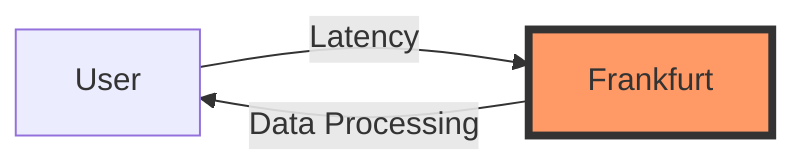
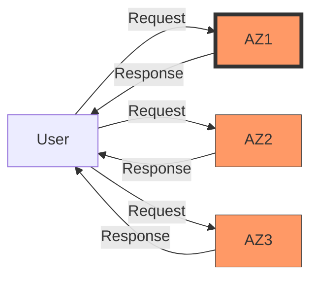
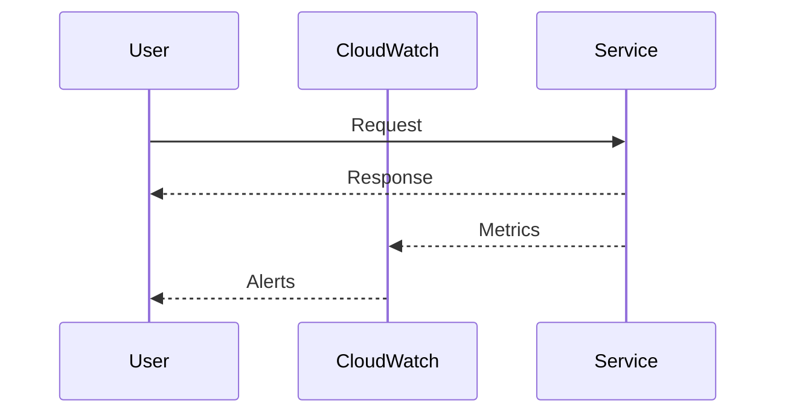

## Global Data Center Regions and Reliability

### Introduction to Physical Data Centers

Cloud providers operate vast networks of physical data centers around the globe. These data centers house thousands of servers, storage devices, and networking equipment that form the backbone of cloud services. When you rent a virtual server from a cloud provider such as AWS, Google Cloud, or Azure, the underlying hardware is located in one of these physical data centers.

The primary reason for having physical data centers is to provide reliable and scalable infrastructure for cloud services. Each data center is designed to handle high volumes of traffic and data processing, ensuring that cloud services remain available and performant.

### Geographical Distribution of Data Centers

Given that users are geographically distributed across the world, it would be inefficient to have all data centers located in a single region, such as the United States. Users in Europe, Asia, and other parts of the world would experience significant latency due to the long distances their data would have to travel.

To address this issue, cloud providers distribute their data centers across various regions worldwide. This distribution ensures that users can access cloud services with minimal latency, regardless of their location. For instance, AWS has numerous regions spread across North America, South America, Europe, Asia, and Australia.

### Understanding Regions

A region is a geographical area where a set of data centers is located. Each region is composed of multiple availability zones, which are separate data centers within the same region. This design provides redundancy and fault tolerance, ensuring that services remain available even if one availability zone fails.

#### Example Regions

Here are some examples of regions used by AWS:

- **US East (N. Virginia)**: `us-east-1`
- **US West (Oregon)**: `us-west-2`
- **Europe (Ireland)**: `eu-west-1`
- **Asia Pacific (Singapore)**: `ap-southeast-1`
- **Australia (Sydney)**: `ap-southeast-2`

### Selecting a Region

When creating resources on AWS, such as virtual servers (EC2 instances), you must specify the region where these resources will reside. Choosing the appropriate region is crucial for minimizing latency and ensuring optimal performance.

For example, if you are based in central Europe and need to deploy virtual servers on AWS, selecting the Frankfurt region (`eu-central-1`) would be ideal. This choice minimizes the distance between your users and the data center, leading to faster response times and better user experience.



### Reliability and Backup

Cloud providers offer various mechanisms to ensure the reliability and availability of their services. One such mechanism is the use of multiple availability zones within a region. By distributing resources across multiple availability zones, cloud providers can mitigate the risk of downtime caused by failures in a single data center.

#### Example: AWS Availability Zones

AWS divides each region into multiple availability zones. For instance, the US East (N. Virginia) region (`us-east-1`) has three availability zones: `us-east-1a`, `us-east-1b`, and `us-east-1c`. Deploying resources across these availability zones ensures that even if one availability zone experiences an outage, the others can continue to serve requests.



### Recent Real-World Examples

Recent real-world examples highlight the importance of choosing the right region and ensuring reliability through redundancy. For instance, during the 2021 AWS outage in the US East (N. Virginia) region, many services experienced downtime due to issues in one of the availability zones. This incident underscores the need for deploying critical applications across multiple availability zones to minimize the impact of such outages.

### How to Prevent / Defend

#### Detection

To detect potential issues with region selection and availability zones, you can monitor the performance and availability of your services using tools provided by the cloud provider. For example, AWS CloudWatch can be used to track metrics such as latency, error rates, and uptime.



#### Prevention

To prevent issues related to region selection and availability zones, follow these best practices:

1. **Choose the Right Region**: Select a region that is geographically close to your users to minimize latency.
2. **Deploy Across Multiple Availability Zones**: Distribute your resources across multiple availability zones within a region to ensure high availability.
3. **Use Auto Scaling**: Implement auto scaling to automatically adjust the number of instances based on demand, ensuring optimal performance and cost efficiency.
4. **Regularly Monitor Performance**: Use monitoring tools to regularly check the performance and availability of your services.

#### Secure Coding Fixes

When deploying resources on AWS, ensure that you configure them correctly to take advantage of the region and availability zone features. Here is an example of how to create an EC2 instance in the Frankfurt region (`eu-central-1`):

**Vulnerable Code:**
```python
import boto3

ec2 = boto3.resource('ec2')
instance = ec2.create_instances(
    ImageId='ami-0abcdef1234567890',
    MinCount=1,
    MaxCount=1,
    InstanceType='t2.micro'
)
```

**Secure Code:**
```python
import boto3

ec2 = boto3.resource('ec2', region_name='eu-central-1')
instance = ec2.create_instances(
    ImageId='ami-0abcdef1234567890',
    MinCount=1,
    MaxCount=1,
    InstanceType='t2.micro',
    Placement={'AvailabilityZone': 'eu-central-1a'}
)
```

### Configuration Hardening

To further enhance the security and reliability of your cloud resources, consider implementing the following configuration hardening measures:

1. **Enable Multi-Factor Authentication (MFA)**: Require MFA for accessing your cloud accounts to prevent unauthorized access.
2. **Use Strong IAM Policies**: Define strong IAM policies to restrict access to your cloud resources based on the principle of least privilege.
3. **Enable Encryption**: Enable encryption for your data at rest and in transit to protect sensitive information.

### Conclusion

Understanding the global distribution of data centers and the concept of regions is crucial for deploying reliable and performant cloud services. By selecting the appropriate region and leveraging multiple availability zones, you can ensure that your applications remain available and responsive to users worldwide. Additionally, implementing robust monitoring and security measures will help you detect and prevent potential issues, ensuring the continued reliability of your cloud infrastructure.

### Hands-On Labs

To gain practical experience with global data center regions and reliability, consider the following hands-on labs:

- **PortSwigger Web Security Academy**: Offers exercises on cloud security and regional deployment strategies.
- **AWS Well-Architected Labs**: Provides guided labs to help you understand and implement best practices for deploying resources across multiple regions and availability zones.
- **CloudGoat**: A cloud security training platform that includes scenarios for managing multi-region deployments and ensuring high availability.

By completing these labs, you will gain a deeper understanding of how to effectively manage and secure your cloud resources across global data center regions.

---
<!-- nav -->
[[01-Global Data Center Regions and Reliability in AWS|Global Data Center Regions and Reliability in AWS]] | [[DevOps/DevOps Bootcamp/11-Miscellaneous/11-Global Data Center Regions And Reliability/00-Overview|Overview]] | [[DevOps/DevOps Bootcamp/11-Miscellaneous/11-Global Data Center Regions And Reliability/03-Practice Questions & Answers|Practice Questions & Answers]]
