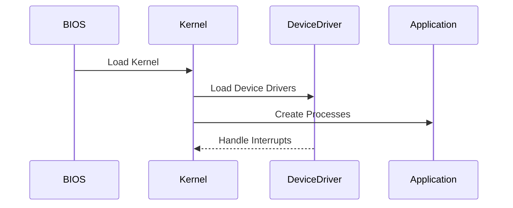
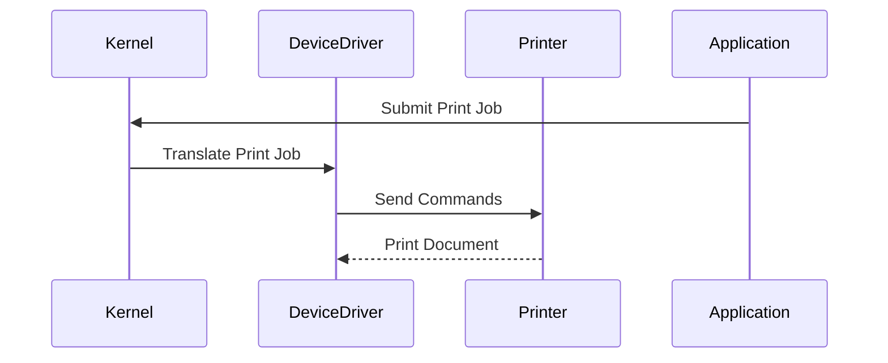
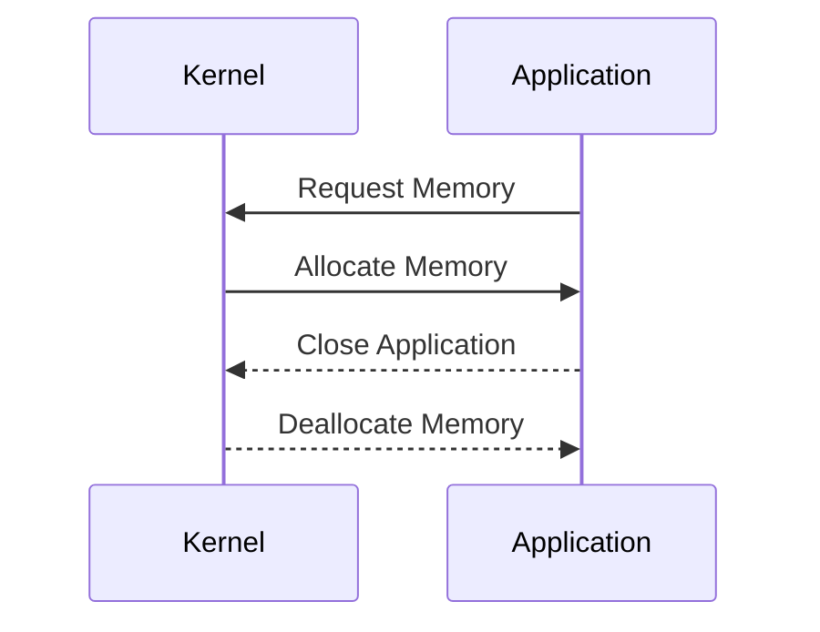
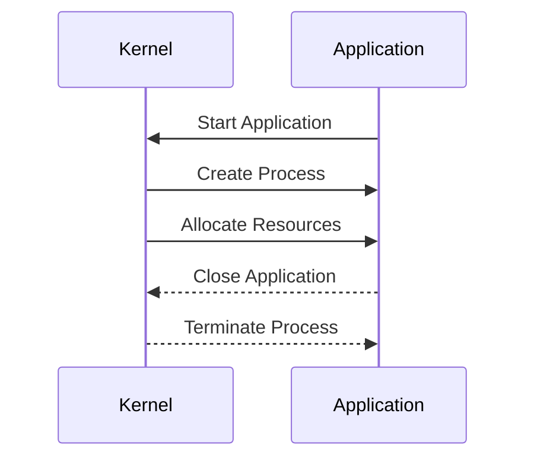
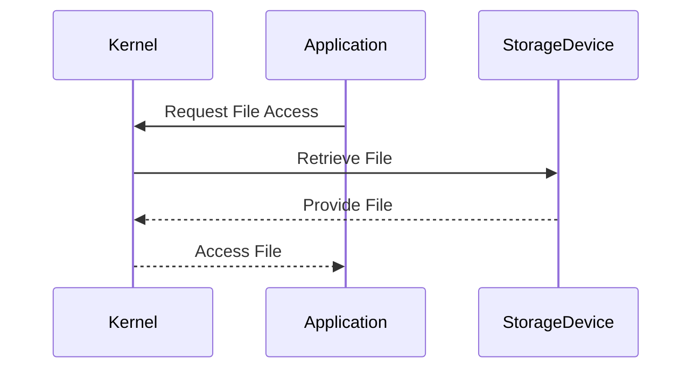
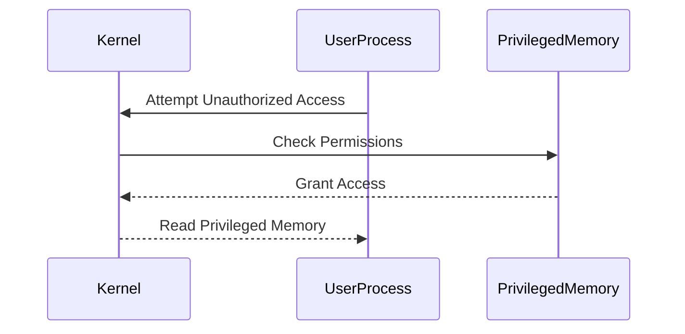

## Introduction to Operating System Kernels

The kernel is the core component of an operating system (OS) that interacts directly with the hardware. It is the first piece of software loaded when a computer boots up and is responsible for managing the hardware components such as the CPU, memory, and storage devices. The kernel acts as a bridge between the hardware and the software, providing essential services to both.

### What is a Kernel?

A kernel is a program written in low-level programming languages like C or assembly. It is responsible for managing the system's resources, including:

- **CPU Management**: Allocating CPU time to processes.
- **Memory Management**: Allocating and deallocating memory.
- **Device Drivers**: Managing communication with hardware devices.
- **Process Management**: Creating, scheduling, and terminating processes.
- **File System Management**: Providing access to files and directories.

### Why is the Kernel Important?

The kernel is crucial because it ensures that the hardware resources are used efficiently and securely. Without a kernel, applications would not be able to interact with the hardware directly, leading to chaos and inefficiency. The kernel provides a stable and consistent interface for applications to interact with the underlying hardware.

### How Does the Kernel Work?

When a computer boots up, the BIOS (Basic Input/Output System) initializes the hardware and loads the kernel into memory. The kernel then takes control and performs several critical tasks:

1. **Initialization**: The kernel initializes the hardware components and sets up the necessary data structures.
2. **Device Driver Loading**: The kernel loads device drivers, which are programs that enable communication between the hardware and the OS.
3. **Process Management**: The kernel creates and manages processes, allocating CPU time and memory resources.
4. **Interrupt Handling**: The kernel handles interrupts from hardware devices, ensuring that the system remains responsive.

### Example: Boot Process

Consider a typical boot process:



### Device Drivers

Device drivers are programs that enable communication between the hardware and the OS. They provide a standardized interface for the kernel to interact with hardware devices. For example, a printer requires a device driver to function correctly.

#### Example: Printer Device Driver

Suppose you have a printer connected to your computer. The printer device driver allows your computer to send print jobs to the printer. Here’s how it works:

1. **Device Initialization**: The kernel initializes the printer device and loads the device driver.
2. **Print Job Submission**: An application sends a print job to the kernel.
3. **Driver Execution**: The device driver translates the print job into commands that the printer understands.
4. **Printer Operation**: The printer receives the commands and prints the document.



### Memory Management

Memory management is a critical task performed by the kernel. It allocates and deallocates memory to processes, ensuring that each process has the necessary resources to run.

#### Example: Memory Allocation

Consider a scenario where an application requests memory from the kernel:

1. **Memory Request**: An application requests memory from the kernel.
2. **Memory Allocation**: The kernel allocates memory to the application.
3. **Memory Deallocation**: When the application is closed, the kernel deallocates the memory.



### Process Management

Process management is another key responsibility of the kernel. It creates and manages processes, allocating CPU time and memory resources.

#### Example: Process Creation

Consider a scenario where an application is started:

1. **Process Creation**: The kernel creates a new process for the application.
2. **Resource Allocation**: The kernel allocates CPU time and memory resources to the process.
3. **Process Termination**: When the application is closed, the kernel terminates the process and cleans up the resources.



### File System Management

The kernel also manages the file system, providing access to files and directories. It ensures that files are stored and retrieved correctly.

#### Example: File Access

Consider a scenario where an application accesses a file:

1. **File Request**: An application requests access to a file.
2. **File Retrieval**: The kernel retrieves the file from the storage device.
3. **File Access**: The application reads or writes to the file.



### Recent Real-World Examples

Recent vulnerabilities and breaches often involve weaknesses in the kernel. For example, the Meltdown and Spectre vulnerabilities exploited flaws in CPU architecture, affecting the kernel's ability to manage memory and processes securely.

#### Example: Meltdown Vulnerability

Meltdown is a vulnerability that affects Intel processors. It allows unauthorized reading of privileged memory contents. The vulnerability was discovered in 2018 and affected millions of computers worldwide.



### How to Prevent / Defend

To prevent and defend against kernel-related vulnerabilities, several measures can be taken:

1. **Secure Coding Practices**: Ensure that kernel code is written securely, following best practices.
2. **Regular Updates**: Keep the kernel and device drivers updated to patch known vulnerabilities.
3. **Hardening Configurations**: Harden the kernel configurations to minimize attack surfaces.
4. **Monitoring and Logging**: Monitor kernel activities and log suspicious behavior.

#### Example: Secure Coding Fix

Consider a vulnerable kernel code snippet that allows unauthorized memory access:

```c
// Vulnerable Code
void read_memory(unsigned int address) {
    unsigned char *ptr = (unsigned char *)address;
    printf("Memory at %x: %x\n", address, *ptr);
}
```

Here is the secure version:

```c
// Secure Code
void read_memory(unsigned int address) {
    if (!check_permissions(address)) {
        return;
    }
    unsigned char *ptr = (unsigned char *)address;
    printf("Memory at %x: %x\n", address, *ptr);
}

bool check_permissions(unsigned int address) {
    // Check if the current process has permission to access the memory
    // Return true if allowed, false otherwise
    return true; // Placeholder for actual implementation
}
```

### Conclusion

The kernel is the heart of an operating system, managing hardware components and providing essential services to applications. Understanding how the kernel works is crucial for developing secure and efficient software. By following secure coding practices and regularly updating the kernel, developers can mitigate potential vulnerabilities and ensure the stability and security of their systems.

### Practice Labs

For hands-on experience with kernel management, consider the following labs:

- **PortSwigger Web Security Academy**: Focuses on web application security but includes modules on server-side attacks that involve kernel interactions.
- **OWASP Juice Shop**: A deliberately insecure web application that includes challenges related to server-side vulnerabilities.
- **DVWA (Damn Vulnerable Web Application)**: Another intentionally vulnerable web application that covers various security topics, including kernel-related issues.

These labs provide practical experience in identifying and mitigating kernel-related vulnerabilities, enhancing your skills in securing operating systems.

---
<!-- nav -->
[[DevOps/DevOps Bootcamp/11-Miscellaneous/12-How Operating Systems Manage Hardware Interaction/00-Overview|Overview]] | [[02-Introduction to Operating System Management of Hardware Interaction|Introduction to Operating System Management of Hardware Interaction]]
