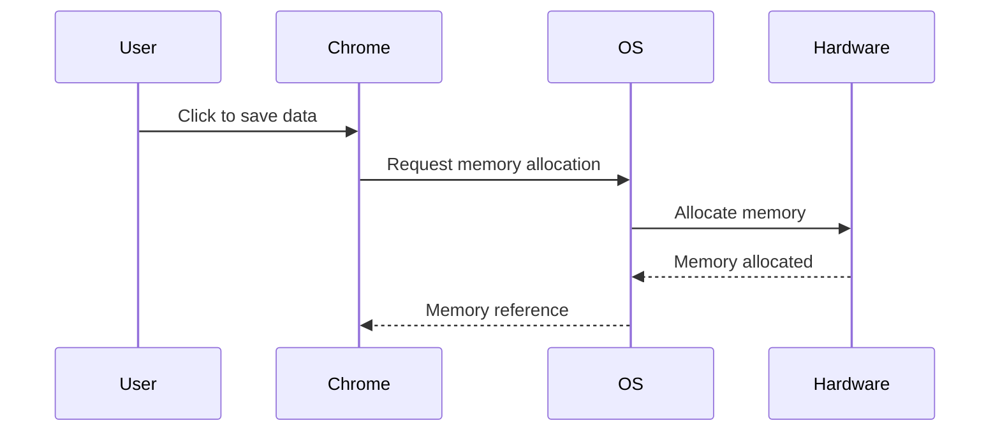
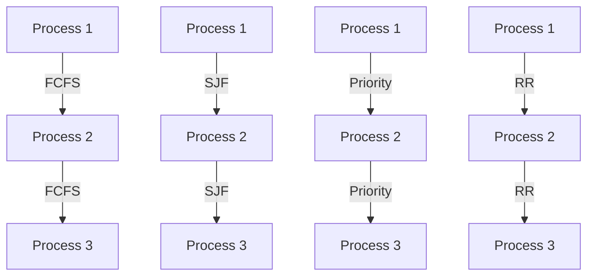
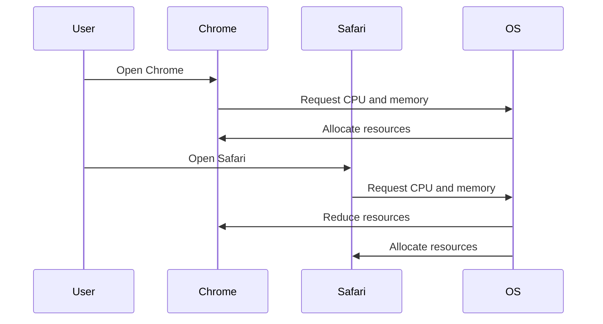
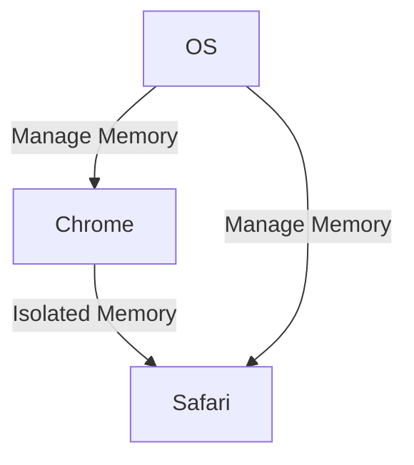
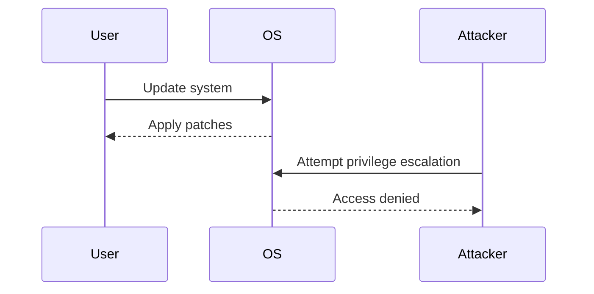

## Introduction to Operating System Management of Hardware Interaction

### Overview of Operating Systems

An operating system (OS) acts as a mediator between the hardware and software layers of a computer system. It manages the allocation and utilization of hardware resources such as the CPU, memory, storage, and input/output devices. The OS ensures that these resources are used efficiently and fairly among various applications running on the system. This interaction is crucial for the smooth functioning of any computing device, whether it's a personal computer, server, or mobile device.

### Role of the Operating System

The primary role of an operating system is to provide a user-friendly interface and manage the underlying hardware resources. Applications communicate with the OS to request specific resources, and the OS translates these requests into actions that the hardware can execute. This translation layer is essential because it abstracts the complexities of hardware interactions from the applications, allowing developers to focus on higher-level functionalities.

#### Example: Memory Allocation Request

Consider a scenario where a web browser like Chrome needs to allocate memory to save some temporary data. Instead of directly interacting with the hardware, Chrome sends a request to the operating system. The OS then allocates the required memory from the available pool and provides a reference to the allocated memory back to Chrome. This abstraction ensures that the application does not need to know the specifics of how the memory is managed by the hardware.



### Process Management

One of the critical tasks of an operating system is process management, which involves managing the CPU resources. A process is an instance of a program in execution. Each process requires CPU time to perform its tasks. The OS schedules processes to run on the CPU based on various criteria such as priority, fairness, and resource availability.

#### CPU Scheduling Algorithms

There are several CPU scheduling algorithms that the OS can use to manage processes:

1. **First-Come, First-Served (FCFS)**: Processes are executed in the order they arrive.
2. **Shortest Job First (SJF)**: Processes with shorter execution times are given priority.
3. **Priority Scheduling**: Processes are assigned priorities, and higher-priority processes are executed first.
4. **Round Robin (RR)**: Each process is given a fixed time slice (quantum) to run before being preempted.



### Resource Allocation and Fair Usage

Another important task of the operating system is to manage the fair usage of resources among the applications. This ensures that no single application monopolizes the resources, leading to a balanced and efficient system.

#### Example: Resource Allocation Between Chrome and Safari

Suppose Chrome is using a significant amount of resources but has not been active for a while. When the user opens Safari, the OS will dynamically adjust the resource allocation. It may reduce the resources allocated to Chrome and increase the resources allocated to Safari to ensure a responsive user experience.



### Isolation of Application Resources

To prevent interference between different applications, the OS isolates their resources. This isolation ensures that one application cannot access or modify the resources of another application, maintaining system stability and security.

#### Example: Memory Isolation

When Chrome and Safari are running simultaneously, the OS ensures that each application has its own isolated memory space. This prevents Chrome from accessing or modifying the memory allocated to Safari, and vice versa.



### Recent Real-World Examples

#### CVE-2021-40456: Windows Kernel Vulnerability

In 2021, a critical vulnerability was discovered in the Windows kernel, which allowed attackers to escalate privileges and gain unauthorized access to system resources. This vulnerability highlights the importance of robust resource management and isolation mechanisms in the operating system.

**Detection and Prevention:**

- **Detection:** Regularly update the operating system and apply security patches.
- **Prevention:** Implement strict access controls and monitor system logs for suspicious activities.



### Complete Example: Full HTTP Request and Response

Consider a scenario where a web application requests memory allocation from the operating system via an API call. The following example demonstrates the full HTTP request and response, including relevant headers and their security implications.

#### HTTP Request

```http
POST /api/memory-allocation HTTP/1.1
Host: example.com
Content-Type: application/json
Authorization: Bearer <token>
Content-Length: 34

{
  "process_id": "1234",
  "memory_size": "10MB"
}
```

#### HTTP Response

```http
HTTP/1.1 200 OK
Date: Mon, 23 Jan 2023 12:00:00 GMT
Content-Type: application/json
Content-Length: 42

{
  "status": "success",
  "allocated_memory": "10MB"
}
```

### Secure Coding Practices

To prevent vulnerabilities related to resource management, it is crucial to follow secure coding practices. Here is an example of a vulnerable code snippet and its secure counterpart.

#### Vulnerable Code

```python
def allocate_memory(process_id, memory_size):
    # Vulnerable code: No validation or isolation
    allocate_memory_to_process(process_id, memory_size)
```

#### Secure Code

```python
def allocate_memory(process_id, memory_size):
    # Secure code: Validate inputs and isolate resources
    if validate_input(process_id, memory_size):
        allocate_memory_to_process(process_id, memory_size)
    else:
        raise ValueError("Invalid input")
```

### Hands-On Labs

For practical experience in understanding how operating systems manage hardware interaction, consider the following labs:

- **PortSwigger Web Security Academy**: Offers interactive labs on web application security, including topics related to resource management.
- **OWASP Juice Shop**: Provides a vulnerable web application for practicing security testing and resource management techniques.
- **DVWA (Damn Vulnerable Web Application)**: A deliberately insecure web application for practicing web security concepts.

These labs provide real-world scenarios and challenges to reinforce the theoretical knowledge gained from this chapter.

### Conclusion

Understanding how operating systems manage hardware interaction is fundamental to developing robust and secure applications. By mastering the principles of process management, resource allocation, and isolation, developers can create more efficient and secure systems. Regular updates, strict access controls, and secure coding practices are essential for preventing vulnerabilities and ensuring system stability.

---
<!-- nav -->
[[01-Introduction to Operating System Kernels|Introduction to Operating System Kernels]] | [[DevOps/DevOps Bootcamp/11-Miscellaneous/12-How Operating Systems Manage Hardware Interaction/00-Overview|Overview]] | [[03-Introduction to Operating Systems and Hardware Interaction|Introduction to Operating Systems and Hardware Interaction]]
