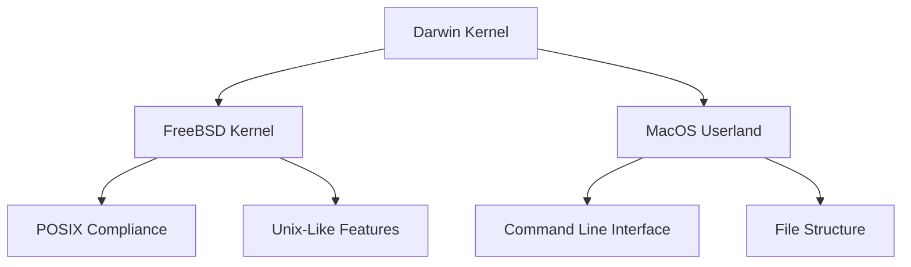
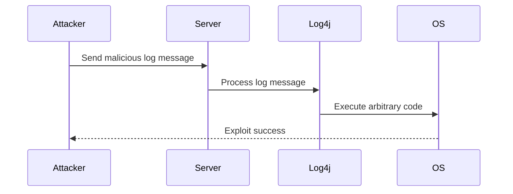

## Introduction to Operating Systems and Hardware Interaction

Operating systems (OS) serve as the intermediary layer between hardware and software, managing resources and providing services to applications. Understanding how OSes interact with hardware is crucial for developers, administrators, and security professionals. This chapter delves into the historical context, architectural details, and practical implications of how operating systems manage hardware interactions, focusing particularly on Unix-based systems like Linux and macOS.

### Historical Context: Unix and Its Influence

To understand the similarities between Linux and macOS, we need to delve into the history of Unix. Unix was developed at Bell Labs in the late 1960s and early 1970s. It was designed to provide a portable, multi-tasking, and multi-user environment. The key features of Unix include:

- **Portability**: Unix was written in a high-level language (C), making it easier to port across different hardware platforms.
- **Modularity**: The system was designed in a modular fashion, allowing components to be replaced or upgraded independently.
- **Hierarchical File System**: Unix introduced a hierarchical file system, which is still used today in many modern operating systems.

#### Unix-Based Operating Systems

Unix served as the foundation for many operating systems, including:

- **Linux**: Developed by Linus Torvalds in 1991, Linux is an open-source Unix-like operating system.
- **macOS**: Based on the Darwin kernel, which includes source code from FreeBSD (a Unix-like operating system).

### Unix and macOS Kernel: Darwin

macOS uses the Darwin kernel, which is a hybrid kernel combining elements of both monolithic and microkernel designs. The Darwin kernel includes significant portions of the FreeBSD kernel, which is a Unix-like operating system. This heritage explains why macOS shares many characteristics with Unix-based systems like Linux.

#### Darwin Kernel Architecture

The Darwin kernel architecture can be visualized using a mermaid diagram:



### Command Line Interface and File Structure

Both Linux and macOS share a similar command-line interface (CLI) and file structure due to their Unix heritage. The CLI provides a powerful way to interact with the operating system, and the file structure follows a hierarchical model.

#### Example Commands

Here are some common commands used in both Linux and macOS:

```bash
# List files in a directory
ls

# Change directory
cd /path/to/directory

# Create a new directory
mkdir new_directory

# Remove a directory
rmdir empty_directory
```

### Standards and Compatibility

To ensure compatibility among different Unix-based systems, various standards were established. These standards define how programs and applications should behave across different operating systems.

#### POSIX Standard

POSIX (Portable Operating System Interface) is a set of standards defined by IEEE for maintaining compatibility between operating systems. POSIX defines a common API for operating systems, ensuring that programs written for one POSIX-compliant system can run on another.

#### Example of POSIX Compliance

Consider a simple C program that reads a file and prints its contents:

```c
#include <stdio.h>
#include <stdlib.h>

int main() {
    FILE *file = fopen("example.txt", "r");
    if (!file) {
        perror("Failed to open file");
        return EXIT_FAILURE;
    }

    char buffer[1024];
    while (fgets(buffer, sizeof(buffer), file)) {
        printf("%s", buffer);
    }

    fclose(file);
    return EXIT_SUCCESS;
}
```

This program will compile and run correctly on any POSIX-compliant system, including Linux and macOS.

### Differences Between Unix-Based Systems and Windows

While Unix-based systems share many similarities, Windows is fundamentally different. Windows is a proprietary operating system developed by Microsoft, and its architecture and APIs differ significantly from Unix-based systems.

#### Windows vs. Unix-Based Systems

- **Kernel Architecture**: Windows uses a monolithic kernel, while Unix-based systems often use a hybrid or microkernel design.
- **File System**: Windows uses NTFS (New Technology File System), while Unix-based systems typically use ext4 (Linux) or APFS (macOS).
- **Command Line Interface**: Windows uses CMD or PowerShell, while Unix-based systems use the Bash shell.

### Real-World Examples and Security Implications

Understanding the differences and similarities between operating systems is crucial for security professionals. Here are some real-world examples and security implications:

#### CVE-2021-44228: Log4Shell

Log4Shell (CVE-2021-44228) is a critical vulnerability affecting Apache Log4j, a widely used Java logging library. This vulnerability allows attackers to execute arbitrary code on affected systems.



#### Secure Coding Practices

To prevent such vulnerabilities, secure coding practices are essential. Here is an example of a vulnerable and secure version of a logging function:

**Vulnerable Code**

```java
import org.apache.logging.log4j.LogManager;
import org.apache.logging.log4j.Logger;

public class VulnerableLogger {
    private static final Logger logger = LogManager.getLogger(VulnerableLogger.class);

    public void logMessage(String message) {
        logger.info(message); // Vulnerable to Log4Shell
    }
}
```

**Secure Code**

```java
import org.apache.logging.log4j.LogManager;
import org.apache.logging.log4j.Logger;

public class SecureLogger {
    private static final Logger logger = LogManager.getLogger(SecureLogger.class);

    public void logMessage(String message) {
        logger.info(message.replaceAll("\\$", "")); // Sanitize input
    }
}
```

### How to Prevent / Defend

#### Detection

Regularly update and patch your systems to mitigate known vulnerabilities. Use tools like `grep` to search for vulnerable code patterns:

```bash
grep -r "\$\(.*\)" /path/to/codebase
```

#### Prevention

Implement secure coding practices and use static analysis tools to identify potential vulnerabilities. Regularly review and update your codebase to ensure compliance with security standards.

#### Secure Configuration

Ensure that your operating system and applications are configured securely. For example, disable unnecessary services and restrict access to sensitive files.

### Conclusion

Understanding how operating systems manage hardware interactions is fundamental to effective DevOps practices. By exploring the historical context, architectural details, and practical implications of Unix-based systems, we can better appreciate the similarities and differences between operating systems and apply this knowledge to improve security and efficiency.

### Practice Labs

For hands-on practice, consider the following labs:

- **PortSwigger Web Security Academy**: Focuses on web application security and includes modules on operating system interaction.
- **OWASP Juice Shop**: A deliberately insecure web application for practicing web security skills.
- **DVWA (Damn Vulnerable Web Application)**: Another intentionally vulnerable web application for learning security concepts.

These labs provide practical experience in working with operating systems and understanding their interactions with hardware and software.

---
<!-- nav -->
[[02-Introduction to Operating System Management of Hardware Interaction|Introduction to Operating System Management of Hardware Interaction]] | [[DevOps/DevOps Bootcamp/11-Miscellaneous/12-How Operating Systems Manage Hardware Interaction/00-Overview|Overview]] | [[04-Introduction to Operating Systems and Kernel Management|Introduction to Operating Systems and Kernel Management]]
