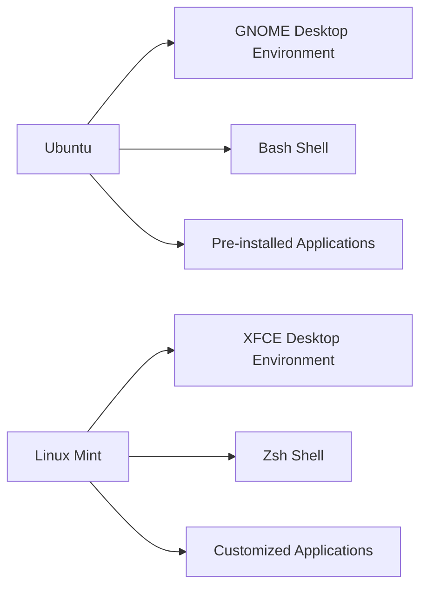
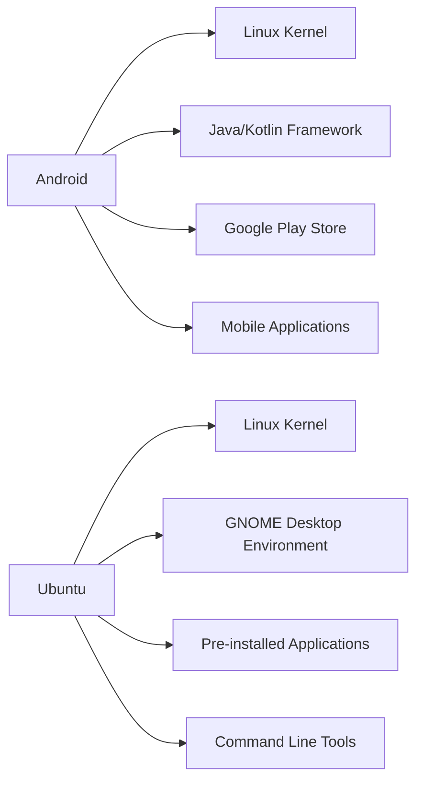
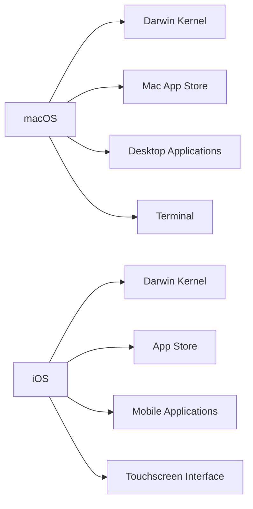
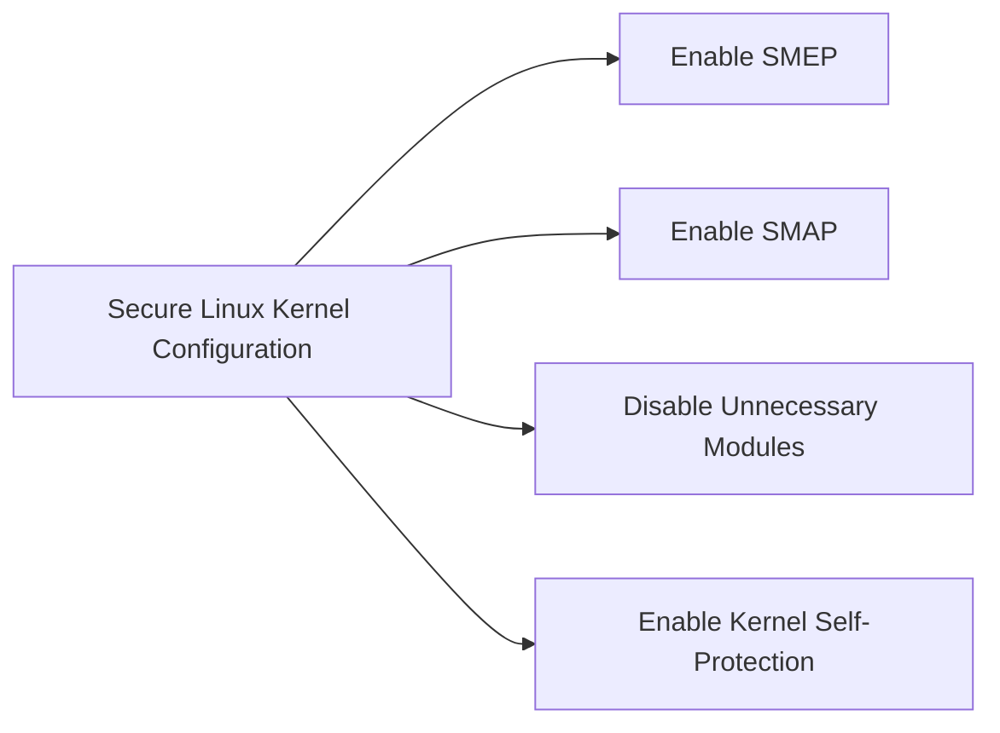

## Introduction to Operating Systems and Kernel Management

Operating systems (OS) are the backbone of modern computing, providing a bridge between hardware and software. They manage hardware resources, provide services to software, and offer a user-friendly interface. At the core of an OS lies the kernel, which is responsible for managing processes, memory, and hardware interactions. This chapter will delve into how different operating systems manage hardware interaction, focusing on Linux-based systems and their derivatives, such as Android, as well as comparing them to macOS and iOS.

### What is an Operating System?

An operating system is a collection of software that manages computer hardware resources and provides common services for computer programs. The primary functions of an OS include:

- **Process Management**: Managing the execution of processes, including scheduling, creation, termination, and synchronization.
- **Memory Management**: Allocating and deallocating memory to processes, ensuring efficient use of resources.
- **File System Management**: Organizing and managing files and directories, providing mechanisms for creating, deleting, and accessing files.
- **Device Management**: Interacting with hardware devices through device drivers, ensuring proper communication and resource allocation.
- **Security Management**: Providing mechanisms to protect data and resources from unauthorized access.

### What is a Kernel?

The kernel is the central component of an operating system. It is responsible for managing the system's resources and providing low-level services to other parts of the OS. The kernel interacts directly with the hardware and provides essential services such as process management, memory management, and device drivers.

#### Types of Kernels

There are two main types of kernels:

- **Monolithic Kernel**: In a monolithic kernel, all the operating system components run in kernel mode, meaning they have direct access to hardware. This type of kernel is efficient but can be complex to maintain and extend. Examples include the Linux kernel and the Windows NT kernel.
  
- **Microkernel**: In a microkernel architecture, only the most basic services run in kernel mode, while other services run in user mode. This design allows for better modularity and easier maintenance. Examples include the Mach kernel and the MINIX kernel.

### Linux Distributions and Their Variants

Linux is a family of open-source operating systems based on the Linux kernel. There are numerous distributions (distros) of Linux, each tailored for specific use cases and preferences. Some popular Linux distributions include:

- **Ubuntu**: A widely-used distribution known for its ease of use and community support.
- **Linux Mint**: A user-friendly distribution that aims to be more accessible to new users.
- **CentOS**: A stable and reliable distribution often used in enterprise environments.
- **Debian**: A highly customizable distribution known for its stability and large package repository.

Despite their differences, all these distributions share the same underlying Linux kernel. The differences lie primarily in the application layer, which includes:

- **Graphical User Interface (GUI)**: Different distributions may use different desktop environments (DEs) such as GNOME, KDE, XFCE, etc., which affect the look and feel of the interface.
- **Applications**: Each distribution packages different sets of applications, libraries, and tools. For example, Ubuntu comes with a variety of pre-installed applications, while Debian offers a vast repository of packages.
- **Command Line Interface (CLI)**: Different distributions may have different default shells (e.g., Bash, Zsh) and command-line utilities.

### Example: Ubuntu vs. Linux Mint

Let's compare Ubuntu and Linux Mint to illustrate the differences in the application layer:



- **Ubuntu** uses the GNOME desktop environment by default, which provides a modern and intuitive interface. It comes with a variety of pre-installed applications and uses the Bash shell as the default command-line interface.
  
- **Linux Mint** uses the XFCE desktop environment, which is lightweight and fast. It also comes with a set of customized applications and uses the Zsh shell as the default command-line interface.

### Android: A Mobile Operating System Based on Linux

Android is a mobile operating system developed by Google. It is based on the Linux kernel and is designed specifically for mobile devices such as smartphones and tablets. Despite being based on the same kernel, Android has a completely different application layer compared to traditional Linux distributions.

#### Key Differences Between Android and Traditional Linux Distributions

- **Hardware**: Android runs on mobile hardware, which includes processors optimized for power efficiency, touchscreens, cameras, GPS, and other sensors.
  
- **Application Layer**: Android uses a custom application framework based on Java and Kotlin. It has a unique set of applications and services tailored for mobile use, such as the Google Play Store, messaging apps, and location services.

#### Example: Android vs. Ubuntu



- **Android** uses the Linux kernel but has a custom application framework based on Java and Kotlin. It includes the Google Play Store and a wide range of mobile applications.
  
- **Ubuntu** uses the Linux kernel and has a desktop environment based on GNOME. It includes a variety of pre-installed applications and command-line tools.

### macOS and iOS: Based on the Darwin Kernel

macOS and iOS are operating systems developed by Apple. Unlike Linux-based systems, they are based on the Darwin kernel, which is a hybrid kernel derived from the Mach kernel and the BSD Unix kernel.

#### Key Features of Darwin Kernel

- **Hybrid Kernel Architecture**: The Darwin kernel combines elements of both monolithic and microkernel architectures, providing a balance between performance and modularity.
  
- **BSD Unix Compatibility**: The Darwin kernel includes many features from the BSD Unix kernel, making it compatible with a wide range of Unix applications and tools.

#### Comparison: macOS vs. iOS



- **macOS** uses the Darwin kernel and includes the Mac App Store, a wide range of desktop applications, and a terminal for command-line operations.
  
- **iOS** also uses the Darwin kernel but is designed for mobile devices. It includes the App Store, a variety of mobile applications, and a touchscreen interface.

### Security Considerations in Operating Systems

Security is a critical aspect of operating systems, especially when dealing with hardware interactions. Here are some key security considerations:

- **Kernel Security**: The kernel is the most privileged part of the OS and must be protected from vulnerabilities. Kernel exploits can lead to full system compromise.
  
- **Device Driver Security**: Device drivers interact directly with hardware and can introduce security risks if not properly secured. Vulnerable drivers can be exploited to gain elevated privileges or execute arbitrary code.

- **User Space Security**: While the kernel is the most critical component, user space applications also pose security risks. Malicious applications can exploit vulnerabilities in the OS or other applications to gain unauthorized access.

### Real-World Examples of Security Breaches

#### CVE-2017-5753: Spectre and Meltdown

In 2017, two major vulnerabilities were discovered in the CPU architecture of modern processors: Spectre and Meltdown. These vulnerabilities allowed attackers to bypass hardware isolation between processes, potentially exposing sensitive information such as passwords and encryption keys.

- **Spectre**: This vulnerability exploits speculative execution in CPUs, allowing attackers to read arbitrary memory locations.
  
- **Meltdown**: This vulnerability allows attackers to read kernel memory from user space, bypassing hardware-enforced isolation.

#### How to Prevent / Defend Against Spectre and Meltdown

To mitigate the risks posed by Spectre and Meltdown, several measures can be taken:

- **Software Patches**: Apply the latest security patches provided by the OS vendor. These patches typically include mitigations for known vulnerabilities.
  
- **Kernel Hardening**: Enable kernel hardening features such as SMEP (Supervisor Mode Execution Prevention) and SMAP (Supervisor Mode Access Prevention).

- **Secure Coding Practices**: Follow secure coding practices to minimize the risk of introducing vulnerabilities in user space applications.

### Complete Example: Secure Configuration of a Linux Kernel

Here is an example of a secure configuration for a Linux kernel:



- **Enable SMEP**: Supervisor Mode Execution Prevention prevents user-space code from executing in kernel mode.
  
- **Enable SMAP**: Supervisor Mode Access Prevention prevents user-space code from accessing kernel memory.
  
- **Disable Unnecessary Modules**: Disable modules that are not required to reduce the attack surface.
  
- **Enable Kernel Self-Protection**: Enable kernel self-protection features to prevent exploitation of known vulnerabilities.

### Code Example: Enabling SMEP and SMAP in a Linux Kernel

To enable SMEP and SMAP in a Linux kernel, you can modify the kernel configuration file (`config`):

```bash
# Enable SMEP
CONFIG_STRICT_DEVMEM=y
CONFIG_X86_SMAP=y

# Enable SMAP
CONFIG_X86_SMAP=y
```

After modifying the configuration, rebuild the kernel and install it:

```bash
make
sudo make modules_install
sudo make install
```

### Hands-On Labs for Practicing Kernel Management

To practice kernel management and security, consider the following hands-on labs:

- **PortSwigger Web Security Academy**: Offers a comprehensive set of labs covering various aspects of web security, including OS-level attacks.
  
- **OWASP Juice Shop**: A deliberately insecure web application for practicing security testing and penetration testing.

- **DVWA (Damn Vulnerable Web Application)**: A PHP/MySQL web application that is intentionally vulnerable for educational purposes.

- **WebGoat**: An interactive web security training application that teaches web application security lessons.

### Conclusion

Understanding how operating systems manage hardware interaction is crucial for developing secure and efficient systems. By exploring the differences between various Linux distributions, Android, macOS, and iOS, we can appreciate the diversity of operating systems and their unique strengths. Additionally, by addressing security considerations and learning from real-world examples, we can ensure that our systems remain robust and resilient against potential threats.

This chapter has provided a comprehensive overview of operating systems and their kernel management, including detailed explanations, real-world examples, and practical advice for securing your systems. By mastering these concepts, you will be well-equipped to handle the challenges of modern computing.

---
<!-- nav -->
[[03-Introduction to Operating Systems and Hardware Interaction|Introduction to Operating Systems and Hardware Interaction]] | [[DevOps/DevOps Bootcamp/11-Miscellaneous/12-How Operating Systems Manage Hardware Interaction/00-Overview|Overview]] | [[05-Introduction to Operating Systems and Their Role in Managing Hardware Interaction|Introduction to Operating Systems and Their Role in Managing Hardware Interaction]]
