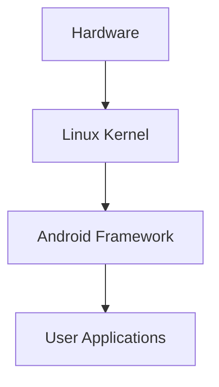
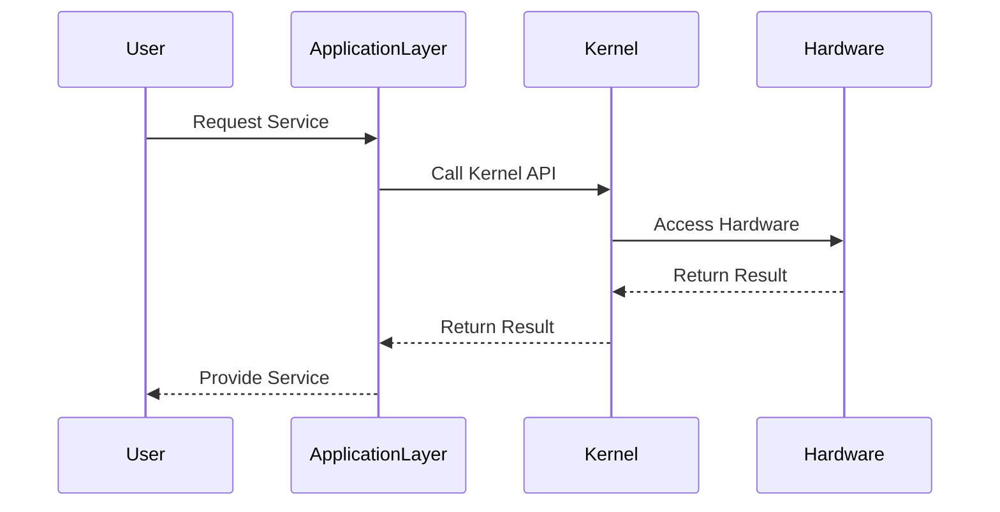
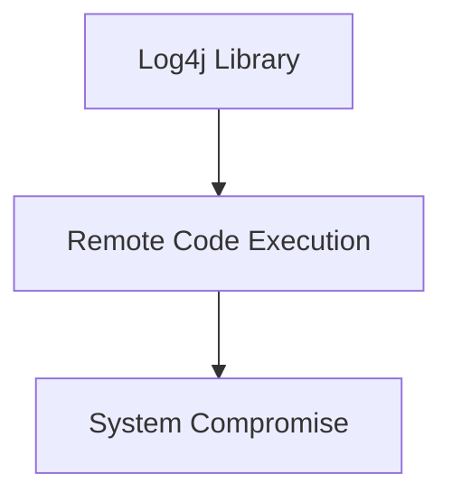

## Introduction to Operating Systems and Their Role in Managing Hardware Interaction

Operating systems (OS) serve as the fundamental software layer that manages and controls computer hardware resources. They provide a platform for other software applications to run efficiently and securely. This chapter delves into the intricacies of how operating systems manage hardware interaction, focusing on both desktop and server operating systems. We will explore the different layers within an OS, their functions, and how they interact with the underlying hardware.

### Desktop vs. Server Operating Systems

Desktop operating systems are designed for personal computers, laptops, and mobile devices. These systems typically come with a graphical user interface (GUI) and a variety of user applications such as web browsers, media players, and office suites. Examples of desktop operating systems include Windows, macOS, and various Linux distributions like Ubuntu.

Server operating systems, on the other hand, are optimized for running on servers and providing services to multiple users or applications. These systems are often based on Linux and are designed to be lightweight and performant. They typically lack a GUI and rely solely on a command-line interface (CLI) for administration. Examples of server operating systems include Red Hat Enterprise Linux, CentOS, and Debian.

#### Example: Android Operating System

To illustrate the layers within an operating system, let's consider the Android operating system, which is widely used on mobile devices. The architecture of Android can be broken down into several layers:

1. **Hardware Layer**: This includes the physical components of the device, such as the CPU, memory, storage, and input/output (I/O) devices.
2. **Kernel Layer**: The Linux kernel manages the hardware resources and provides low-level services to the higher layers.
3. **Operating System Application Layer**: This layer includes the Android framework, which provides APIs for developing applications.
4. **User Applications Layer**: This is where the actual applications run, such as messaging apps, games, and productivity tools.



### Layers of an Operating System

An operating system consists of multiple layers, each serving a specific purpose. Understanding these layers is crucial for comprehending how an OS interacts with hardware and provides services to applications.

#### Hardware Layer

The hardware layer comprises the physical components of the computer, including the CPU, memory, storage, and I/O devices. These components form the foundation upon which the OS operates.

#### Kernel Layer

The kernel is the core component of the operating system. It manages the hardware resources and provides essential services to the higher layers. The kernel handles tasks such as process management, memory management, file systems, and device drivers.

##### Process Management

Process management involves creating, scheduling, and terminating processes. The kernel ensures that processes are allocated appropriate resources and are executed in a fair manner.

##### Memory Management

Memory management involves allocating and deallocating memory to processes. The kernel uses techniques such as virtual memory and paging to optimize memory usage.

##### File Systems

File systems manage the storage and retrieval of data on disk. The kernel supports various file systems, such. as ext4, NTFS, and HFS+.

##### Device Drivers

Device drivers are software components that allow the kernel to communicate with hardware devices. Each device driver is responsible for managing a specific type of hardware.

#### Operating System Application Layer

The operating system application layer provides a set of APIs and services for developing applications. This layer abstracts the complexities of the lower layers and provides a simpler interface for developers.

#### User Applications Layer

The user applications layer is where the actual applications run. These applications interact with the operating system through the APIs provided by the application layer.

### Interaction Between Layers

The interaction between the layers is critical for the proper functioning of the operating system. The following diagram illustrates the flow of control between the layers:



### Recent Real-World Examples

Recent vulnerabilities and breaches highlight the importance of robust operating system design and management. One notable example is the Log4j vulnerability (CVE-2021-44228), which affected the Apache Log4j logging library. This vulnerability allowed attackers to execute arbitrary code on affected systems, leading to widespread exploitation.

#### Example: Log4j Vulnerability

The Log4j vulnerability was a critical remote code execution (RCE) flaw that affected millions of systems worldwide. The vulnerability was present in the Log4j library, which is widely used in Java applications for logging purposes.



#### Detection and Prevention

To detect and prevent such vulnerabilities, organizations should implement the following measures:

1. **Regular Updates and Patch Management**: Ensure that all systems are up-to-date with the latest security patches.
2. **Vulnerability Scanning**: Use tools like Nessus or OpenVAS to scan for known vulnerabilities.
3. **Secure Coding Practices**: Follow secure coding guidelines to minimize the risk of introducing vulnerabilities.
4. **Network Segmentation**: Implement network segmentation to limit the spread of attacks.

### Secure Coding Fixes

Here is an example of a vulnerable code snippet and its secure counterpart:

#### Vulnerable Code

```java
import org.apache.logging.log4j.LogManager;
import org.apache.logging.log4j.Logger;

public class VulnerableClass {
    private static final Logger logger = LogManager.getLogger(VulnerableClass.class);

    public void logMessage(String message) {
        logger.info(message);
    }
}
```

#### Secure Code

```java
import org.apache.logging.log4j.LogManager;
import org.apache.logging.log4j.Logger;

public class SecureClass {
    private static final Logger logger = LogManager.getLogger(SecureClass.class);

    public void logMessage(String message) {
        // Sanitize input to prevent RCE
        String sanitizedMessage = sanitizeInput(message);
        logger.info(sanitizedMessage);
    }

    private String sanitizeInput(String input) {
        // Implement sanitization logic here
        return input.replaceAll("\\$", "");
    }
}
```

### Conclusion

Understanding the layers of an operating system and how they interact with hardware is crucial for effective system management and security. By following best practices and implementing robust security measures, organizations can mitigate the risks associated with operating system vulnerabilities.

### Practice Labs

For hands-on experience with operating systems and their management, consider the following labs:

- **PortSwigger Web Security Academy**: Offers practical exercises on web application security.
- **OWASP Juice Shop**: A deliberately insecure web application for practicing security testing.
- **DVWA (Damn Vulnerable Web Application)**: A PHP/MySQL web application that is riddled with vulnerabilities for educational purposes.
- **WebGoat**: An interactive training application that teaches web application security lessons.

These labs provide a comprehensive learning experience and help reinforce the concepts discussed in this chapter.

---
<!-- nav -->
[[04-Introduction to Operating Systems and Kernel Management|Introduction to Operating Systems and Kernel Management]] | [[DevOps/DevOps Bootcamp/11-Miscellaneous/12-How Operating Systems Manage Hardware Interaction/00-Overview|Overview]] | [[06-Introduction to Operating Systems|Introduction to Operating Systems]]
