## Introduction to Operating Systems

An operating system (OS) is a crucial layer of software that manages and controls computer hardware, providing common services for computer programs. It acts as a bridge between the hardware and the software, enabling users and applications to interact with the underlying hardware efficiently and effectively. This chapter will delve into the intricacies of how operating systems manage hardware interactions, focusing on various types of operating systems such as Linux, Windows, and macOS.

### Types of Operating Systems

Operating systems can be broadly categorized into two main types: server operating systems and desktop/client operating systems.

#### Desktop/Client Operating Systems

Desktop or client operating systems are designed to run on personal computers and laptops. They provide a user-friendly graphical user interface (GUI) and support Input/Output (I/O) devices such as keyboards, mice, and monitors. These operating systems are optimized for individual use and are equipped with a wide range of applications and utilities to enhance productivity and entertainment.

**Examples:**
- **Windows 10/11**: Microsoft's flagship desktop operating system, widely used in both home and office environments.
- **macOS**: Apple's desktop operating system, known for its sleek design and integration with other Apple products.
- **Linux Distributions**: Various flavors of Linux such as Ubuntu, Fedora, and Mint, which offer open-source alternatives with customizable GUIs.

#### Server Operating Systems

Server operating systems are designed to run on powerful machines that serve multiple users or applications simultaneously. These systems typically lack a graphical user interface and are managed through command-line interfaces (CLI). They are optimized for efficiency and reliability, making them ideal for hosting web servers, databases, and other critical services.

**Examples:**
- **Windows Server**: Microsoft's server operating system, commonly used in enterprise environments.
- **Linux Server Distributions**: Various flavors of Linux such as CentOS, Debian, and Ubuntu Server, which are widely used due to their stability and flexibility.

### Key Features of Operating Systems

Operating systems perform several essential functions:

1. **Process Management**: Managing processes, including creation, execution, synchronization, and termination.
2. **Memory Management**: Allocating and deallocating memory to processes, managing virtual memory, and handling page faults.
3. **File System Management**: Organizing and managing files and directories, providing mechanisms for accessing and manipulating data.
4. **Device Management**: Interacting with hardware devices, managing device drivers, and handling input/output operations.
5. **Security Management**: Ensuring the integrity, confidentiality, and availability of data and resources.

### Linux Operating Systems

Linux is a popular open-source operating system kernel that powers a wide range of distributions. It is highly flexible and can be customized to suit various needs, from desktop computing to server management.

#### Linux Kernel

The Linux kernel is the core component of the Linux operating system. It manages hardware resources and provides services to user-space applications. The kernel is responsible for process scheduling, memory management, file system operations, and device driver management.

**Example:**
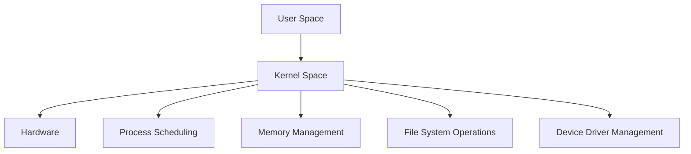

#### Linux Distributions

Linux distributions are complete operating systems built around the Linux kernel. They include a variety of tools, libraries, and applications tailored to specific use cases.

**Examples:**
- **Ubuntu**: A popular distribution known for its ease of use and extensive package repository.
- **CentOS**: A community-supported distribution derived from Red Hat Enterprise Linux, widely used in enterprise environments.
- **Debian**: A distribution known for its stability and large software repository.

### Windows Operating Systems

Windows is a proprietary operating system developed by Microsoft. It is widely used in both personal and enterprise environments.

#### Windows Client Operating Systems

Windows client operating systems are designed for personal use and provide a rich GUI and a wide range of applications.

**Example:**
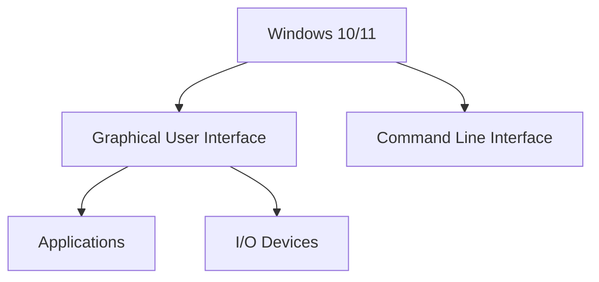

#### Windows Server Operating Systems

Windows Server operating systems are designed for enterprise environments and provide robust features for managing servers and networks.

**Example:**
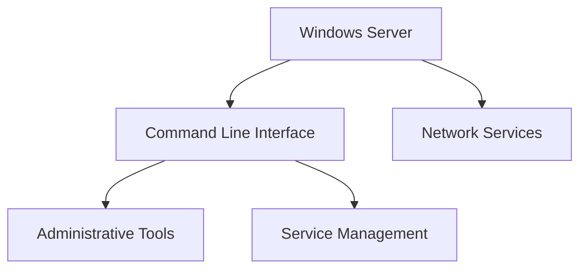

### macOS Operating Systems

macOS is the operating system developed by Apple for Macintosh computers. It is based on the Darwin kernel and provides a seamless integration with other Apple products.

#### macOS Evolution

macOS was originally called OS X, which later changed to macOS. Despite the name change, the underlying operating system remained the same.

**Example:**

### Mobile Operating Systems

Mobile operating systems are designed for smartphones and tablets. They provide a user-friendly interface and support a wide range of applications.

#### iOS

iOS is the operating system developed by Apple for iPhones and iPads. It is based on the Darwin kernel and provides a seamless integration with other Apple products.

**Example:**
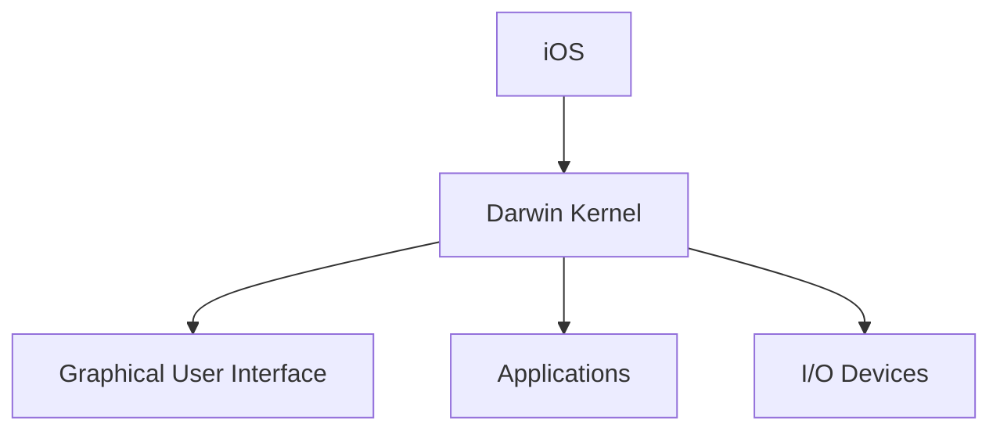

#### Android

Android is an open-source operating system developed by Google. It is based on the Linux kernel and supports a wide range of devices, from smartphones to tablets.

**Example:**
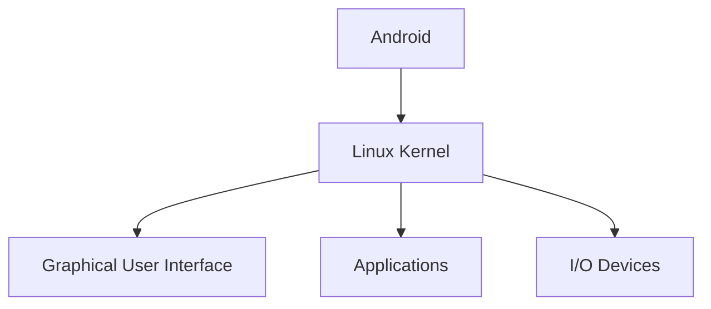

### Hardware Interaction

Operating systems manage hardware interactions through device drivers, which are software components that enable communication between the operating system and hardware devices.

#### Device Drivers

Device drivers are responsible for translating commands from the operating system into instructions that the hardware can understand. They handle tasks such as reading and writing data, controlling hardware operations, and managing interrupts.

**Example:**
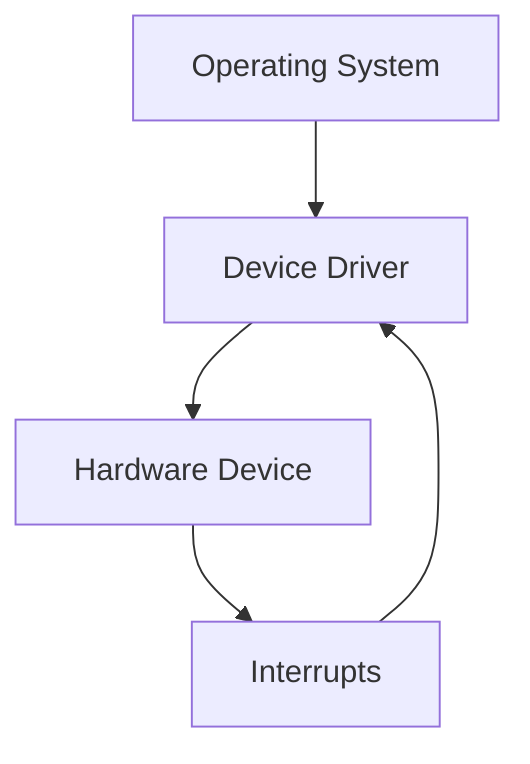

### Security Considerations

Operating systems play a crucial role in ensuring the security of hardware and software resources. They provide mechanisms for authentication, authorization, and encryption to protect against unauthorized access and data breaches.

#### Authentication

Authentication is the process of verifying the identity of a user or system. Operating systems provide mechanisms such as usernames and passwords, biometric authentication, and multi-factor authentication to ensure that only authorized users can access the system.

**Example:**
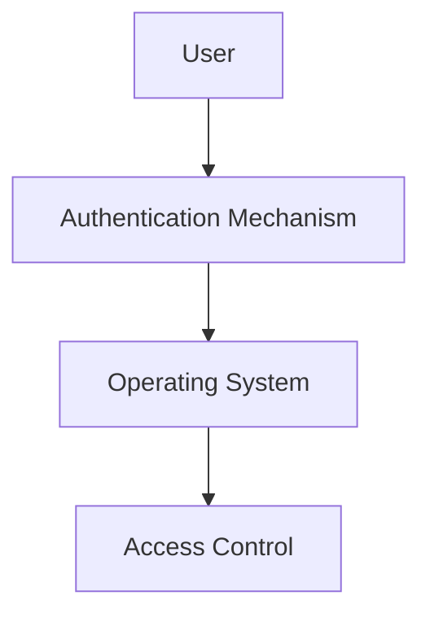

#### Authorization

Authorization is the process of granting or denying access to resources based on the user's identity and permissions. Operating systems provide mechanisms such as access control lists (ACLs) and role-based access control (RBAC) to manage user permissions and restrict access to sensitive resources.

**Example:**
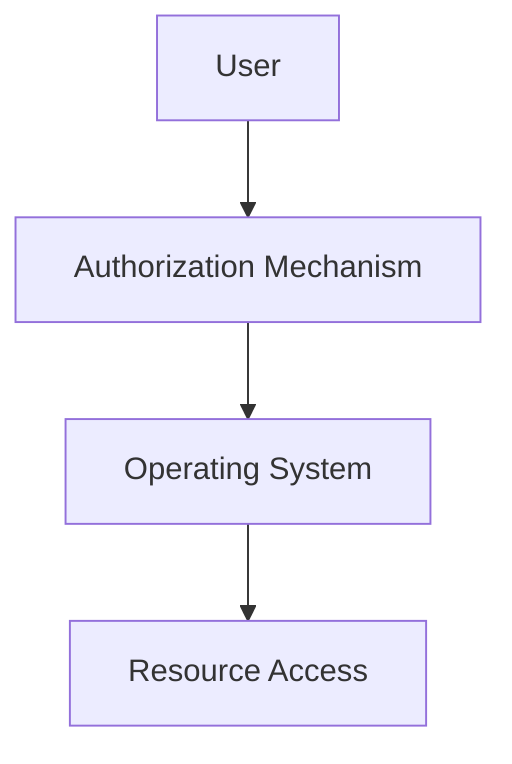

#### Encryption

Encryption is the process of converting data into a secure format that can only be decrypted with a key. Operating systems provide mechanisms such as symmetric and asymmetric encryption to protect data at rest and in transit.

**Example:**
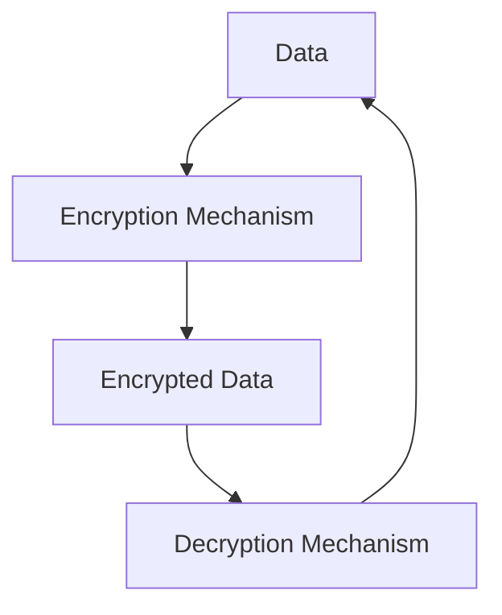

### Recent Real-World Examples

#### CVE-2021-44228 (Log4Shell)

CVE-2021-44228, also known as Log4Shell, is a critical vulnerability in the Apache Log4j library that affects many operating systems and applications. This vulnerability allows attackers to execute arbitrary code on affected systems, leading to remote code execution and potential data breaches.

**Example:**
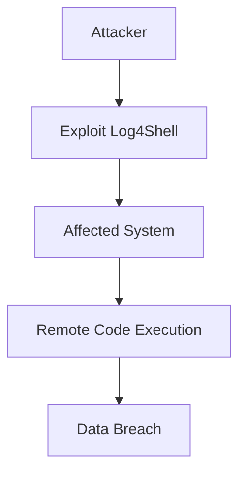

#### How to Prevent/Defend

To prevent and defend against vulnerabilities such as Log4Shell, organizations should implement the following measures:

1. **Patch Management**: Regularly update and patch operating systems and applications to address known vulnerabilities.
2. **Intrusion Detection**: Implement intrusion detection systems (IDS) to monitor for suspicious activity and alert administrators of potential threats.
3. **Secure Configuration**: Harden operating system configurations by disabling unnecessary services, enforcing strong authentication mechanisms, and restricting access to sensitive resources.
4. **Regular Audits**: Conduct regular security audits and penetration testing to identify and mitigate vulnerabilities.

**Example:**
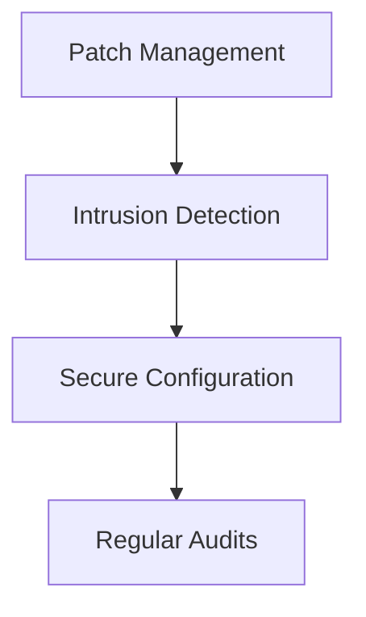

### Conclusion

Operating systems play a vital role in managing hardware interactions and providing a seamless interface for users and applications. By understanding the key features and security considerations of operating systems, organizations can ensure the efficient and secure operation of their systems.

### Practice Labs

For hands-on experience with operating systems, consider the following practice labs:

- **PortSwigger Web Security Academy**: Focuses on web application security but includes modules on operating system fundamentals.
- **OWASP Juice Shop**: A deliberately insecure web application for practicing web security skills.
- **DVWA (Damn Vulnerable Web Application)**: A PHP/MySQL web application that contains numerous security vulnerabilities.
- **WebGoat**: An interactive training application designed to teach web application security.

By engaging with these labs, you can gain practical experience in managing and securing operating systems.

---
<!-- nav -->
[[05-Introduction to Operating Systems and Their Role in Managing Hardware Interaction|Introduction to Operating Systems and Their Role in Managing Hardware Interaction]] | [[DevOps/DevOps Bootcamp/11-Miscellaneous/12-How Operating Systems Manage Hardware Interaction/00-Overview|Overview]] | [[07-Introduction to Processes and Process Management|Introduction to Processes and Process Management]]
