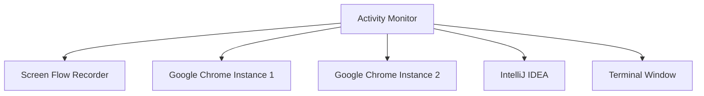
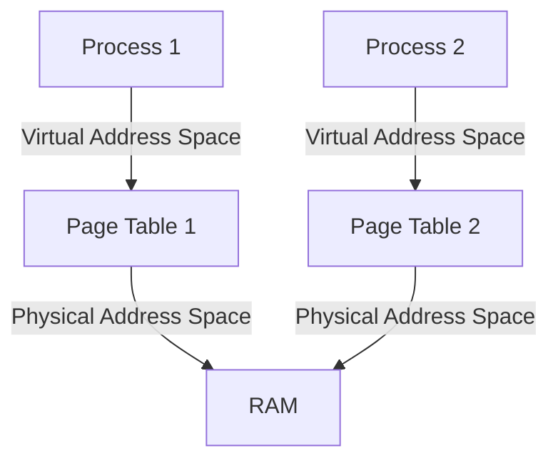
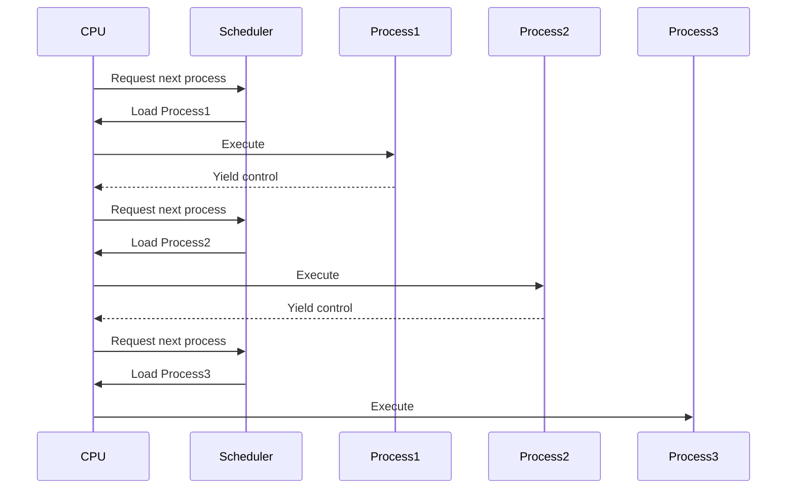
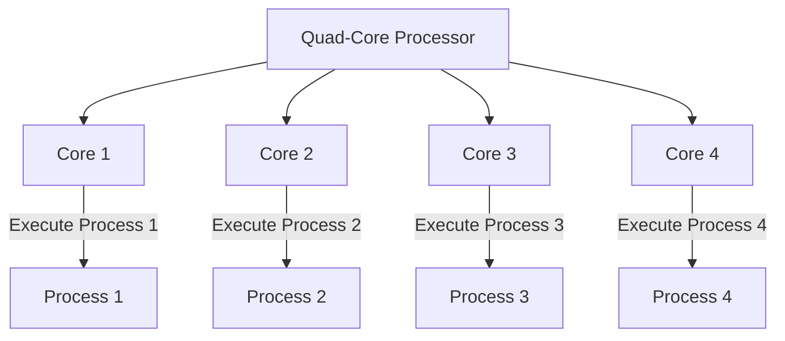
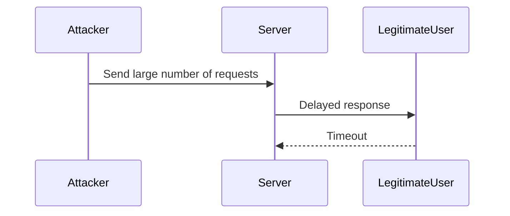
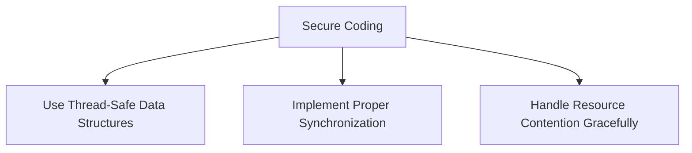

## Introduction to Processes and Process Management

### What is a Process?

A **process** is a fundamental concept in operating systems, representing an instance of a program being executed. It is a small unit that runs on a computer, such as a new browser tab, starting IntelliJ IDEA, or opening a new terminal window. Each process has its own isolated space to execute, ensuring that it does not interfere with the execution of other processes. This isolation is crucial for maintaining system stability and security.

#### Example: Activity Monitor on macOS

Consider the Activity Monitor on macOS, which displays various processes running on a computer. These might include the Screen Flow Recorder, multiple instances of Google Chrome, and other applications. Each process has its own share of CPU allocated to it, allowing the operating system to manage resource allocation effectively.

### Isolation of Processes

Each process operates within its own isolated memory space, preventing direct interference between processes. This isolation ensures that if one process crashes, it does not affect others, thereby maintaining system stability.

#### Memory Isolation

Memory isolation is achieved through virtual memory management. Each process has its own virtual address space, which is mapped to physical memory by the operating system. This mapping is done using page tables, which translate virtual addresses to physical addresses.

### CPU Allocation and Scheduling

The CPU is responsible for executing instructions of processes. In a single-CPU system, the CPU can process only one task at a time. However, modern operating systems use scheduling algorithms to switch between processes rapidly, creating the illusion of parallel processing.

#### Time-Slicing and Context Switching

Time-slicing is a technique where the CPU allocates a small amount of time (time slice) to each process before switching to another process. This is managed by the operating system's scheduler. Context switching is the process of saving the state of the current process and loading the state of the next process.

### Multi-Core Processors

With the advent of multi-core processors, modern computers can execute multiple processes simultaneously. Dual-core processors have two CPUs, and quad-core processors have four CPUs. This allows for true parallel processing, significantly improving performance.

#### Example: Quad-Core Processor

A quad-core processor can run four processes simultaneously, each on a separate core. This parallelism is particularly beneficial for tasks that can be divided into smaller, independent units, such as video rendering or data analysis.

### Real-World Examples and Recent Developments

#### Real-World Example: Performance Improvement with Multi-Core Processors

Modern applications, such as video editing software like Adobe Premiere Pro, benefit greatly from multi-core processors. These applications can offload tasks to different cores, improving overall performance and reducing processing time.

#### Recent Developments: ARM-based Processors

Recent advancements in ARM-based processors, such as those used in Apple's M1 chip, have brought significant improvements in energy efficiency and performance. These processors support multiple cores and can handle complex tasks efficiently.

### Pitfalls and Security Concerns

#### Resource Contention

Resource contention occurs when multiple processes compete for limited resources, such as CPU time or memory. This can lead to performance degradation and potential security vulnerabilities.

#### Example: Denial of Service (DoS)

An attacker can exploit resource contention by launching a DoS attack, overwhelming the system with requests and causing legitimate processes to fail.

### How to Prevent / Defend

#### Detection

Monitor system performance and resource usage to detect anomalies indicative of a DoS attack. Tools like `top`, `htop`, and `vmstat` can help identify resource-intensive processes.

#### Prevention

Implement rate limiting and traffic filtering to prevent overwhelming the system. Use firewalls and intrusion detection systems (IDS) to block malicious traffic.

#### Secure Coding Practices

Ensure that applications are designed to handle resource contention gracefully. Use thread-safe data structures and implement proper synchronization mechanisms.

### Conclusion

Understanding how operating systems manage hardware interaction through processes is crucial for effective system design and security. By leveraging multi-core processors and implementing robust security measures, developers can create efficient and secure applications.

### Practice Labs

For hands-on experience with process management and security, consider the following labs:

- **PortSwigger Web Security Academy**: Focuses on web application security, including process management and resource contention.
- **OWASP Juice Shop**: Provides a vulnerable web application for practicing security techniques.
- **DVWA (Damn Vulnerable Web Application)**: Offers a range of security vulnerabilities for learning and testing.

These labs provide practical experience in managing processes and securing systems against attacks.

---
<!-- nav -->
[[06-Introduction to Operating Systems|Introduction to Operating Systems]] | [[DevOps/DevOps Bootcamp/11-Miscellaneous/12-How Operating Systems Manage Hardware Interaction/00-Overview|Overview]] | [[08-What is an Operating System|What is an Operating System]]
