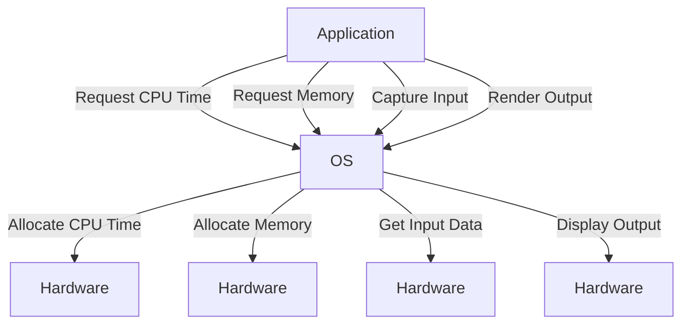

## What is an Operating System?

An operating system (OS) is a critical piece of software that manages and controls computer hardware and software resources, providing common services for computer programs. It acts as a bridge between the hardware and the software, enabling users and applications to interact with the underlying hardware efficiently and securely. Without an OS, direct interaction with hardware would be complex and error-prone, requiring specialized knowledge and code for each hardware component.

### Background Theory

The concept of an operating system emerged as computers became more complex and required standardized ways to manage hardware resources. Early computers had limited capabilities and were programmed directly using machine language. As computing evolved, the need for abstraction and resource management grew, leading to the development of operating systems.

#### Key Components of an Operating System

1. **Kernel**: The core of the operating system responsible for managing hardware resources and providing low-level services to other parts of the OS.
2. **System Libraries**: Precompiled code that provides standard functions and services to applications.
3. **User Interface**: The means through which users interact with the OS, including command-line interfaces (CLI) and graphical user interfaces (GUI).

### Example: Google Chrome Browser

Consider the example of the Google Chrome browser. When you run Chrome, it needs to interact with various hardware components such as the CPU, memory, storage, input devices (mouse, keyboard), and output devices (screen). However, Chrome itself does not contain the code necessary to communicate directly with these hardware components. Instead, it relies on the operating system to handle these interactions.

#### How Does Chrome Interact with Hardware?

When you open Chrome and navigate to a website, the following steps occur:

1. **CPU and Memory Allocation**: The OS allocates CPU time and memory to Chrome.
2. **Input Handling**: The OS captures input from the mouse and keyboard and passes it to Chrome.
3. **Output Display**: The OS handles rendering the webpage on the screen.

### Why Is an Operating System Necessary?

Without an OS, each application would need to include code to interact directly with every hardware component. This approach would be highly inefficient and impractical for several reasons:

1. **Redundancy**: Each application would need to implement similar functionality, leading to redundant code.
2. **Complexity**: Direct hardware interaction requires specialized knowledge and can be error-prone.
3. **Security**: Managing hardware resources securely is challenging without a centralized system.

### How Does the Operating System Act as an Intermediary?

The operating system acts as an intermediary by providing a layer of abstraction between the hardware and the applications. This abstraction allows applications to request resources and perform tasks without needing to understand the underlying hardware details.

#### Example Code: Requesting Resources

Here’s a simplified example of how an application might request resources from the OS:

```python
# Python pseudo-code for requesting resources
def request_resources():
    # Request CPU time from the OS
    cpu_time = os.request_cpu_time(10)
    
    # Allocate memory from the OS
    memory = os.allocate_memory(1024)
    
    # Capture input from the mouse and keyboard
    input_data = os.capture_input()
    
    # Render output on the screen
    os.render_output("Hello, World!")

request_resources()
```

### Mermaid Diagram: Resource Management

A mermaid diagram can help visualize how the OS manages resources:



### Real-World Examples and Recent CVEs

Operating systems play a crucial role in securing hardware interactions. Vulnerabilities in OS resource management can lead to serious security issues. For example, the Heartbleed bug (CVE-2014-0160) affected OpenSSL, a widely used cryptographic library. This vulnerability allowed attackers to read sensitive information from the memory of servers and clients.

#### Secure Coding Practices

To prevent such vulnerabilities, secure coding practices are essential. Here’s an example of a vulnerable code snippet and its secure counterpart:

**Vulnerable Code:**

```c
#include <stdio.h>
#include <string.h>

void insecure_function(char *input) {
    char buffer[10];
    strcpy(buffer, input);
}

int main() {
    char input[] = "This is a very long string that will overflow the buffer";
    insecure_function(input);
    return 0;
}
```

**Secure Code:**

```c
#include <stdio.h>
#include <string.h>

void secure_function(char *input) {
    char buffer[10];
    strncpy(buffer, input, sizeof(buffer) - 1);
    buffer[sizeof(buffer) - 1] = '\0';
}

int main() {
    char input[] = "This is a very long string that will overflow the buffer";
    secure_function(input);
    return  0;
}
```

### How to Prevent / Defend

#### Detection

Regularly update the operating system and its components to patch known vulnerabilities. Use tools like vulnerability scanners to identify potential weaknesses.

#### Prevention

Implement secure coding practices and conduct regular security audits. Harden the OS configuration to minimize attack surfaces.

#### Secure-Coding Fixes

Compare the vulnerable and secure versions of code to understand the differences and apply similar principles to other parts of the application.

### Complete Example: Full HTTP Request and Response

Consider a scenario where a web application interacts with the OS to handle HTTP requests and responses.

**HTTP Request:**

```http
POST /api/data HTTP/1.1
Host: example.com
Content-Type: application/json
Content-Length: 31

{
  "key": "value"
}
```

**HTTP Response:**

```http
HTTP/1.1 200 OK
Date: Mon, 27 Jul 2021 12:28:53 GMT
Server: Apache/2.4.41 (Ubuntu)
Content-Length: 17
Content-Type: application/json

{
  "status": "success"
}
```

### Pitfalls and Common Mistakes

1. **Insecure Configuration**: Failing to properly configure the OS can expose vulnerabilities.
2. **Insufficient Permissions**: Running applications with elevated permissions unnecessarily can lead to security risks.
3. **Outdated Software**: Using outdated OS versions can leave systems vulnerable to known exploits.

### Hands-On Labs

For practical experience with operating systems and their interactions with hardware, consider the following labs:

- **PortSwigger Web Security Academy**: Focuses on web application security but includes modules on OS-level attacks.
- **OWASP Juice Shop**: A deliberately insecure web application for learning about security vulnerabilities.
- **DVWA (Damn Vulnerable Web Application)**: Another intentionally flawed web app for security training.

These labs provide real-world scenarios and challenges to deepen your understanding of operating systems and their role in securing hardware interactions.

By thoroughly understanding the role of an operating system in managing hardware interactions, you can build more secure and efficient applications.

---
<!-- nav -->
[[07-Introduction to Processes and Process Management|Introduction to Processes and Process Management]] | [[DevOps/DevOps Bootcamp/11-Miscellaneous/12-How Operating Systems Manage Hardware Interaction/00-Overview|Overview]] | [[09-InputOutput Devices|InputOutput Devices]]
