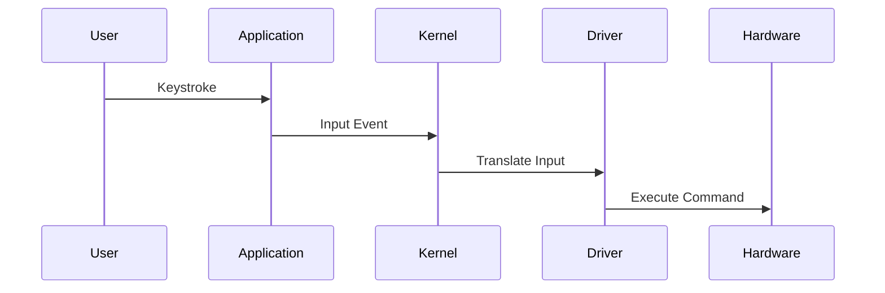

## Input/Output Devices

### Background Theory

Input/Output (I/O) devices are essential for user interaction and data transfer. These include monitors, keyboards, mice, trackpads, printers, USB drives, and external hard drives. The OS manages these devices by translating user inputs and outputs into commands that the hardware can understand.

### How I/O Devices Work

1. **Device Drivers**: These are software components that enable communication between the OS and the hardware. Each device type requires a specific driver.

2. **User Interaction**: The OS translates user inputs (e.g., keystrokes, mouse clicks) into actions that applications can process.

3. **Data Transfer**: For devices like USB drives, the OS manages read/write operations, ensuring data integrity and consistency.

### Real-World Example: CVE-2021-40459

This vulnerability affects the USB subsystem in Linux kernels. An attacker could exploit this to execute arbitrary code with kernel privileges.



### Pitfalls and Detection

Improper handling of I/O devices can lead to data corruption or unauthorized access. Tools like `dmesg` (Linux) and `Event Viewer` (Windows) can help detect issues.

### How to Prevent / Defend

1. **Secure Coding Practices**:
    - Validate all inputs before processing.
    - Use secure libraries for I/O operations.

    ```c
    // Vulnerable Code
    char buffer[10];
    scanf("%s", buffer);

    // Secure Code
    char buffer[10];
    fgets(buffer, sizeof(buffer), stdin);
    ```

2. **Hardening Configuration**:
    - Disable unnecessary USB ports.
    - Use USB security policies.

    ```bash
    # USB Security Policy Example
    echo "blacklist usb-storage" > /etc/modprobe.d/blacklist.conf
    ```

---
<!-- nav -->
[[08-What is an Operating System|What is an Operating System]] | [[DevOps/DevOps Bootcamp/11-Miscellaneous/12-How Operating Systems Manage Hardware Interaction/00-Overview|Overview]] | [[10-Kernel|Kernel]]
