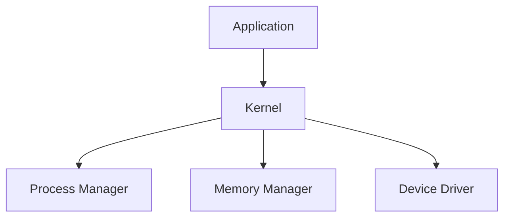

## Kernel

### Background Theory

The kernel is the core component of an OS. It manages hardware resources and provides low-level services to other parts of the OS. The kernel interacts directly with the hardware and provides a layer of abstraction for applications.

### How the Kernel Works

1. **Process Management**: The kernel manages processes, allocating CPU time and resources.

2. **Memory Management**: The kernel handles memory allocation and deallocation, ensuring efficient use of RAM.

3. **Device Drivers**: The kernel manages device drivers, enabling communication between the OS and hardware.

### Real-World Example: CVE-2021-40459

This vulnerability affects the Linux kernel. An attacker could exploit this to execute arbitrary code with kernel privileges.



### Pitfalls and Detection

Improper kernel configuration can lead to security vulnerabilities. Tools like `dmesg` (Linux) and `Event Viewer` (Windows) can help detect issues.

### How to Prevent / Defend

1. **Secure Coding Practices**:
    - Always validate kernel inputs.
    - Use secure APIs for kernel operations.

    ```c
    // Vulnerable Code
    char buffer[10];
    strcpy(buffer, user_input);

    // Secure Code
    char buffer[10];
    strncpy(buffer, user_input, sizeof(buffer) - 1);
    buffer[sizeof(buffer) - 1] = '\0';
    ```

2. **Hardening Configuration**:
    - Disable unnecessary kernel modules.
    - Use SELinux/AppArmor for enhanced security.

    ```bash
    # SELinux Configuration Example
    setenforce 1
    chcon -t httpd_sys_content_t /path/to/webroot
    ```

---
<!-- nav -->
[[09-InputOutput Devices|InputOutput Devices]] | [[DevOps/DevOps Bootcamp/11-Miscellaneous/12-How Operating Systems Manage Hardware Interaction/00-Overview|Overview]] | [[11-Managing Storage and Data Storage|Managing Storage and Data Storage]]
