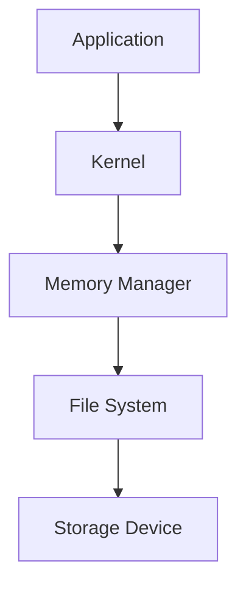

## Managing Storage and Data Storage

### Background Theory

An operating system (OS) plays a critical role in managing storage and ensuring efficient data handling. This includes both internal storage mechanisms such as hard drives and SSDs, as well as external storage devices like USB drives and external hard drives. The OS abstracts the complexities of storage management, providing a unified interface for applications to interact with the underlying hardware.

### How Data Storage Works

The OS manages storage through a hierarchical structure:

1. **File System**: This is the method used to store and organize files on a disk. Common file systems include NTFS (Windows), HFS+ (macOS), and ext4 (Linux).

2. **Disk Management**: The OS handles partitioning, formatting, and mounting of disks. This ensures that different parts of the disk can be used independently and efficiently.

3. **Cache Management**: To improve performance, the OS uses caching techniques to store frequently accessed data in faster memory (like RAM).

### Real-World Example: CVE-2021-34527

This vulnerability affects the way Windows handles objects in memory. An attacker could exploit this vulnerability by running a specially crafted application, which could lead to arbitrary code execution.



### Pitfalls and Detection

One common pitfall is improper handling of file permissions, leading to unauthorized access. Tools like `ls -l` (Linux) and `icacls` (Windows) can help check and enforce proper permissions.

### How to Prevent / Defend

1. **Secure Coding Practices**:
    - Always validate input and output.
    - Use secure APIs for file operations.

    ```python
    # Vulnerable Code
    with open(user_input, 'r') as f:
        data = f.read()

    # Secure Code
    import os
    if os.path.isfile(user_input):
        with open(user_input, 'r') as f:
            data = f.read()
    else:
        raise FileNotFoundError("Invalid file path")
    ```

2. **Hardening Configuration**:
    - Disable unnecessary services.
    - Use SELinux/AppArmor for enhanced security.

    ```bash
    # SELinux Configuration Example
    setenforce 1
    chcon -t httpd_sys_content_t /path/to/webroot
    ```

---
<!-- nav -->
[[10-Kernel|Kernel]] | [[DevOps/DevOps Bootcamp/11-Miscellaneous/12-How Operating Systems Manage Hardware Interaction/00-Overview|Overview]] | [[12-Memory Management in Operating Systems|Memory Management in Operating Systems]]
