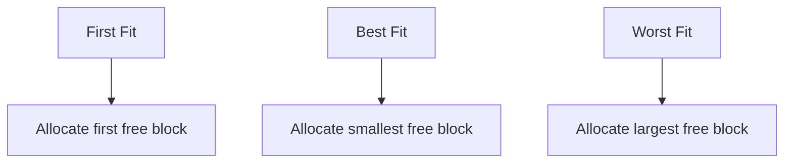
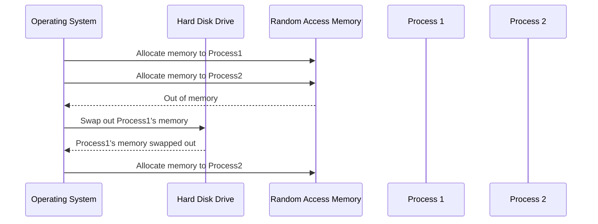
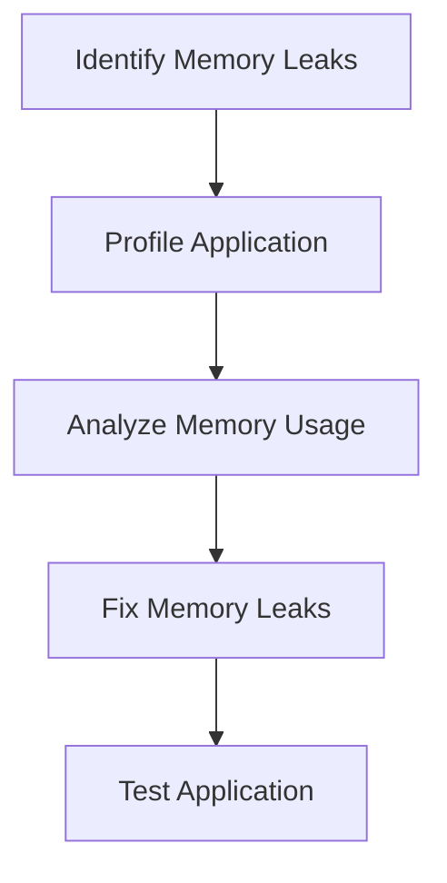

## Memory Management in Operating Systems

### Introduction to Memory Management

Memory management is a fundamental aspect of operating systems, responsible for allocating and deallocating memory to various processes running on a computer. This process ensures that each application has the necessary resources to function correctly. The primary type of memory used for this purpose is Random Access Memory (RAM), which is also referred to as working memory or rapid access memory (REM).

### Understanding RAM and Its Limitations

RAM is a volatile memory type, meaning that it loses its contents when the power is turned off. It is characterized by fast read and write speeds, making it ideal for storing data that needs to be accessed quickly during program execution. However, RAM has a finite capacity, and the amount of available memory can vary depending on the hardware configuration of the computer.

#### Example: RAM Capacity

Consider a typical modern laptop with 16 GB of RAM. This amount of memory is sufficient for most general-purpose computing tasks, such as running a web browser, word processor, and other productivity applications. However, if the user runs resource-intensive applications like video editing software or large-scale simulations, the available RAM might be insufficient.

### Memory Allocation and Deallocation

When a process starts, the operating system allocates a portion of the available RAM to that process. This allocation ensures that the process has the necessary memory to store its data and instructions. The operating system manages this allocation using various algorithms, such as First Fit, Best Fit, and Worst Fit.

#### Example: Memory Allocation Algorithms



### Memory Swapping

When the total memory requirements of all running processes exceed the available RAM, the operating system employs a technique called memory swapping. Memory swapping involves moving less frequently used data from RAM to a secondary storage device, typically a hard disk drive (HDD) or solid-state drive (SSD). This process frees up space in RAM for more critical processes.

#### Example: Memory Swapping Process



### Impact of Memory Swapping

While memory swapping allows the system to continue functioning even when RAM is exhausted, it comes at a cost. Swapping data between RAM and secondary storage is significantly slower than accessing data directly from RAM. This slowdown can result in reduced overall system performance, especially if frequent swapping occurs.

#### Real-World Example: Memory Swapping in Action

Consider a scenario where a user has multiple applications open, including a web browser, email client, and a video editing software. If the combined memory usage of these applications exceeds the available RAM, the operating system will start swapping out less frequently used data from the web browser and email client to make room for the video editing software. This swapping process can cause noticeable delays and reduced responsiveness in the affected applications.

### Detection and Prevention of Memory Swapping Issues

To mitigate the negative effects of memory swapping, it is essential to monitor and manage memory usage effectively. Here are some strategies to prevent excessive memory swapping:

#### Monitoring Memory Usage

Use tools like `top`, `htop`, or `vmstat` to monitor memory usage in real-time. These tools provide insights into which processes are consuming the most memory and help identify potential bottlenecks.

```bash
top
```

#### Increasing Physical Memory

One straightforward solution to reduce memory swapping is to increase the physical RAM installed on the computer. This approach is particularly effective for systems running resource-intensive applications.

#### Optimizing Application Performance

Optimize applications to reduce their memory footprint. This can involve profiling the application to identify memory leaks or inefficient memory usage patterns and implementing fixes.

#### Example: Secure Coding Practices to Reduce Memory Leaks



#### Code Example: Detecting and Fixing Memory Leaks

```python
# Vulnerable code
def allocate_memory():
    data = [i for i in range(1000000)]
    return data

# Secure code
import gc

def allocate_memory_secure():
    data = [i for i in range(1000000)]
    del data
    gc.collect()
    return None
```

### Hands-On Labs for Memory Management

For practical experience with memory management, consider the following labs:

- **PortSwigger Web Security Academy**: Offers exercises related to web application security, including memory management in web servers.
- **OWASP Juice Shop**: Provides a vulnerable web application for practicing secure coding and memory management techniques.
- **DVWA (Damn Vulnerable Web Application)**: Another web application for learning about web security, including memory management issues.

By thoroughly understanding and managing memory allocation and swapping, you can ensure optimal performance and reliability of your applications and systems.

### Conclusion

Memory management is a critical aspect of operating systems, ensuring that each process has the necessary resources to function correctly. By understanding the principles of memory allocation, deallocation, and swapping, you can optimize system performance and prevent issues caused by excessive memory usage. Through monitoring, optimization, and secure coding practices, you can effectively manage memory and maintain efficient system operation.

---
<!-- nav -->
[[11-Managing Storage and Data Storage|Managing Storage and Data Storage]] | [[DevOps/DevOps Bootcamp/11-Miscellaneous/12-How Operating Systems Manage Hardware Interaction/00-Overview|Overview]] | [[13-Security and Networking|Security and Networking]]
