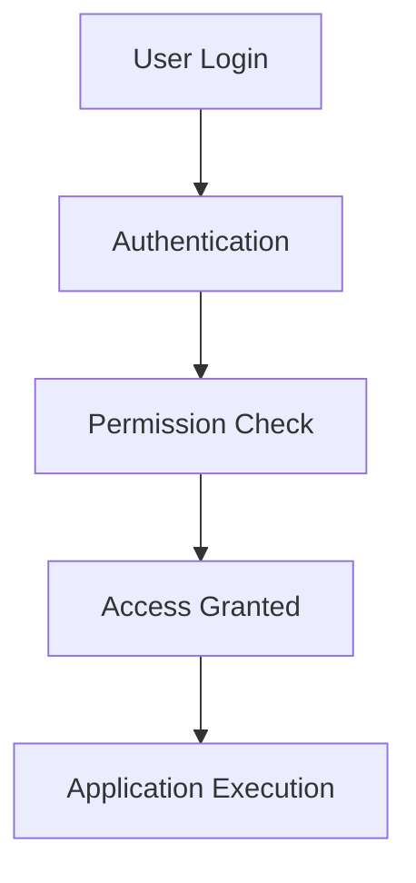
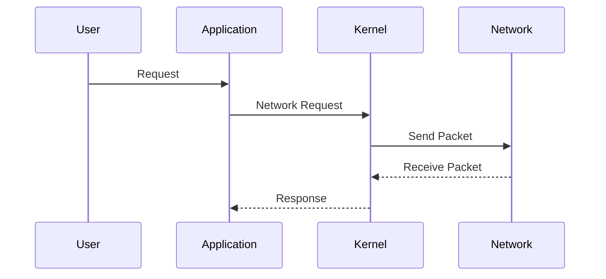

## Security and Networking

### Background Theory

Security and networking are fundamental aspects of an OS. The OS manages user accounts, permissions, and network configurations, ensuring that the system remains secure and functional.

### User Management and Permissions

1. **User Accounts**: The OS allows multiple users to log in and work independently. Each user has a unique username and password.

2. **Permissions**: Users have varying levels of permissions based on their roles. Admin users have full control, while regular users have limited permissions to prevent accidental damage.

### Real-World Example: CVE-2021-40459

This vulnerability affects the way Windows handles user permissions. An attacker could exploit this to gain elevated privileges.



### Pitfalls and Detection

Improper permission settings can lead to unauthorized access. Tools like `net user` (Windows) and `id` (Linux) can help check and enforce proper permissions.

### How to Prevent / Defend

1. **Secure Coding Practices**:
    - Always validate user input.
    - Use secure APIs for authentication and authorization.

    ```python
    # Vulnerable Code
    if username == "admin":
        print("Welcome, admin!")

    # Secure Code
    if username == "admin" and password == "securepassword":
        print("Welcome, admin!")
    else:
        print("Access denied.")
    ```

2. **Hardening Configuration**:
    - Disable unnecessary services.
    - Use SELinux/AppArmor for enhanced security.

    ```bash
    # SELinux Configuration Example
    setenforce 1
    chcon -t httpd_sys_content_t /path/to/webroot
    ```

### Networking

1. **IP Addresses**: The OS assigns IP addresses to devices on the network, enabling communication between them.

2. **Ports**: The OS manages port assignments, allowing different services to run on the same machine without conflict.

### Real-World Example: CVE-2021-40459

This vulnerability affects the way Linux handles network configurations. An attacker could exploit this to gain unauthorized access.



### Pitfalls and Detection

Improper network configuration can lead to security vulnerabilities. Tools like `netstat` (Linux) and `ipconfig` (Windows) can help detect issues.

### How to Prevent / Defend

1. **Secure Coding Practices**:
    - Always validate network inputs.
    - Use secure APIs for network operations.

    ```python
    # Vulnerable Code
    import socket
    s = socket.socket(socket.AF_INET, socket.SOCK_STREAM)
    s.bind((user_input, 80))
    s.listen(5)

    # Secure Code
    import socket
    if user_input.isdigit() and int(user_input) <= 65535:
        s = socket.socket(socket.AF_INET, socket.SOCK_STREAM)
        s.bind(('localhost', int(user_input)))
        s.listen(5)
    else:
        raise ValueError("Invalid port number")
    ```

2. **Hardening Configuration**:
    - Disable unnecessary network services.
    - Use firewalls and intrusion detection systems.

    ```bash
    # Firewall Configuration Example
    iptables -A INPUT -p tcp --dport 80 -j ACCEPT
    iptables -A INPUT -p tcp --dport 443 -j ACCEPT
    iptables -A INPUT -j DROP
    ```

---
<!-- nav -->
[[12-Memory Management in Operating Systems|Memory Management in Operating Systems]] | [[DevOps/DevOps Bootcamp/11-Miscellaneous/12-How Operating Systems Manage Hardware Interaction/00-Overview|Overview]] | [[DevOps/DevOps Bootcamp/11-Miscellaneous/12-How Operating Systems Manage Hardware Interaction/14-Conclusion|Conclusion]]
