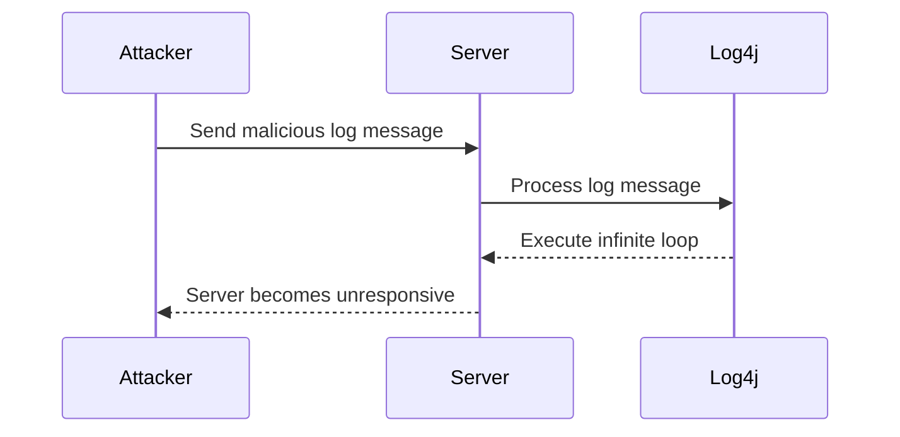

## Introduction to Loops for Continuous Program Execution

In the realm of programming, loops are fundamental constructs used to repeatedly execute a block of code until a certain condition is met. One of the most commonly used types of loops is the `while` loop, which continues to execute as long as a specified condition remains true. This chapter delves deep into the implementation and usage of `while` loops in Python, focusing on their role in continuous program execution.

### Understanding the `while` Loop

The `while` loop is a control flow statement that allows code to be executed repeatedly based on a given boolean condition. The general syntax of a `while` loop in Python is:

```python
while condition:
    # Code block to be executed
```

Here, `condition` is a boolean expression that is evaluated before each iteration of the loop. If the condition evaluates to `True`, the code block within the loop is executed. After executing the code block, the condition is re-evaluated, and the process repeats until the condition becomes `False`.

#### Example: Basic `while` Loop

Let's start with a simple example to illustrate the basic structure of a `while` loop:

```python
counter = 0
while counter < 5:
    print(f"Counter is {counter}")
    counter += 1
```

In this example, the loop will continue to execute as long as `counter` is less than 5. Each time through the loop, the value of `counter` is printed, and then incremented by 1. Once `counter` reaches 5, the condition `counter < 5` becomes `False`, and the loop terminates.

### Infinite Loops Using `while True`

One common use case for `while` loops is creating infinite loops. An infinite loop is a loop that continues to execute indefinitely unless explicitly broken out of using a `break` statement or some other mechanism.

In Python, an infinite loop can be created by setting the condition to `True`. Since `True` is always `True`, the loop will continue to execute forever. Here’s how it looks:

```python
while True:
    print("This loop will run forever")
```

However, such a loop is generally not useful unless you have a way to break out of it. Typically, this is done using a `break` statement inside the loop. For example:

```python
while True:
    user_input = input("Enter 'quit' to exit: ")
    if user_input == 'quit':
        break
    print(f"You entered: {user_input}")
```

In this example, the loop will continue to prompt the user for input until the user enters 'quit'. At that point, the `break` statement is executed, and the loop terminates.

### Conditional Logic in `while` Loops

The condition in a `while` loop can be any boolean expression. This allows for complex logic to determine whether the loop should continue. For instance, you might want to loop until a specific condition is met, such as a user providing a valid input.

#### Example: Validating User Input

Consider a scenario where you want to ensure that the user provides a positive integer. You can use a `while` loop to keep prompting the user until they provide a valid input:

```python
while True:
    user_input = input("Please enter a positive integer: ")
    if user_input.isdigit() and int(user_input) > 0:
        print(f"You entered a valid positive integer: {user_input}")
        break
    else:
        print("Invalid input. Please try again.")
```

In this example, the loop continues to prompt the user for input until they provide a positive integer. The `isdigit()` method checks if the input consists only of digits, and `int(user_input) > 0` ensures that the number is positive.

### Common Pitfalls and Best Practices

While `while` loops are powerful, they can also lead to common pitfalls if not used carefully. Some of the most common issues include:

1. **Infinite Loops**: If the condition never becomes `False`, the loop will run indefinitely. Always ensure there is a way to break out of the loop.
2. **Off-by-One Errors**: Be careful with conditions involving counters or indices. Off-by-one errors can cause unexpected behavior.
3. **Complex Conditions**: Avoid overly complex conditions in the loop. Break down complex logic into simpler steps if necessary.

#### How to Prevent / Defend Against Infinite Loops

To prevent infinite loops, ensure that there is a mechanism to break out of the loop. This can be done using a `break` statement, a `return` statement, or by modifying the condition in such a way that it eventually becomes `False`.

For example, consider a loop that reads data from a file until the end of the file is reached:

```python
with open('data.txt', 'r') as file:
    while True:
        line = file.readline()
        if not line:
            break
        print(line.strip())
```

In this example, the loop continues to read lines from the file until the end of the file is reached (`file.readline()` returns an empty string). The `break` statement ensures that the loop terminates when the end of the file is reached.

### Real-World Examples and Security Implications

Loops, especially infinite loops, can have significant security implications if not handled properly. For example, a poorly designed loop can lead to denial-of-service (DoS) attacks, where an attacker can cause a program to consume excessive resources, leading to system instability.

#### Example: CVE-2021-3186 (Apache Log4j)

In December 2021, a critical vulnerability was discovered in Apache Log4j, a widely used logging library. The vulnerability, known as CVE-2021-44228, allowed attackers to execute arbitrary code on affected systems. One of the ways this vulnerability could be exploited involved an infinite loop in the logging mechanism, causing the server to become unresponsive.



In this example, the attacker sends a malicious log message to the server, which is processed by Log4j. Due to the vulnerability, Log4j executes an infinite loop, causing the server to become unresponsive.

### Secure Coding Practices

To prevent such vulnerabilities, it is crucial to follow secure coding practices. This includes:

1. **Input Validation**: Always validate user input to ensure it meets the expected format and constraints.
2. **Resource Management**: Ensure that loops do not consume excessive resources. Use timeouts and limits to prevent infinite loops.
3. **Error Handling**: Implement proper error handling to gracefully handle unexpected conditions.

#### Example: Secure Input Validation

Here’s an example of how to securely validate user input to prevent infinite loops:

```python
def get_positive_integer():
    while True:
        user_input = input("Please enter a positive integer: ")
        if user_input.isdigit() and int(user_input) > 0:
            return int(user_input)
        else:
            print("Invalid input. Please try again.")

# Usage
positive_integer = get_positive_integer()
print(f"You entered a valid positive integer: {positive_integer}")
```

In this example, the function `get_positive_integer` ensures that the user provides a valid positive integer before returning it. This prevents the possibility of an infinite loop due to invalid input.

### Conclusion

Loops, particularly `while` loops, are essential constructs in programming that allow for repeated execution of code based on a condition. While they offer great flexibility, they also come with potential pitfalls, especially when it comes to infinite loops. By following best practices and secure coding guidelines, you can effectively use `while` loops to create robust and secure programs.

### Practice Labs

For hands-on practice with loops and secure coding practices, consider the following labs:

- **PortSwigger Web Security Academy**: Offers interactive labs on various web security topics, including secure coding practices.
- **OWASP Juice Shop**: A deliberately insecure web application for security training, which includes scenarios where loops and input validation play a crucial role.
- **DVWA (Damn Vulnerable Web Application)**: Another popular web application for security training, featuring various vulnerabilities that can be exploited through loops and improper input validation.

By engaging with these labs, you can gain practical experience in implementing and securing loops in real-world applications.

---
<!-- nav -->
[[DevOps/DevOps Bootcamp/11-Miscellaneous/13-Implementing Loops for Continuous Program Execution/00-Overview|Overview]] | [[02-Introduction to Loops in Programming|Introduction to Loops in Programming]]
