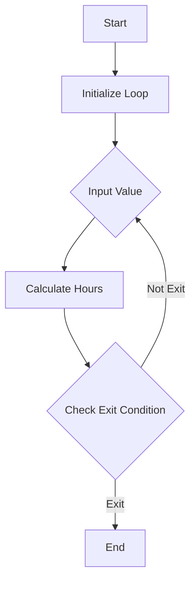

## Introduction to Loops in Programming

In programming, loops are essential constructs that allow a set of instructions to be executed repeatedly based on a specified condition. This repetition is crucial for automating tasks that would otherwise require manual intervention each time. In the context of our application, we currently face a limitation where the program can only handle one input at a time before exiting. To address this, we need to implement a loop that allows continuous execution, enabling users to perform multiple calculations without restarting the application.

### What Are Loops?

Loops are control structures used to repeat a section of code multiple times until a particular condition is met. There are several types of loops in most programming languages, including:

1. **For Loop**: Iterates a fixed number of times.
2. **While Loop**: Executes as long as a given condition is true.
3. **Do-While Loop**: Similar to a while loop but guarantees that the loop body is executed at least once.

### Why Use Loops?

Using loops is beneficial for several reasons:

1. **Efficiency**: Automates repetitive tasks, reducing the need for manual intervention.
2. **Flexibility**: Allows the program to adapt to varying conditions and requirements.
3. **Maintainability**: Simplifies the codebase by abstracting repetitive logic into a single construct.

### How Loops Work

The basic structure of a loop includes:

1. **Initialization**: Setting up initial values or conditions.
2. **Condition Check**: Evaluating whether the loop should continue.
3. **Loop Body**: The set of instructions to be executed.
4. **Update**: Modifying the loop variables to progress towards the termination condition.

### Example: Implementing a Loop in Python

Let's consider a simple Python program that calculates the number of hours based on user input. Initially, the program can only handle one input at a time:

```python
def calculate_hours(value):
    try:
        hours = int(value)
        print(f"The number of hours is {hours}")
    except ValueError:
        print("Invalid value provided")

value = input("Enter a value: ")
calculate_hours(value)
```

To enable continuous execution, we can modify this program using a `while` loop:

```python
def calculate_hours(value):
    try:
        hours = int(value)
        print(f"The number of hours is {hours}")
    except ValueError:
        print("Invalid value provided")

while True:
    value = input("Enter a value (type 'exit' to quit): ")
    if value.lower() == 'exit':
        break
    calculate_hours(value)
```

### Explanation of the Code

1. **Function Definition**: `calculate_hours(value)` handles the calculation and error checking.
2. **Loop Initialization**: `while True:` creates an infinite loop.
3. **User Input**: `value = input("Enter a value (type 'exit' to quit): ")` prompts the user for input.
4. **Exit Condition**: `if value.lower() == 'exit': break` checks if the user wants to exit the loop.
5. **Loop Body**: `calculate_hours(value)` executes the calculation function.

### Mermaid Diagram of the Loop Structure



### Real-World Examples and Applications

Loops are widely used in various applications, such as:

1. **Web Scraping**: Automating the extraction of data from websites.
2. **Data Processing**: Handling large datasets by iterating through records.
3. **Game Development**: Managing game states and player interactions.

### Common Pitfalls and Best Practices

#### Infinite Loops

One of the most common issues with loops is creating an infinite loop, which occurs when the termination condition is never met. This can lead to the program hanging indefinitely.

**Example of an Infinite Loop:**

```python
i = 0
while i < 10:
    print(i)
```

**How to Prevent Infinite Loops:**

1. **Ensure Termination Condition**: Always check that the loop will eventually terminate.
2. **Use Break Statements**: Provide a way to exit the loop explicitly.

**Corrected Example:**

```python
i = 0
while i < 10:
    print(i)
    i += 1
```

### Secure Coding Practices

When implementing loops, it's important to ensure that the code is secure and robust against potential vulnerabilities.

#### Buffer Overflow

Buffer overflow occurs when a loop writes more data than the allocated buffer can hold, leading to memory corruption.

**Example of Buffer Overflow:**

```c
#include <stdio.h>
#include <string.h>

int main() {
    char buffer[10];
    strcpy(buffer, "This is a very long string");
    printf("%s\n", buffer);
    return 0;
}
```

**How to Prevent Buffer Overflow:**

1. **Use Safe Functions**: Replace unsafe functions like `strcpy` with safer alternatives like `strncpy`.
2. **Validate Input Length**: Ensure that input does not exceed the buffer size.

**Secure Example:**

```c
#include <stdio.h>
#include <string.h>

int main() {
    char buffer[10];
    const char *input = "This is a very long string";
    strncpy(buffer, input, sizeof(buffer) - 1);
    buffer[sizeof(buffer) - 1] = '\0';
    printf("%s\n", buffer);
    return  0;
}
```

### Detection and Prevention

#### Detection

1. **Static Analysis Tools**: Use tools like SonarQube, Fortify, or Veracode to identify potential issues in the code.
2. **Dynamic Analysis Tools**: Employ tools like Valgrind or AddressSanitizer to detect runtime errors.

#### Prevention

1. **Code Reviews**: Regularly review code to catch potential issues early.
2. **Unit Testing**: Write comprehensive unit tests to validate the behavior of loops.

### Conclusion

Implementing loops is a fundamental aspect of programming that enables efficient and flexible automation. By understanding the concepts, structures, and best practices associated with loops, developers can create robust and secure applications. Continuously practicing and refining these skills will enhance your ability to write high-quality code.

### Hands-On Labs

For practical experience with loops and related concepts, consider the following labs:

- **PortSwigger Web Security Academy**: Offers exercises on web scraping and data processing.
- **OWASP Juice Shop**: Provides challenges involving data handling and processing.
- **DVWA (Damn Vulnerable Web Application)**: Includes scenarios for handling user inputs securely.

By engaging with these resources, you can deepen your understanding and proficiency in implementing loops effectively and securely.

---
<!-- nav -->
[[01-Introduction to Loops for Continuous Program Execution|Introduction to Loops for Continuous Program Execution]] | [[DevOps/DevOps Bootcamp/11-Miscellaneous/13-Implementing Loops for Continuous Program Execution/00-Overview|Overview]] | [[03-Implementing Loops for Continuous Program Execution|Implementing Loops for Continuous Program Execution]]
