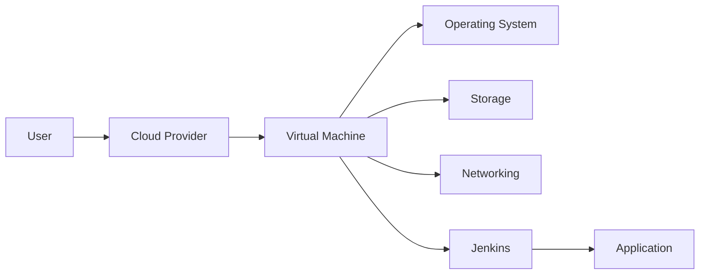

## Introduction to Infrastructure as a Service (IaaS)

Infrastructure as a Service (IaaS) is a foundational component of modern cloud computing, providing users with virtualized computing resources over the internet. This model allows organizations to rent IT infrastructure—servers, storage, networks, and operating systems—from a cloud provider rather than purchasing and maintaining physical hardware themselves. IaaS is particularly useful for DevOps teams, as it enables the rapid deployment and scaling of applications, which is crucial for agile development practices.

### What is IaaS?

To understand IaaS, consider a scenario where you and your team are developing a web application. Once the application is developed, it needs to run somewhere. Traditionally, this would involve purchasing physical servers, setting them up, connecting them to a network, and deploying the application on these servers. However, with IaaS, you can achieve the same result without the overhead of managing physical hardware.

#### Key Components of IaaS

1. **Virtual Machines (VMs)**: These are software-based representations of physical computers. They allow you to run multiple operating systems and applications on a single physical server.
2. **Storage**: Cloud providers offer scalable storage solutions that can be easily provisioned and managed.
3. **Networking**: IaaS includes services for creating and managing virtual networks, including firewalls, load balancers, and other network components.
4. **Operating Systems**: Users can choose from a variety of operating systems, including Linux distributions and Windows Server.

### Why Use IaaS?

Using IaaS offers several advantages:

1. **Scalability**: You can easily scale resources up or down based on demand.
2. **Cost Efficiency**: Pay-as-you-go pricing models reduce the need for large upfront investments in hardware.
3. **Flexibility**: You can quickly provision new environments for testing, development, or production.
4. **Maintenance**: Cloud providers handle the maintenance of the underlying infrastructure, freeing up your team to focus on core business activities.

### Example: Setting Up Jenkins on IaaS

Let's walk through an example of setting up Jenkins, a popular continuous integration and continuous delivery (CI/CD) tool, using IaaS.

#### Step-by-Step Process

1. **Choose a Cloud Provider**: Select a cloud provider such as Amazon Web Services (AWS), Microsoft Azure, or Google Cloud Platform (GCP).
2. **Provision a Virtual Machine**: Create a new VM instance with the desired specifications (CPU, memory, storage).
3. **Install Operating System**: Choose an appropriate operating system, such as Ubuntu or CentOS.
4. **Configure Networking**: Set up the necessary network configurations, including IP addresses, security groups, and firewalls.
5. **Install Jenkins**: Use package managers like `apt` or `yum` to install Jenkins on the VM.
6. **Deploy Application**: Deploy your application on the VM and configure Jenkins to integrate with your CI/CD pipeline.

#### Full Example with Code

```bash
# Step 1: Provision a VM on AWS
aws ec2 run-instances --image-id ami-0c94855ba95c71c99 --count 1 --instance-type t2.micro --key-name MyKeyPair --security-group-ids sg-0123456789abcdef0 --subnet-id subnet-0123456789abcdef0

# Step 2: SSH into the VM
ssh -i MyKeyPair.pem ubuntu@<public-ip>

# Step 3: Install Jenkins
sudo apt update
sudo apt install openjdk-11-jdk
wget -q -O - https://pkg.jenkins.io/debian/jenkins.io.key | sudo apt-key add -
sudo sh -c 'echo deb http://pkg.jenkins.io/debian-stable binary/ > /etc/apt/sources.list.d/jenkins.list'
sudo apt update
sudo apt install jenkins
```

### Diagram: IaaS Architecture



### Real-World Examples and Breaches

One notable breach involving IaaS was the Capital One data breach in 2019. Hackers exploited a misconfigured firewall rule on a server hosted on AWS, gaining unauthorized access to sensitive customer data. This highlights the importance of proper configuration and security practices when using IaaS.

### How to Prevent / Defend

#### Detection

1. **Monitoring**: Implement monitoring tools to detect unusual activity on your IaaS instances.
2. **Logging**: Enable detailed logging and regularly review logs for suspicious behavior.

#### Prevention

1. **Secure Configuration**: Follow best practices for securing your IaaS environment, including proper firewall rules and network segmentation.
2. **Regular Updates**: Keep your operating systems and applications up-to-date with the latest security patches.

#### Secure Coding Fixes

**Vulnerable Code**

```yaml
# Insecure IAM Policy
{
    "Version": "2012-10-17",
    "Statement": [
        {
            "Effect": "Allow",
            "Action": "*",
            "Resource": "*"
        }
    ]
}
```

**Fixed Code**

```yaml
# Secure IAM Policy
{
    "Version": "2012-10-17",
    "Statement": [
        {
            "Effect": "Allow",
            "Action": [
                "ec2:*",
                "s3:*"
            ],
            "Resource": "*"
        }
    ]
}
```

### Hands-On Labs

For practical experience with IaaS, consider the following labs:

- **PortSwigger Web Security Academy**: Offers hands-on labs for web application security.
- **OWASP Juice Shop**: A deliberately insecure web application for practicing web security skills.
- **DVWA (Damn Vulnerable Web Application)**: A PHP/MySQL web application that is riddled with vulnerabilities.

These labs provide a controlled environment to practice and learn about IaaS setup and management.

### Conclusion

Understanding and effectively utilizing IaaS is crucial for modern DevOps teams. By leveraging the scalability, flexibility, and cost efficiency of IaaS, organizations can streamline their development and deployment processes. Proper configuration and security practices are essential to prevent breaches and ensure the integrity of your IaaS environment.

---
<!-- nav -->
[[DevOps/DevOps Bootcamp/11-Miscellaneous/14-Infrastructure As A Service Setup And Management/00-Overview|Overview]] | [[DevOps/DevOps Bootcamp/11-Miscellaneous/14-Infrastructure As A Service Setup And Management/02-Practice Questions & Answers|Practice Questions & Answers]]
