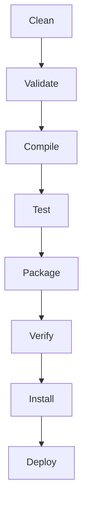
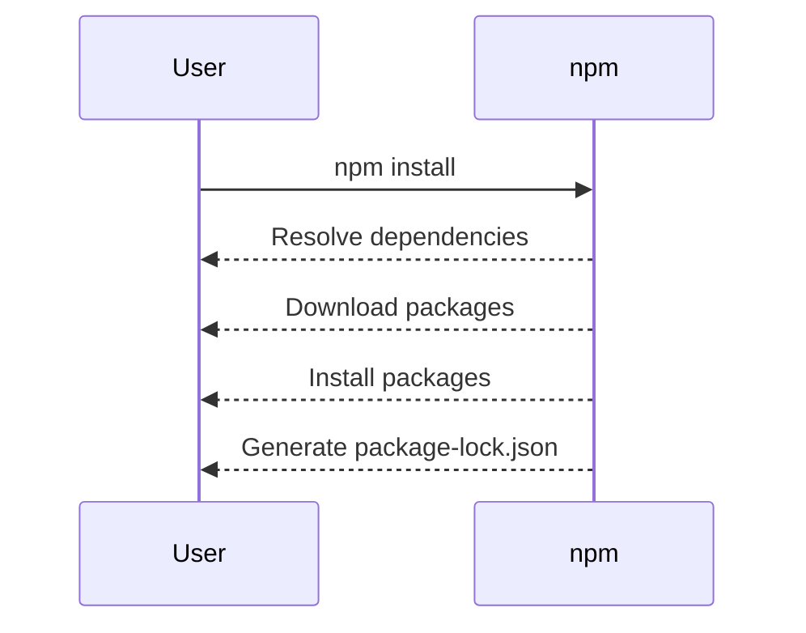

## Installing Tools for Java and JavaScript Projects

In this section, we will cover the installation of essential tools required for working with Java and JavaScript projects. This includes Java, Maven, Node.js, npm, and an integrated development environment (IDE) like IntelliJ IDEA. Understanding how to install and configure these tools is crucial for any developer or DevOps engineer, as it forms the foundation for building and managing applications.

### Java Installation

Java is a programming language and computing platform that is widely used for developing enterprise-scale applications. To install Java, you can download the latest version from the official Oracle website or use OpenJDK, which is an open-source implementation of the Java Platform.

#### Installation Steps

1. **Download Java**: Visit the [Oracle JDK](https://www.oracle.com/java/technologies/javase-jdk17-downloads.html) or [OpenJDK](https://openjdk.java.net/) website and download the appropriate version for your operating system.
2. **Install Java**: Follow the installation instructions provided by the installer. On Windows, this typically involves running an `.exe` file and following the prompts. On macOS, you might use a `.pkg` file. On Linux, you can use package managers like `apt` or `yum`.

```bash
# Example for installing OpenJDK on Ubuntu
sudo apt update
sudo apt install openjdk-17-jdk
```

#### Verification

After installation, verify that Java is correctly installed by checking the version:

```bash
java -version
```

This should output the version of Java installed on your system.

### Maven Installation

Maven is a build automation tool primarily used for Java projects. It manages dependencies and builds the project according to a defined lifecycle.

#### Installation Steps

1. **Download Maven**: Visit the [Apache Maven](https://maven.apache.org/download.cgi) website and download the binary distribution.
2. **Extract and Configure**: Extract the downloaded archive to a directory of your choice. Add the `bin` directory of the extracted Maven folder to your system’s PATH environment variable.

```bash
# Example for setting up Maven on Ubuntu
tar -xzf apache-maven-3.8.6-bin.tar.gz -C /opt/
export PATH=/opt/apache-maven-3.8.6/bin:$PATH
```

#### Verification

Verify that Maven is correctly installed by checking the version:

```bash
mvn -v
```

This should output the version of Maven installed on your system.

### Node.js and npm Installation

Node.js is a JavaScript runtime built on Chrome's V8 JavaScript engine. npm (Node Package Manager) is a package manager for Node.js that allows you to manage dependencies and packages.

#### Installation Steps

1. **Download Node.js**: Visit the [Node.js](https://nodejs.org/en/download/) website and download the LTS (Long-Term Support) version.
2. **Install Node.js**: Follow the installation instructions provided by the installer. On Windows, this typically involves running an `.msi` file and following the prompts. On macOS, you might use a `.pkg` file. On Linux, you can use package managers like `apt` or `yum`.

```bash
# Example for installing Node.js on Ubuntu
curl -fsSL https://deb.nodesource.com/setup_16.x | sudo -E bash -
sudo apt-get install -y nodejs
```

#### Verification

Verify that Node.js and npm are correctly installed by checking their versions:

```bash
node -v
npm -v
```

This should output the versions of Node.js and npm installed on your system.

### IntelliJ IDEA Installation

IntelliJ IDEA is a powerful IDE for Java and other languages. It provides features such as code completion, debugging, and version control integration.

#### Installation Steps

1. **Download IntelliJ IDEA**: Visit the [JetBrains IntelliJ IDEA](https://www.jetbrains.com/idea/download/) website and download the Community Edition (free) or Ultimate Edition (paid).
2. **Install IntelliJ IDEA**: Follow the installation instructions provided by the installer. On Windows, this typically involves running an `.exe` file and following the prompts. On macOS, you might use a `.dmg` file. On Linux, you can use package managers like `apt` or `yum`.

```bash
# Example for installing IntelliJ IDEA on Ubuntu
sudo snap install intellij-idea-community --classic
```

#### Verification

Verify that IntelliJ IDEA is correctly installed by launching it and checking the version.

### Setting Up Your Development Environment

Once all the tools are installed, you can start setting up your development environment. Here’s a step-by-step guide:

1. **Create a New Project**:
    - Open IntelliJ IDEA.
    - Click on `File > New > Project`.
    - Choose the type of project you want to create (e.g., Java, Spring Boot, etc.).

2. **Configure Build Tools**:
    - For Java projects, configure Maven by adding the `pom.xml` file.
    - For JavaScript projects, configure npm by adding the `package.json` file.

3. **Add Dependencies**:
    - In Maven, add dependencies to the `pom.xml` file.
    - In npm, add dependencies to the `package.json` file.

### Real-World Examples

#### Recent CVEs and Breaches

1. **CVE-2021-44228 (Log4Shell)**: This vulnerability affected Apache Log4j, a popular logging framework used in many Java applications. It allowed attackers to execute arbitrary code on the server. Ensure that you keep your Java libraries up-to-date and use dependency management tools like Maven to manage versions.

2. **CVE-2021-21972 (Spring Framework RCE)**: This vulnerability affected the Spring Framework, allowing remote code execution. Ensure that you use secure coding practices and regularly update your frameworks.

### Code Examples

#### Maven Configuration

Here’s an example of a `pom.xml` file for a simple Java project:

```xml
<project xmlns="http://maven.apache.org/POM/4.0.0"
         xmlns:xsi="http://www.w3.org/2001/XMLSchema-instance"
         xsi:schemaLocation="http://maven.apache.org/POM/4.0.0 http://maven.apache.org/xsd/maven-4.0.0.xsd">
    <modelVersion>4.0.0</modelVersion>
    <groupId>com.example</groupId>
    <artifactId>example-project</artifactId>
    <version>1.0-SNAPSHOT</version>
    <dependencies>
        <dependency>
            <groupId>junit</groupId>
            <artifactId>junit</artifactId>
            <version>4.13.2</version>
            <scope>test</scope>
        </dependency>
    </dependencies>
</project>
```

#### npm Configuration

Here’s an example of a `package.json` file for a simple JavaScript project:

```json
{
  "name": "example-project",
  "version": "1.0.0",
  "main": "index.js",
  "scripts": {
    "start": "node index.js"
  },
  "dependencies": {
    "express": "^4.18.2"
  }
}
```

### Mermaid Diagrams

#### Maven Build Lifecycle



#### npm Install Process



### Common Pitfalls and How to Prevent Them

#### Java Version Conflicts

**Problem**: Using multiple versions of Java in a single project can lead to conflicts and unexpected behavior.

**Solution**: Use tools like `sdkman` to manage multiple Java versions and ensure consistency across your projects.

```bash
# Example for using sdkman to install Java
curl -s "https://get.sdkman.io" | bash
source "$HOME/.sdkman/bin/sdkman-init.sh"
sdk install java 17.0.6-open
```

#### Dependency Management Issues

**Problem**: Outdated or insecure dependencies can introduce vulnerabilities into your project.

**Solution**: Regularly update your dependencies and use tools like `mvn dependency:analyze` and `npm audit` to identify and fix issues.

```bash
# Example for updating dependencies in Maven
mvn versions:update-properties

# Example for auditing dependencies in npm
npm audit
```

### Secure Coding Practices

#### Java Secure Coding

**Vulnerable Code**:

```java
public class VulnerableCode {
    public static void main(String[] args) {
        String userInput = args[0];
        System.out.println(userInput);
    }
}
```

**Secure Code**:

```java
import java.util.regex.Pattern;

public class SecureCode {
    private static final Pattern SAFE_PATTERN = Pattern.compile("[a-zA-Z0-9]+");

    public static void main(String[] args) {
        String userInput = args[0];
        if (SAFE_PATTERN.matcher(userInput).matches()) {
            System.out.println(userInput);
        } else {
            System.out.println("Invalid input");
        }
    }
}
```

#### JavaScript Secure Coding

**Vulnerable Code**:

```javascript
const express = require('express');
const app = express();

app.get('/', (req, res) => {
    res.send(req.query.message);
});

app.listen(3000, () => {
    console.log('Server started on port 3000');
});
```

**Secure Code**:

```javascript
const express = require('express');
const app = express();
const { escapeHtml } = require('escape-goat');

app.get('/', (req, res) => {
    const safeMessage = escapeHtml(req.query.message || '');
    res.send(safeMessage);
});

app.listen(3000, () => {
    console.log('Server started on port 3000');
});
```

### Hands-On Labs

To practice and reinforce your learning, consider the following labs:

- **PortSwigger Web Security Academy**: Offers interactive labs for web application security.
- **OWASP Juice Shop**: A deliberately insecure web application for practicing web security skills.
- **DVWA (Damn Vulnerable Web Application)**: A PHP/MySQL web application that is riddled with vulnerabilities.
- **WebGoat**: An interactive training application designed to teach web application security lessons.

These labs provide practical experience in setting up and securing development environments, which is essential for becoming proficient in DevOps.

By following this comprehensive guide, you will be well-equipped to install and configure the necessary tools for Java and JavaScript projects, ensuring a robust and secure development environment.

---
<!-- nav -->
[[DevOps/DevOps Bootcamp/11-Miscellaneous/15-Installing Tools For Java And JavaScript Projects/00-Overview|Overview]] | [[DevOps/DevOps Bootcamp/11-Miscellaneous/15-Installing Tools For Java And JavaScript Projects/02-Practice Questions & Answers|Practice Questions & Answers]]
