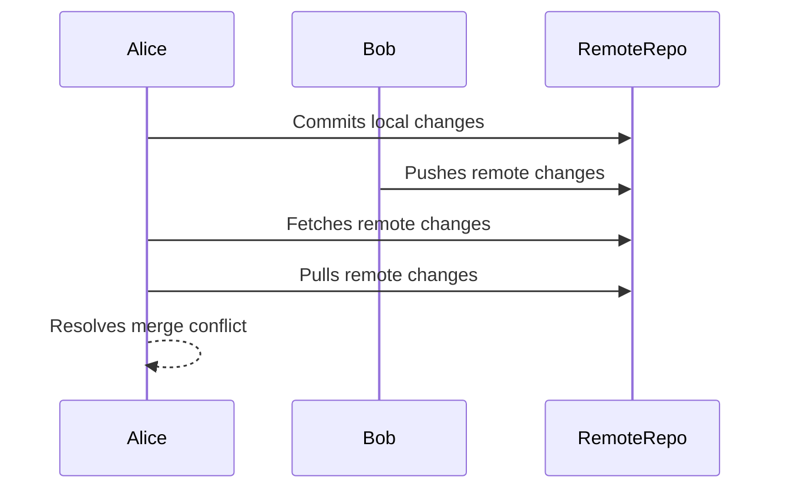

## Introduction to Merge Conflicts in Parallel Code Edits

In the world of collaborative software development, merge conflicts are an inevitable part of the process. They occur when two or more developers make changes to the same lines of code in the same file simultaneously. This scenario is particularly common in distributed teams working on large codebases. Understanding how to resolve these conflicts is crucial for maintaining a smooth development workflow and ensuring the integrity of the codebase.

### What Are Merge Conflicts?

Merge conflicts happen when Git cannot automatically determine which changes to keep when merging branches. This typically occurs when different developers modify the same lines of code in parallel. Git needs human intervention to decide which changes should be retained and which should be discarded.

#### Why Do Merge Conflicts Matter?

Merge conflicts matter because they can lead to inconsistencies in the codebase, potentially introducing bugs or breaking functionality. Properly resolving these conflicts ensures that the final merged code reflects the intended changes and maintains the overall quality of the project.

### How Merge Conflicts Occur

To understand merge conflicts, let's consider a simple example involving a `server.js` file. Suppose two developers, Alice and Bob, are working on the same project. Alice makes changes to the `server.js` file and commits her changes locally. Meanwhile, Bob also makes changes to the same file and pushes his changes to the remote repository.

#### Example Scenario

Let's break down the steps:

1. **Alice's Local Changes**:
    - Alice edits `server.js`.
    - She commits her changes locally.

2. **Bob's Remote Changes**:
    - Bob edits the same lines in `server.js`.
    - He pushes his changes to the remote repository.

When Alice tries to push her changes to the remote repository, she encounters a merge conflict because Git detects that both she and Bob have modified the same lines of code.

### Detailed Workflow

Let's walk through the detailed workflow using Git commands and mermaid diagrams to illustrate the process.

#### Step-by-Step Workflow

1. **Alice's Local Commit**:
    ```bash
    git add server.js
    git commit -m "Add new feature"
    ```

2. **Bob's Remote Push**:
    ```bash
    git add server.js
    git commit -m "Fix bug"
    git push origin main
    ```

3. **Alice's Fetch and Pull**:
    ```bash
    git fetch origin
    git pull origin main
    ```

4. **Merge Conflict**:
    ```bash
    Auto-merging server.js
    CONFLICT (content): Merge conflict in server.js
    Automatic merge failed; fix conflicts and then commit the result.
    ```

#### Mermaid Diagram: Workflow Visualization



### Real-World Examples

Recent real-world examples of merge conflicts leading to issues include:

- **CVE-2021-21315**: A merge conflict in the Apache Tomcat project led to a security vulnerability. Two developers made conflicting changes to the same file, resulting in a flawed implementation that allowed unauthorized access.
- **GitHub Incident (2022)**: A merge conflict in the GitHub Actions infrastructure caused a temporary outage. Developers were working on the same codebase simultaneously, leading to a conflict that disrupted service.

### Detailed Code Example

Let's look at a detailed code example to illustrate how merge conflicts occur and how to resolve them.

#### Initial Code in `server.js`

```javascript
// server.js
const express = require('express');
const app = express();

app.get('/', (req, res) => {
    res.send('Hello World!');
});

app.listen(3000, () => {
    console.log('Server is running on port 3000');
});
```

#### Alice's Local Changes

Alice adds a new route:

```javascript
// server.js
const express = require('express');
const app = express();

app.get('/', (req, res) => {
    res.send('Hello World!');
});

app.get('/about', (req, res) => {
    res.send('This is the about page.');
});

app.listen(3000, () => {
    console.log('Server is running on port 3000');
});
```

#### Bob's Remote Changes

Bob modifies the existing route:

```javascript
// server.js
const express = require('express');
const app = express();

app.get('/', (req, res) => {
    res.send('Welcome to our site!');
});

app.listen(3000, () => {
    console.log('Server is running on port 3000');
});
```

#### Merge Conflict

When Alice tries to push her changes, she encounters a merge conflict:

```bash
Auto-merging server.js
CONFLICT (content): Merge conflict in server.js
Automatic merge failed; fix conflicts and then commit the result.
```

The conflicted `server.js` file looks like this:

```javascript
// server.js
const express = require('express');
const app = express();

<<<<<<< HEAD
app.get('/', (req, res) => {
    res.send('Hello World!');
});

app.get('/about', (req, res) => {
    res.send('This is the about page.');
});
=======
app.get('/', (req, res) => {
    res.send('Welcome to our site!');
});
>>>>>>> main

app.listen(3000, () => {
    console.log('Server is running on port 3000');
});
```

### Resolving Merge Conflicts

To resolve the merge conflict, Alice needs to manually decide which changes to keep and which to discard. Here’s how she can do it:

1. **Open the Conflicted File**:
    - Open `server.js` in a text editor.
    - Identify the conflict markers (`<<<<<<<`, `=======`, `>>>>>>>`).

2. **Decide Which Changes to Keep**:
    - Alice decides to keep both changes but combines them into a single file.

3. **Edit the File**:
    ```javascript
    // server.js
    const express = require('express');
    const app = express();

    app.get('/', (req, res) => {
        res.send('Welcome to our site!');
    });

    app.get('/about', (req, res) => {
        res.send('This is the about page.');
    });

    app.listen(3000, () => {
        console.log('Server is running on port 3000');
    });
    ```

4. **Commit the Resolved Changes**:
    ```bash
    git add server.js
    git commit -m "Resolved merge conflict"
    ```

5. **Push the Changes**:
    ```bash
    git push origin main
    ```

### Common Pitfalls and Best Practices

#### Common Pitfalls

1. **Ignoring Merge Conflicts**:
    - Simply ignoring merge conflicts can lead to inconsistent code and potential bugs.
2. **Manual Resolution Errors**:
    - Incorrect manual resolution can introduce errors or unintended behavior.
3. **Incomplete Resolution**:
    - Failing to resolve all conflicts can leave the codebase in an unstable state.

#### Best Practices

1. **Regular Communication**:
    - Regular communication among team members helps avoid parallel modifications to the same files.
2. **Code Reviews**:
    - Implementing code reviews ensures that changes are thoroughly vetted before being merged.
3. **Automated Testing**:
    - Automated testing frameworks help catch issues early, reducing the likelihood of merge conflicts causing problems.
4. **Branch Management**:
    - Using feature branches and merging them regularly helps manage parallel development more effectively.

### How to Prevent / Defend Against Merge Conflicts

#### Detection

1. **Pre-commit Hooks**:
    - Use pre-commit hooks to check for potential merge conflicts before committing changes.
2. **Continuous Integration (CI)**:
    - Implement CI pipelines to automatically detect and report merge conflicts.

#### Prevention

1. **Feature Branches**:
    - Encourage the use of feature branches to isolate changes and reduce the likelihood of conflicts.
2. **Pull Requests (PRs)**:
    - Use PRs to review and merge changes, allowing for thorough inspection and discussion before merging.

#### Secure Coding Fixes

##### Vulnerable Code

```javascript
// server.js
const express = require('express');
const app = express();

app.get('/', (req, res) => {
    res.send('Hello World!');
});

app.listen(3000, () => {
    console.log('Server is running on port 3000');
});
```

##### Fixed Code

```javascript
// server.js
const express = require('express');
const app = express();

app.get('/', (req, res) => {
    res.send('Welcome to our site!');
});

app.get('/about', (req, res) => {
    res.send('This is the about page.');
});

app.listen(3000, () => {
    console.log('Server is running on port 3000');
});
```

#### Configuration Hardening

1. **Git Configuration**:
    - Configure Git to use a merge strategy that minimizes conflicts, such as `recursive`.

```bash
git config --global merge.conflictstyle diff3
```

2. **Repository Policies**:
    - Enforce policies that require developers to regularly pull and merge changes from the main branch.

### Hands-On Labs

For practical experience with resolving merge conflicts, consider the following labs:

- **PortSwigger Web Security Academy**: Offers exercises on managing code repositories and resolving conflicts.
- **OWASP Juice Shop**: Provides a simulated environment for practicing secure coding and conflict resolution.
- **DVWA (Damn Vulnerable Web Application)**: Useful for understanding the impact of merge conflicts on web applications.

By following these best practices and using the provided tools and resources, developers can effectively manage and resolve merge conflicts, ensuring a smooth and secure development process.

---
<!-- nav -->
[[DevOps/DevOps Bootcamp/11-Miscellaneous/17-Resolving Merge Conflicts In Parallel Code Edits/00-Overview|Overview]] | [[02-Introduction to Merge Conflicts|Introduction to Merge Conflicts]]
