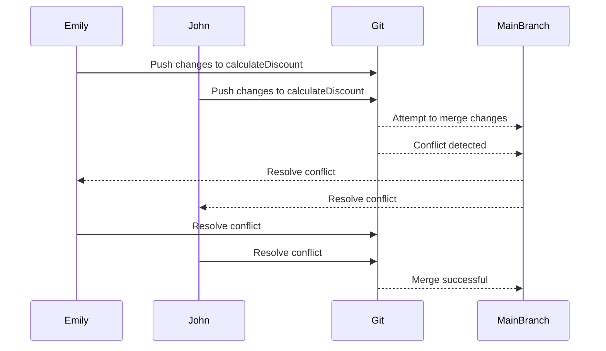

## Introduction to Merge Conflicts

In the realm of software development, particularly within distributed teams using version control systems like Git, merge conflicts are an inevitable part of the process. A merge conflict occurs when two developers attempt to modify the same part of a file in parallel, leading to a situation where Git cannot automatically determine which changes should take precedence. Understanding how to resolve these conflicts effectively is crucial for maintaining a smooth workflow and ensuring the integrity of the codebase.

### What is a Merge Conflict?

A merge conflict arises when two branches being merged contain conflicting changes to the same part of the code. These conflicts can occur in various scenarios, such as:

- **Parallel Development**: Two developers working on the same feature branch.
- **Feature Branches**: Multiple feature branches being merged into a main branch.
- **Rebasing**: When rebasing a branch onto another, conflicts can arise due to overlapping changes.

### Why Do Merge Conflicts Matter?

Merge conflicts are significant because they can disrupt the development process and lead to potential bugs if not resolved correctly. Proper resolution ensures that the final codebase reflects the intended changes and maintains consistency across all branches.

### How Do Merge Conflicts Occur?

Consider a scenario where two developers, Emily and John, are working on the same feature branch. Emily makes changes to a function `calculateDiscount`, while John modifies the same function in a different way. When they attempt to merge their changes, Git encounters a conflict because it cannot automatically determine which version of the function to keep.

### Example Scenario

Let's illustrate this with a simple example. Suppose the original codebase contains the following function:

```python
def calculateDiscount(price, discountRate):
    return price * (1 - discountRate)
```

Emily modifies the function to include a minimum discount rate:

```python
def calculateDiscount(price, discountRate, minDiscount=0.1):
    effectiveDiscount = max(discountRate, minDiscount)
    return price * (1 - effectiveDiscount)
```

John, on the other hand, modifies the function to handle negative prices gracefully:

```python
def calculateDiscount(price, discountRate):
    if price < 0:
        return 0
    return price * (1 - discountRate)
```

When these changes are merged, Git will encounter a conflict because both modifications affect the same function.

### Visualizing Merge Conflicts

To better understand merge conflicts, let's visualize the process using a mermaid diagram:



### Resolving Merge Conflicts

Resolving merge conflicts involves identifying the conflicting changes, understanding the context of each modification, and deciding on the final version of the code. This process can be done using various tools and methods, including Git command-line tools, GUI-based Git clients, and integrated development environments (IDEs).

#### Using Git Command Line

The command-line approach is a powerful method for resolving merge conflicts. Here’s a step-by-step guide:

1. **Identify Conflicts**:
   Run `git status` to identify files with conflicts.

   ```bash
   git status
   ```

2. **Open Files in Editor**:
   Open the conflicted files in your preferred text editor. Git marks the conflicting sections with markers like `<<<<<<<`, `=======`, and `>>>>>>>`.

   ```bash
   git checkout --conflict=merge <file>
   ```

3. **Resolve Conflicts**:
   Edit the file to resolve the conflicts. Remove the conflict markers and decide on the final version of the code.

4. **Add Resolved Files**:
   Add the resolved files to the staging area.

   ```bash
   git add <file>
   ```

5. **Complete the Merge**:
   Complete the merge process.

   ```bash
   git commit
   ```

#### Using GUI-Based Git Clients

GUI-based Git clients provide a more visual approach to resolving merge conflicts. Tools like SourceTree, GitKraken, and GitHub Desktop offer intuitive interfaces for identifying and resolving conflicts.

1. **Open the Client**:
   Launch your preferred Git client.

2. **Identify Conflicts**:
   The client will highlight files with conflicts.

3. **Resolve Conflicts**:
   Use the built-in tools to compare and merge changes visually.

4. **Commit Changes**:
   Once conflicts are resolved, commit the changes.

#### Using IDEs

Integrated Development Environments (IDEs) like IntelliJ IDEA, Visual Studio Code, and Eclipse provide built-in support for resolving merge conflicts.

1. **Open the Project**:
   Open your project in the IDE.

2. **Identify Conflicts**:
   The IDE will highlight files with conflicts.

3. **Resolve Conflicts**:
   Use the built-in merge tools to compare and resolve changes.

4. **Commit Changes**:
   Commit the resolved changes.

### Real-World Examples

Recent real-world examples of merge conflicts include issues in open-source projects and large-scale enterprise applications. For instance, a conflict in a popular open-source library led to a delay in the release of a new version due to unresolved conflicts between contributors.

### Common Pitfalls

Several common pitfalls can arise during the resolution of merge conflicts:

- **Incomplete Resolution**: Failing to resolve all conflicts can lead to incomplete or incorrect code.
- **Incorrect Resolution**: Choosing the wrong version of the code can introduce bugs or inconsistencies.
- **Ignoring Conflicts**: Ignoring conflicts can lead to silent failures and unexpected behavior in the application.

### How to Prevent / Defend Against Merge Conflicts

Preventing and defending against merge conflicts involves several strategies:

#### Detection

- **Automated Testing**: Implement continuous integration (CI) pipelines with automated tests to catch conflicts early.
- **Conflict Detection Tools**: Use tools like `git diff` and `git status` to detect conflicts before merging.

#### Prevention

- **Code Reviews**: Conduct regular code reviews to ensure changes are compatible and conflicts are identified early.
- **Feature Branches**: Use feature branches to isolate changes and reduce the likelihood of conflicts.

#### Secure Coding Fixes

Compare the vulnerable and secure versions of the code:

**Vulnerable Version**:

```python
def calculateDiscount(price, discountRate):
    return price * (1 - discountRate)
```

**Secure Version**:

```python
def calculateDiscount(price, discountRate, minDiscount=0.1):
    effectiveDiscount = max(discountRate, minDiscount)
    if price < 0:
        return 
    return price * (1 - effectiveDiscount)
```

#### Configuration Hardening

- **Merge Strategies**: Configure Git to use specific merge strategies that minimize conflicts.
- **Branch Policies**: Implement branch policies that require approval before merging to ensure compatibility.

### Conclusion

Understanding and effectively resolving merge conflicts is essential for maintaining a healthy and efficient development workflow. By leveraging the right tools and practices, developers can minimize the impact of conflicts and ensure the integrity of the codebase.

### Practice Labs

For hands-on practice with resolving merge conflicts, consider the following labs:

- **PortSwigger Web Security Academy**: Offers exercises on Git and version control.
- **OWASP Juice Shop**: Provides a simulated environment for practicing Git operations.
- **DVWA (Damn Vulnerable Web Application)**: Includes scenarios for managing code conflicts in a web application context.

By engaging with these labs, you can gain practical experience in handling merge conflicts and improve your skills in version control and collaboration.

---
<!-- nav -->
[[01-Introduction to Merge Conflicts in Parallel Code Edits|Introduction to Merge Conflicts in Parallel Code Edits]] | [[DevOps/DevOps Bootcamp/11-Miscellaneous/17-Resolving Merge Conflicts In Parallel Code Edits/00-Overview|Overview]] | [[DevOps/DevOps Bootcamp/11-Miscellaneous/17-Resolving Merge Conflicts In Parallel Code Edits/03-Practice Questions & Answers|Practice Questions & Answers]]
