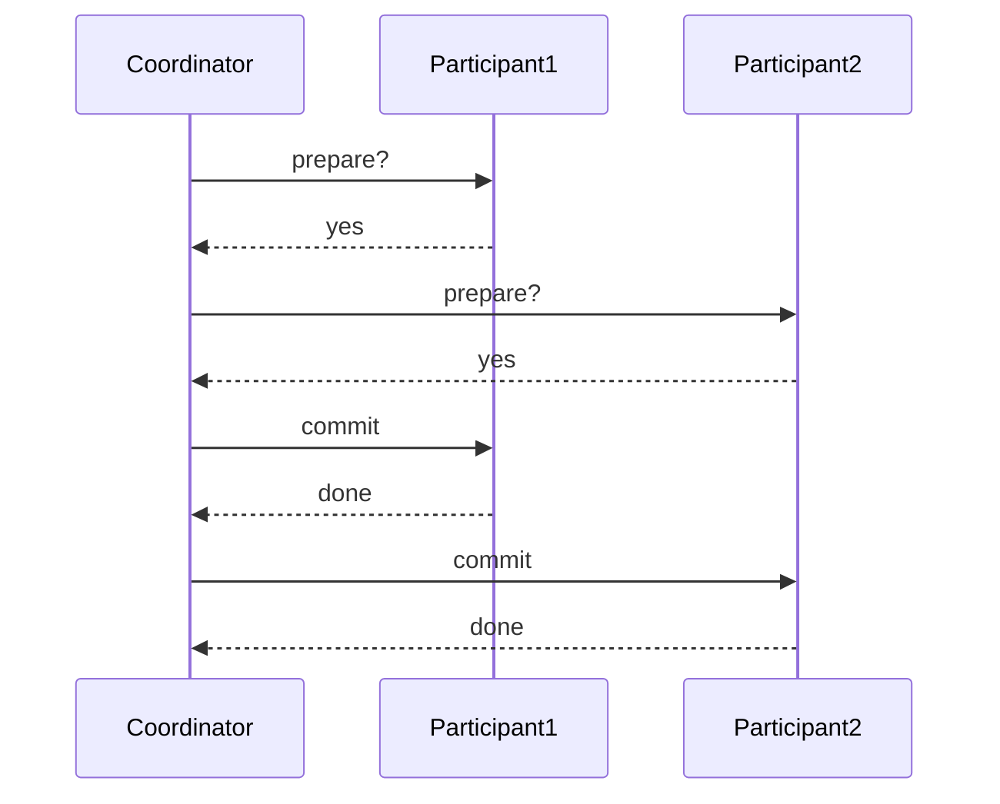

## Introduction to Database Consistency and Transactions

In the realm of database management systems, ensuring data consistency is paramount, especially in critical applications such as banking and finance. Data consistency refers to the accuracy and reliability of data within a database. When transactions involve multiple operations across several tables, maintaining consistency becomes particularly challenging. This chapter delves into the mechanisms that ensure transactional integrity and the implications of these mechanisms on scalability.

### What is a Transaction?

A transaction is a sequence of operations performed as a single logical unit of work. In the context of databases, a transaction typically involves reading and writing data to one or more tables. The goal is to ensure that all operations within a transaction are completed successfully, or if any operation fails, the entire transaction is rolled back to maintain data consistency.

#### Example Scenario

Consider a banking application where a user transfers money from one account to another. This transaction involves two primary operations:

1. Deducting the amount from the sender's account.
2. Adding the same amount to the receiver's account.

If either of these operations fails, the entire transaction should be rolled back to avoid inconsistencies. For instance, if the deduction from the sender's account succeeds but the addition to the receiver's account fails due to a network disruption, the transaction should be rolled back to restore the original state.

### ACID Properties

To ensure data consistency, transactions must adhere to the ACID properties:

- **Atomicity**: Ensures that all operations within a transaction are treated as a single unit. If any part of the transaction fails, the entire transaction is rolled back.
- **Consistency**: Ensures that the database transitions from one valid state to another. Any transaction that violates the database constraints is rolled back.
- **Isolation**: Ensures that concurrent transactions do not interfere with each other. Each transaction operates in isolation from others.
- **Durability**: Ensures that once a transaction is committed, it remains committed even in the event of a system failure.

### Mechanisms for Ensuring Transactional Integrity

Databases employ various mechanisms to ensure transactional integrity. One of the most crucial mechanisms is the **two-phase commit protocol** (2PC), which ensures that all participants in a distributed transaction agree to commit or rollback the transaction.

#### Two-Phase Commit Protocol

The 2PC protocol consists of two phases:

1. **Prepare Phase**: Each participant votes whether to commit or rollback the transaction. If all participants vote to commit, the coordinator proceeds to the commit phase. If any participant votes to rollback, the coordinator aborts the transaction.
2. **Commit Phase**: Once all participants have voted to commit, the coordinator sends a commit message to all participants. Each participant then commits the transaction locally.



### Real-World Examples and Implications

#### Recent Breaches and CVEs

One notable example of a breach related to transactional integrity is the **Equifax data breach** in 2017. Although the breach was primarily due to a vulnerability in Apache Struts, it highlighted the importance of robust transactional controls. Had the transactional integrity been compromised, the financial implications could have been even more severe.

#### Code Example: Implementing Transactions in SQL

Here is an example of how transactions can be implemented in SQL using a simple banking transfer scenario:

```sql
BEGIN TRANSACTION;

UPDATE accounts SET balance = balance - 100 WHERE account_id = 1;
UPDATE accounts SET balance = balance + 100 WHERE account_id = 2;

COMMIT;
```

If any of the `UPDATE` statements fail, the entire transaction is rolled back:

```sql
BEGIN TRANSACTION;

UPDATE accounts SET balance = balance - 100 WHERE account_id = 1;
-- Simulate a failure
RAISE EXCEPTION 'Transaction failed';

ROLLBACK;
```

### Scalability Challenges

While transactional integrity is crucial, it often comes at the cost of scalability. Traditional SQL databases, which enforce strong consistency through mechanisms like 2PC, can become bottlenecks in highly scalable environments.

#### Distributed Systems and Eventual Consistency

In distributed systems, achieving strong consistency can be challenging. Instead, many systems opt for eventual consistency, where consistency is guaranteed over time rather than immediately. This approach allows for better scalability but requires careful design to handle potential inconsistencies.

### How to Prevent / Defend

#### Detection and Prevention

To ensure transactional integrity and prevent inconsistencies, several strategies can be employed:

1. **Use ACID-compliant Databases**: Ensure that your database management system supports ACID properties.
2. **Implement Robust Transaction Management**: Use proper transaction management techniques, including the two-phase commit protocol.
3. **Regular Audits and Monitoring**: Regularly audit and monitor transactions to detect any anomalies or failures.

#### Secure Coding Practices

Secure coding practices are essential to prevent transactional inconsistencies. Here is an example of a vulnerable code snippet and its secure counterpart:

**Vulnerable Code:**

```python
def transfer_money(sender_account, receiver_account, amount):
    sender_account.balance -= amount
    receiver_account.balance += amount
```

**Secure Code:**

```python
def transfer_money(sender_account, receiver_account, amount):
    with db.transaction():
        sender_account.balance -= amount
        receiver_account.balance += amount
```

### Conclusion

Ensuring transactional integrity is crucial for maintaining data consistency in critical applications. While traditional SQL databases provide robust mechanisms for transactional integrity, they often come at the cost of scalability. Understanding the trade-offs and implementing proper transaction management techniques is essential for building reliable and scalable systems.

### Practice Labs

For hands-on experience with transactional integrity and database management, consider the following labs:

- **PortSwigger Web Security Academy**: Offers exercises on securing web applications, including transactional integrity.
- **OWASP Juice Shop**: Provides a vulnerable web application for practicing security testing, including scenarios involving database transactions.
- **DVWA (Damn Vulnerable Web Application)**: Another excellent resource for learning about web application security, including transactional integrity.

By mastering these concepts and practicing with real-world tools, you can build robust and secure systems that maintain data consistency even in complex environments.

---
<!-- nav -->
[[DevOps/DevOps Bootcamp/11-Miscellaneous/18-Types Of Databases And Their Use Cases/00-Overview|Overview]] | [[02-Introduction to Database Types and Their Use Cases|Introduction to Database Types and Their Use Cases]]
