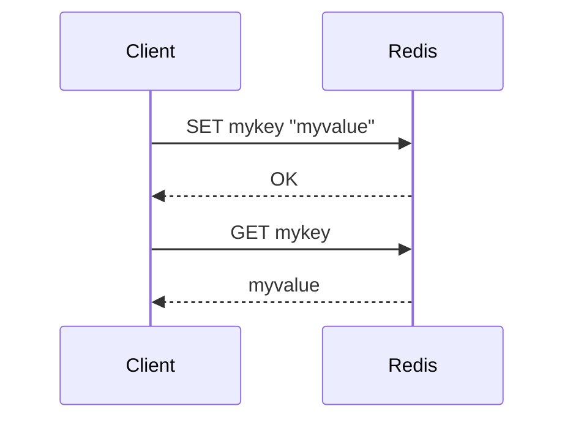

## Introduction to Database Types and Their Use Cases

In the realm of modern computing, databases play a crucial role in storing, retrieving, and managing vast amounts of data efficiently. Over the years, various types of databases have emerged, each designed to address specific requirements and challenges. Understanding these different types and their use cases is essential for developers and DevOps engineers to make informed decisions about which database to use for their applications.

### Key-Value Databases

One of the simplest and most efficient types of databases is the **key-value database**. These databases store data as pairs of keys and values, similar to a dictionary or hash table in programming languages. The primary characteristics of key-value databases include:

- **Data Model**: Each piece of data is stored as a key-value pair. The key is unique and serves as an identifier for the associated value.
- **Storage Mechanism**: Unlike traditional relational databases that store data on disk, key-value databases often store data in memory, making access extremely fast.
- **Use Cases**: Key-value databases are ideal for scenarios where high-speed data retrieval is critical, such as caching, session management, and real-time analytics.

#### Popular Key-Value Databases

Some popular key-value databases include:

- **Redis**: A widely-used in-memory data structure store that supports various data structures like strings, hashes, lists, sets, and sorted sets.
- **Memcached**: Another in-memory key-value store that is primarily used for caching purposes.
- **Etsy**: Although not as commonly known as Redis or Memcached, Etsy has developed its own key-value store for internal use.

### Data Model and Operations

The data model in key-value databases is straightforward. Each key is unique and maps to a specific value. Here’s how basic operations work:

- **Write Operation**: To write data, you add a key-value pair. For example, in Redis, you might use the `SET` command to store a value:
  ```redis
  SET mykey "myvalue"
  ```
- **Read Operation**: To retrieve data, you use the key to fetch the corresponding value. In Redis, you would use the `GET` command:
  ```redis
  GET mykey
  ```

#### Mermaid Diagram: Key-Value Database Operations



### Performance Characteristics

Key-value databases are renowned for their speed due to their in-memory storage mechanism. Storing data in memory allows for extremely fast read and write operations compared to disk-based storage. However, this comes with limitations:

- **Limited Storage Capacity**: Since data is stored in memory, the amount of data that can be stored is limited by the available RAM.
- **Persistence Challenges**: Data stored in memory is volatile and can be lost if the system crashes. Therefore, key-value databases often implement mechanisms to periodically save data to disk or use replication to ensure data durability.

#### Real-World Example: Redis in Action

Redis is extensively used in production environments for various purposes, including caching, session management, and real-time analytics. For instance, consider a scenario where a web application uses Redis to cache frequently accessed data:

```redis
# Set a key-value pair in Redis
SET user:1234 "John Doe"

# Retrieve the value using the key
GET user:1234
```

This setup ensures that data retrieval is extremely fast, enhancing the overall performance of the application.

### Security Considerations

While key-value databases offer excellent performance, they also come with security risks. Ensuring the security of data stored in these databases is crucial. Here are some common vulnerabilities and how to mitigate them:

#### Vulnerability: Unsecured Access

**Description**: Key-value databases, especially those running in-memory, can be vulnerable to unauthorized access if proper security measures are not implemented.

**Example**: An unsecured Redis instance could allow attackers to execute arbitrary commands, leading to data theft or manipulation.

#### How to Prevent / Defend

1. **Authentication and Authorization**:
   - Implement authentication mechanisms to restrict access to authorized users only.
   - Use role-based access control (RBAC) to define permissions for different users.

2. **Network Security**:
   - Restrict network access to the key-value database server using firewalls and network segmentation.
   - Use encrypted connections (e.g., TLS) to protect data in transit.

3. **Regular Audits and Monitoring**:
   - Perform regular security audits to identify and mitigate potential vulnerabilities.
   - Monitor access logs and system events to detect suspicious activities.

#### Secure Configuration Example: Redis

Here’s an example of a secure Redis configuration:

```yaml
# Redis configuration file (redis.conf)
requirepass your_strong_password
port 6379
bind 127.0.0.1
tcp-keepalive 60
timeout 300
maxmemory 1gb
maxmemory-policy allkeys-lru
```

In this configuration:
- `requirepass` enforces password protection.
- `bind` restricts Redis to listen only on the loopback interface.
- `tcp-keepalive` and `timeout` settings help manage idle connections.
- `maxmemory` limits the amount of memory Redis can use.
- `maxmemory-policy` defines the eviction policy for managing memory usage.

### Hands-On Practice

To gain practical experience with key-value databases, consider the following labs:

- **PortSwigger Web Security Academy**: Offers modules on securing web applications, including sections on database security.
- **OWASP Juice Shop**: A deliberately insecure web application for practicing security testing and learning about common vulnerabilities.
- **DVWA (Damn Vulnerable Web Application)**: A PHP/MySQL web application that demonstrates web application vulnerabilities.

These labs provide a controlled environment to experiment with key-value databases and understand their strengths and weaknesses in real-world scenarios.

### Conclusion

Key-value databases are powerful tools for high-performance data storage and retrieval. By understanding their data model, operations, and performance characteristics, developers can leverage these databases effectively in their applications. Additionally, implementing robust security measures is crucial to protect data integrity and confidentiality. Through hands-on practice and continuous learning, you can master the art of working with key-value databases and build secure, efficient systems.

---
<!-- nav -->
[[01-Introduction to Database Consistency and Transactions|Introduction to Database Consistency and Transactions]] | [[DevOps/DevOps Bootcamp/11-Miscellaneous/18-Types Of Databases And Their Use Cases/00-Overview|Overview]] | [[03-Introduction to Relational Databases and Their Use Cases|Introduction to Relational Databases and Their Use Cases]]
