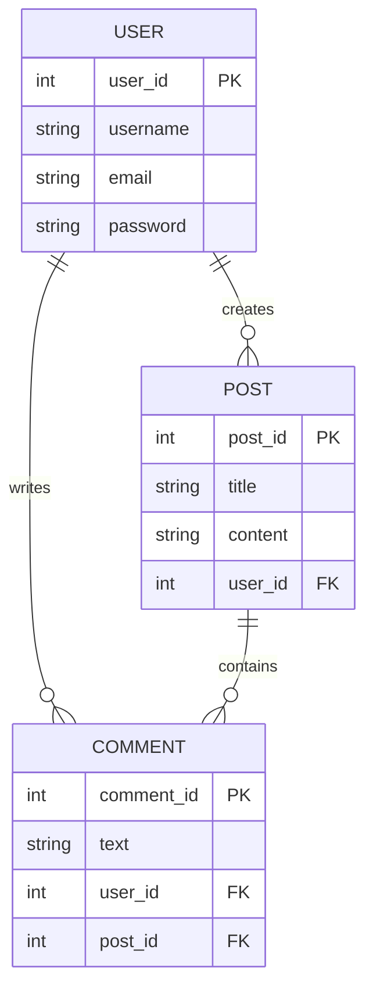

## Introduction to Relational Databases and Their Use Cases

Relational databases are a cornerstone of modern software development, particularly in the realm of DevOps. They provide a structured method to store, manage, and retrieve data efficiently. In this section, we will delve into the core concepts of relational databases, their structure, and how they are used in various applications. We will also explore the importance of ACID compliance and its implications on data integrity and reliability.

### Structure of Relational Databases

A relational database organizes data into tables, which consist of rows and columns. Each row represents an entity, such as a user, post, or comment. Each column represents an attribute of that entity, such as a user ID, username, or email address.

#### Tables and Entities

Consider a simple application that manages users, posts, and comments. Here’s how these entities might be structured:

- **Users Table**: Contains information about users.
  - `user_id` (Primary Key)
  - `username`
  - `email`
  - `password`

- **Posts Table**: Contains information about posts.
  - `post_id` (Primary Key)
  - `title`
  - `content`
  - `user_id` (Foreign Key referencing Users)

- **Comments Table**: Contains information about comments.
  - `comment_id` (Primary Key)
  - `text`
  - `user_id` (Foreign Key referencing Users)
  - `post_id` (Foreign Key referencing Posts)



#### Primary Keys and Foreign Keys

- **Primary Key**: A primary key uniquely identifies each record in a table. It ensures that no two records have the same value in the primary key field.
- **Foreign Key**: A foreign key is a field (or collection of fields) in one table that uniquely identifies a row of another table. It establishes a link between data in two tables.

In our example:
- `user_id` in the `POST` and `COMMENT` tables is a foreign key that references the `user_id` in the `USER` table.
- `post_id` in the `COMMENT` table is a foreign key that references the `post_id` in the `POST` table.

### Why Use Separate Tables?

Using separate tables for different entities helps maintain data integrity and avoids redundancy. For instance, if a user writes 1,000 comments and posts, storing all user information (like username, email, password, etc.) with each comment and post would be highly inefficient and redundant.

By using foreign keys, we can reference the user information without duplicating it. This approach ensures that updates to user information (such as changing an email address) only need to be made once in the `USER` table, rather than across multiple entries in the `POST` and `COMMENT` tables.

### ACID Compliance

ACID stands for Atomicity, Consistency, Isolation, and Durability. These properties ensure that transactions in a relational database are processed reliably and consistently.

#### Atomicity

Atomicity ensures that a transaction is treated as a single unit of work. It either completes entirely or not at all. If any part of the transaction fails, the entire transaction is rolled back.

#### Consistency

Consistency ensures that a transaction brings the database from one valid state to another. It maintains the database's integrity by ensuring that all rules and constraints are followed.

#### Isolation

Isolation ensures that concurrent transactions do not interfere with each other. Each transaction should operate independently of others, even if they are executing simultaneously.

#### Durability

Durability ensures that once a transaction has been committed, it remains so, even in the event of a system failure. This is typically achieved through the use of transaction logs.

### Real-World Example: Data Integrity in Financial Systems

Financial systems often rely heavily on ACID-compliant databases to ensure that transactions are processed correctly and consistently. For example, consider a banking system where a user transfers money from one account to another. This operation involves multiple steps:

1. Deduct the amount from the sender's account.
2. Add the amount to the receiver's account.
3. Record the transaction in the transaction log.

If any of these steps fail, the entire transaction should be rolled back to maintain data integrity.

### Vulnerabilities and Defenses

Despite the robustness of ACID-compliant databases, vulnerabilities can still exist. One common issue is SQL injection, where an attacker manipulates input to execute arbitrary SQL commands.

#### SQL Injection Example

Consider a simple login form where a user enters their username and password. An insecure implementation might look like this:

```sql
SELECT * FROM users WHERE username = '$username' AND password = '$password';
```

An attacker could inject malicious SQL code, such as:

```sql
$username = 'admin\' -- ';
$password = 'anything';
```

This would result in the following SQL query:

```sql
SELECT * FROM users WHERE username = 'admin' -- ' AND password = 'anything';
```

The `--` comment symbol effectively bypasses the password check.

#### How to Prevent SQL Injection

To prevent SQL injection, use parameterized queries or prepared statements. These methods ensure that user input is treated as data, not executable code.

```sql
SELECT * FROM users WHERE username = ? AND password = ?;
```

Here’s how you might implement this in Python using SQLite:

```python
import sqlite3

# Connect to the database
conn = sqlite3.connect('example.db')
cursor = conn.cursor()

# Prepare the statement
query = "SELECT * FROM users WHERE username = ? AND password = ?"
params = ('admin', 'password')

# Execute the query
cursor.execute(query, params)
result = cursor.fetchone()

print(result)
```

### Conclusion

Relational databases are essential tools in modern software development, providing a structured and efficient way to manage data. By understanding the principles of ACID compliance and the importance of proper data modeling, developers can build robust and reliable systems. Additionally, being aware of potential vulnerabilities and implementing appropriate defenses ensures that these systems remain secure and functional.

### Practice Labs

For hands-on experience with relational databases and their use cases, consider the following labs:

- **PortSwigger Web Security Academy**: Offers modules on SQL injection and other database-related security topics.
- **OWASP Juice Shop**: A deliberately insecure web application for practicing web security skills.
- **DVWA (Damn Vulnerable Web Application)**: Another intentionally flawed web app for learning security concepts.

These resources provide practical scenarios to apply the theoretical knowledge gained in this chapter.

---
<!-- nav -->
[[02-Introduction to Database Types and Their Use Cases|Introduction to Database Types and Their Use Cases]] | [[DevOps/DevOps Bootcamp/11-Miscellaneous/18-Types Of Databases And Their Use Cases/00-Overview|Overview]] | [[04-Introduction to Relational Databases|Introduction to Relational Databases]]
