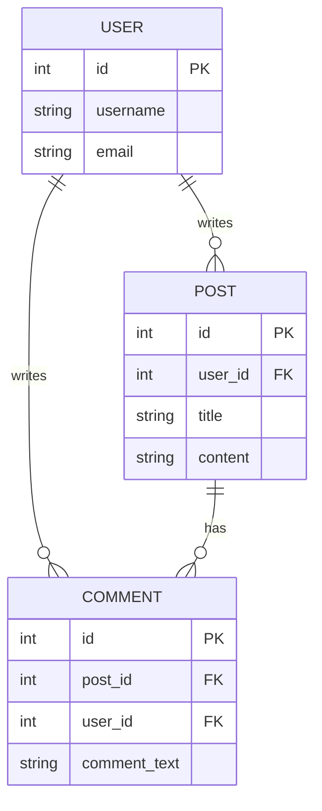

## Introduction to Relational Databases

Relational databases are a cornerstone of modern data management systems. They are designed to handle structured data efficiently and provide robust mechanisms for querying and manipulating data. This chapter delves into the intricacies of relational databases, including their structure, use cases, and practical applications. We will explore the underlying principles, the SQL language, and the various tools and techniques used to manage and secure relational databases.

### What is a Relational Database?

A relational database is a type of database that organizes data into one or more tables of columns and rows, with a unique key for each row. Each table represents a specific entity, and the relationships between these entities are defined through keys and foreign keys. This structure allows for efficient querying and manipulation of data using Structured Query Language (SQL).

#### Structure of a Relational Database

In a relational database, data is organized into tables, which consist of rows and columns. Each column represents an attribute of the entity, and each row represents an instance of that entity. For example, consider an application with users who write comments on posts of other users and who also publish their own posts. The following tables might represent this scenario:



### Use Cases for Relational Databases

Relational databases are widely used in various applications due to their ability to handle structured data efficiently. Some common use cases include:

- **Financial Systems**: Banks and financial institutions use relational databases to manage transactions, account balances, and customer information.
- **Healthcare Systems**: Hospitals and clinics use relational databases to store patient records, medical histories, and appointment schedules.
- **E-commerce Platforms**: Online retailers use relational databases to manage product catalogs, customer orders, and inventory levels.
- **Social Media Platforms**: Social media platforms use relational databases to manage user profiles, posts, comments, and interactions.

### Structured Query Language (SQL)

Structured Query Language (SQL) is the standard language used to interact with relational databases. It provides a set of commands for creating, modifying, and querying data stored in tables. The following are some basic SQL commands:

- **CREATE TABLE**: Used to create a new table.
- **INSERT INTO**: Used to insert data into a table.
- **SELECT**: Used to retrieve data from a table.
- **UPDATE**: Used to modify existing data in a table.
- **DELETE**: Used to remove data from a table.

#### Example SQL Commands

Let's create the `USER`, `POST`, and `COMMENT` tables and insert some sample data:

```sql
CREATE TABLE USER (
    id INT PRIMARY KEY,
    username VARCHAR(50),
    email VARCHAR(100)
);

CREATE TABLE POST (
    id INT PRIMARY KEY,
    user_id INT,
    title VARCHAR(100),
    content TEXT,
    FOREIGN KEY (user_id) REFERENCES USER(id)
);

CREATE TABLE COMMENT (
    id INT PRIMARY KEY,
    post_id INT,
    user_id INT,
    comment_text TEXT,
    FOREIGN KEY (post_id) REFERENCES POST(id),
    FOREIGN KEY (user_id) REFERENCES USER(id)
);

INSERT INTO USER (id, username, email) VALUES (1, 'alice', 'alice@example.com');
INSERT INTO USER (id, username, email) VALUES (2, 'bob', 'bob@example.com');

INSERT INTO POST (id, user_id, title, content) VALUES (1, 1, 'My First Post', 'This is my first post.');
INSERT INTO POST (id, user_id, title, content) VALUES (2, 2, 'Another Post', 'This is another post.');

INSERT INTO COMMENT (id, post_id, user_id, comment_text) VALUES (1, 1, 2, 'Great post!');
INSERT INTO COMMENT (id, post_id, user_id, comment_text) VALUES (2, 2, 1, 'I agree.');
```

### Schema Design

Before inserting data into a relational database, it is essential to design the schema. A schema defines the structure of the database, including the tables, columns, and relationships between them. The schema should be designed carefully to ensure data integrity and efficient querying.

#### Steps to Design a Schema

1. **Identify Entities**: Determine the main entities in your application (e.g., users, posts, comments).
2. **Define Attributes**: Identify the attributes for each entity (e.g., user ID, username, email; post ID, user ID, title, content).
3. **Establish Relationships**: Define the relationships between entities (e.g., a user can write multiple posts and comments).
4. **Create Tables**: Create tables for each entity, ensuring that each table has a primary key.
5. **Add Foreign Keys**: Add foreign keys to establish relationships between tables.

### Data Integrity

Data integrity is crucial in relational databases to ensure that the data remains accurate and consistent. There are several types of constraints that can be applied to enforce data integrity:

- **Primary Key Constraint**: Ensures that each row in a table has a unique identifier.
- **Foreign Key Constraint**: Ensures that the values in a column match the values in another column.
- **Unique Constraint**: Ensures that the values in a column are unique.
- **Check Constraint**: Ensures that the values in a column meet certain conditions.

#### Example Constraints

```sql
ALTER TABLE USER ADD CONSTRAINT pk_user PRIMARY KEY (id);
ALTER TABLE POST ADD CONSTRAINT fk_post_user FOREIGN KEY (user_id) REFERENCES USER(id);
ALTER TABLE COMMENT ADD CONSTRAINT fk_comment_post FOREIGN KEY (post_id) REFERENCES POST(id);
ALTER TABLE COMMENT ADD CONSTRAINT fk_comment_user FOREIGN KEY (user_id) REFERENCES USER(id);
```

### Querying Data

Querying data from a relational database involves using SQL statements to retrieve and manipulate data. Common operations include selecting, filtering, sorting, and joining data from multiple tables.

#### Example Queries

- **Select All Users**:
  ```sql
  SELECT * FROM USER;
  ```

- **Select Posts Written by Alice**:
  ```sql
  SELECT * FROM POST WHERE user_id = 1;
  ```

- **Join Users and Posts**:
  ```sql
  SELECT U.username, P.title, P.content
  FROM USER U
  JOIN POST P ON U.id = P.user_id;
  ```

### Performance Optimization

Performance optimization is critical for ensuring that queries execute efficiently. Techniques for optimizing performance include indexing, query optimization, and database tuning.

#### Indexing

Indexes can significantly improve the performance of queries by allowing the database to quickly locate data. An index is created on one or more columns of a table.

```sql
CREATE INDEX idx_user_email ON USER(email);
```

### Security Considerations

Security is paramount in managing relational databases. Common security threats include SQL injection, unauthorized access, and data breaches. To mitigate these risks, several security measures can be implemented.

#### SQL Injection Prevention

SQL injection is a common security vulnerability where an attacker injects malicious SQL code into a query. To prevent SQL injection, use parameterized queries or prepared statements.

```sql
-- Vulnerable query
SELECT * FROM USER WHERE username = 'alice';

-- Secure query using parameterized statement
SELECT * FROM USER WHERE username = ?;
```

#### Access Control

Access control ensures that only authorized users can access the database. This can be achieved through user authentication, role-based access control, and least privilege principles.

```sql
-- Grant SELECT permission to a user
GRANT SELECT ON USER TO alice;

-- Revoke SELECT permission from a user
REVOKE SELECT ON USER FROM alice;
```

### Real-World Examples

Real-world examples of breaches and vulnerabilities can help illustrate the importance of proper database management and security practices.

#### Example: Equifax Data Breach (CVE-2017-5638)

The Equifax data breach in 2017 exposed sensitive personal information of millions of customers. The breach was caused by a vulnerability in the Apache Struts framework, which allowed attackers to execute arbitrary code and gain access to the database.

To prevent similar breaches, organizations should:

- **Keep Software Updated**: Regularly update software and apply security patches.
- **Implement Strong Authentication**: Use multi-factor authentication and strong password policies.
- **Monitor and Audit**: Continuously monitor database activity and conduct regular audits.

### How to Prevent / Defend

#### Detection

Detecting potential security issues involves monitoring database activity and analyzing logs for suspicious behavior. Tools like intrusion detection systems (IDS) and security information and event management (SIEM) systems can help in this regard.

#### Prevention

Preventing security issues involves implementing robust security measures, such as:

- **Secure Coding Practices**: Follow secure coding guidelines to avoid common vulnerabilities.
- **Regular Audits**: Conduct regular security audits to identify and address vulnerabilities.
- **Least Privilege Principle**: Ensure that users and applications have only the minimum necessary permissions.

#### Secure Code Fix

Here is an example of a vulnerable SQL query and its secure counterpart:

**Vulnerable Query**:
```sql
SELECT * FROM USER WHERE username = 'alice';
```

**Secure Query**:
```sql
SELECT * FROM USER WHERE username = ?;
```

#### Configuration Hardening

Hardening the database configuration involves:

- **Disabling Unnecessary Services**: Disable any services that are not required.
- **Enforcing Strong Password Policies**: Require strong passwords and enforce password expiration.
- **Limiting Remote Access**: Restrict remote access to the database and use secure protocols.

### Conclusion

Relational databases are essential for managing structured data efficiently. By understanding the principles of relational databases, designing effective schemas, and implementing robust security measures, organizations can ensure the integrity, performance, and security of their data.

### Practice Labs

For hands-on experience with relational databases, consider the following practice labs:

- **PortSwigger Web Security Academy**: Offers interactive labs on web security, including SQL injection.
- **OWASP Juice Shop**: A deliberately insecure web application for practicing web security skills.
- **DVWA (Damn Vulnerable Web Application)**: A PHP/MySQL web application that contains numerous security vulnerabilities.

These labs provide practical experience in managing and securing relational databases, helping to reinforce the concepts covered in this chapter.

---
<!-- nav -->
[[03-Introduction to Relational Databases and Their Use Cases|Introduction to Relational Databases and Their Use Cases]] | [[DevOps/DevOps Bootcamp/11-Miscellaneous/18-Types Of Databases And Their Use Cases/00-Overview|Overview]] | [[05-Key-Value Databases|Key-Value Databases]]
