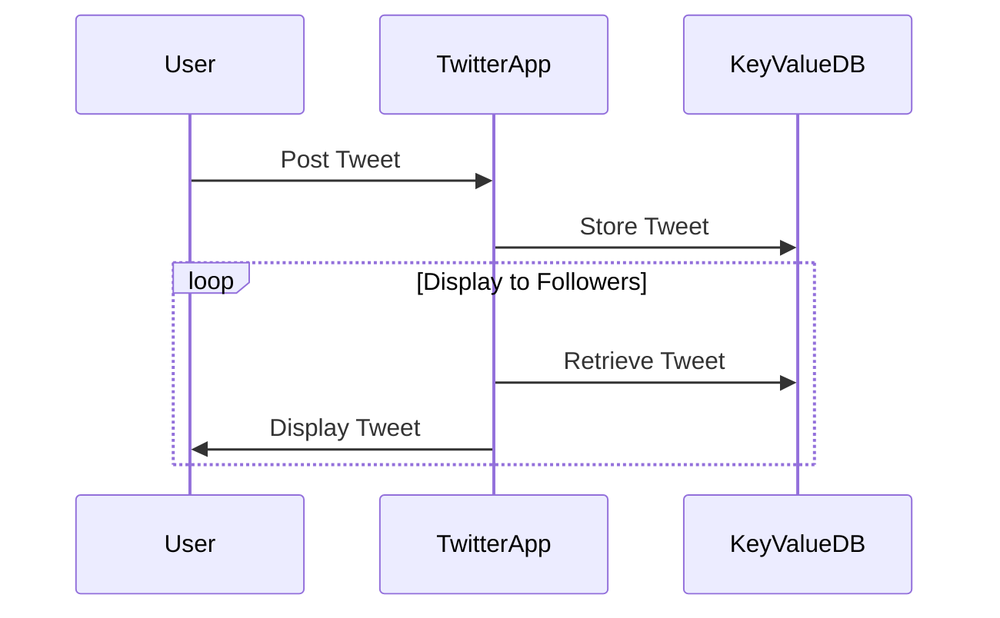
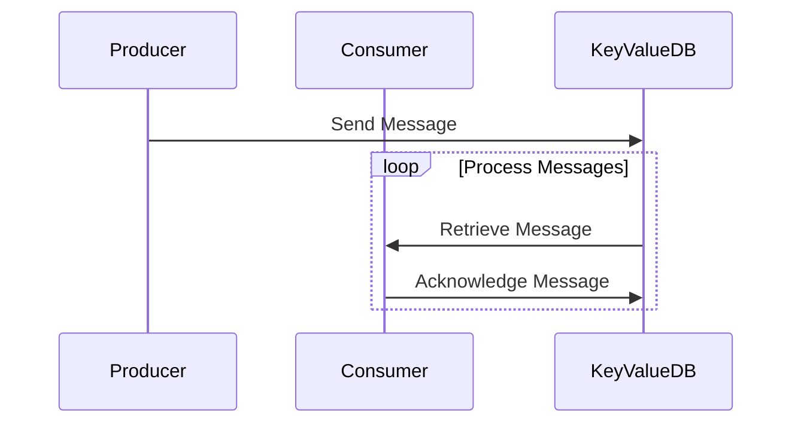
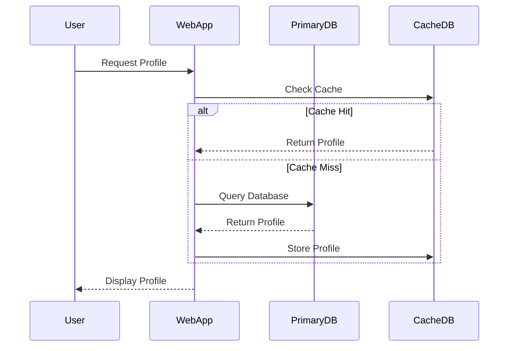
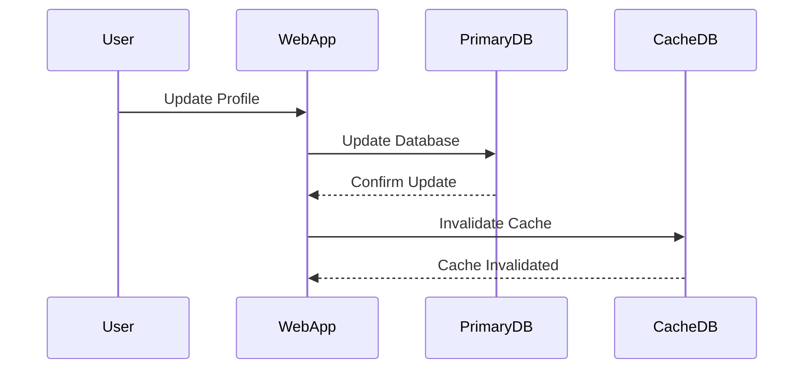
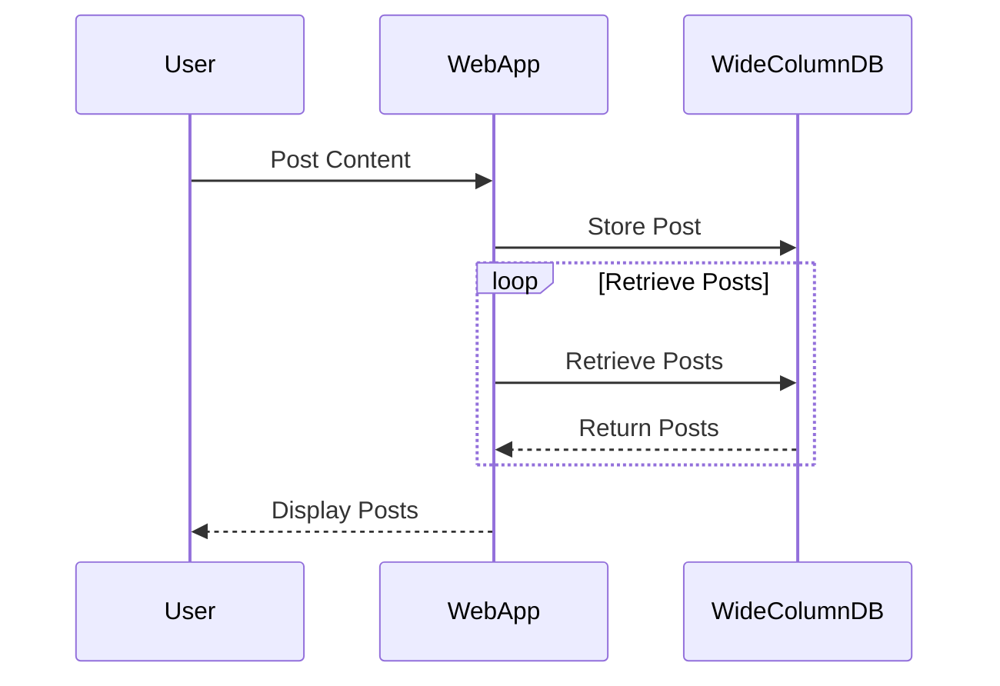

## Key-Value Databases

### Overview and Use Cases

Key-value databases are a type of NoSQL database that stores data in an associative array, a structure composed of pairs of keys and values. Each key is unique within the database, and the value can be any type of data, including strings, numbers, or even complex objects like JSON documents. These databases are designed for high performance and scalability, making them ideal for scenarios where speed and real-time data access are critical.

#### Real-Time Data Delivery

One of the most prominent use cases for key-value databases is real-time data delivery. Applications like Twitter and Snapchat rely heavily on key-value databases to ensure that user interactions are delivered instantly. For instance, when a user posts a tweet, the tweet is stored in a key-value database, and the system can quickly retrieve and display the tweet to all followers.



#### Message Queue

Another common use case is using key-value databases as a message queue. In this scenario, messages are stored in the database, and consumers can retrieve and process these messages in real-time. This is particularly useful in distributed systems where different components need to communicate asynchronously.



### Implementation Example: Redis

Redis is a popular open-source key-value database that supports various data structures, including strings, hashes, lists, sets, and sorted sets. It is widely used for caching, session management, and real-time analytics due to its high performance and low latency.

#### Redis Configuration

To set up Redis, you typically start by installing it on your server. Once installed, you can configure Redis to suit your needs. Here’s an example of a basic Redis configuration:

```ini
# redis.conf
port 6379
bind 127.0.0.1
maxmemory 256mb
maxmemory-policy allkeys-lru
```

This configuration sets the Redis port to 6379, binds it to the localhost interface, and limits the maximum memory usage to 256MB with an LRU eviction policy.

#### Redis Commands

Here are some common Redis commands:

```sh
# Set a key-value pair
redis-cli SET mykey "Hello, Redis!"

# Get the value of a key
redis-cli GET mykey

# Delete a key
redis-cli DEL mykey
```

### Use Case: Caching

Caching is one of the most common use cases for key-value databases. By storing frequently accessed data in a cache, you can significantly reduce the load on your primary database and improve application performance.

#### Example: Caching User Profiles

Suppose you have a web application that displays user profiles. Instead of querying the primary database every time a profile is requested, you can store the profiles in a key-value database like Redis.



### Use Case: Kubernetes State Storage

In Kubernetes, the `etcd` key-value database is used to store the cluster state. Every change in the cluster, such as creating or deleting resources, is immediately reflected in the `etcd` store. This ensures that the cluster state is consistent and up-to-date.

#### Example: etcd Configuration

To set up `etcd`, you can use the following command:

```sh
etcd --name node1 --data-dir /var/lib/etcd/default.etcd --listen-client-urls http://127.0.0.1:2379 --advertise-client-urls http://127.0.0.1:2379
```

This command starts an `etcd` node named `node1` and configures it to listen on `http://127.0.0.1:2379`.

### Pitfalls and How to Prevent

#### Data Consistency

One of the main challenges with key-value databases is ensuring data consistency. Since these databases are often used for caching, it is crucial to implement proper mechanisms to keep the cache in sync with the primary database.

**How to Prevent:**

1. **Use Expiry Mechanisms:** Set expiry times for cached data to ensure it is refreshed periodically.
2. **Implement Cache Invalidation:** Invalidate cache entries when the corresponding data in the primary database changes.

#### Example: Cache Invalidation



### Wide Column Databases

### Overview and Use Cases

Wide column databases are a type of NoSQL database that stores data in a tabular format, similar to relational databases. However, unlike relational databases, wide column databases allow for flexible schemas, where each row can have a different number of columns. This makes them ideal for handling large volumes of unstructured or semi-structured data.

#### Real-World Examples

Popular implementations of wide column databases include Apache Cassandra and Apache HBase. These databases are used in various industries, including social media, e-commerce, and finance, to manage large datasets.

#### Example: Apache Cassandra

Apache Cassandra is a highly scalable and fault-tolerant wide column database. It is designed to handle large amounts of data across many commodity servers, providing high availability with no single point of failure.

##### Cassandra Configuration

To set up Cassandra, you typically start by installing it on your server. Once installed, you can configure Cassandra to suit your needs. Here’s an example of a basic Cassandra configuration:

```yaml
# cassandra.yaml
cluster_name: 'Test Cluster'
num_tokens: 256
seed_provider:
    - class_name: org.apache.cassandra.locator.SimpleSeedProvider
      parameters:
          - seeds: "127.0.0.1"
```

This configuration sets the cluster name to `Test Cluster`, specifies the number of tokens, and defines the seed nodes.

##### Cassandra Commands

Here are some common Cassandra commands:

```sh
# Create a keyspace
cqlsh> CREATE KEYSPACE mykeyspace WITH replication = {'class': 'SimpleStrategy', 'replication_factor': 1};

# Use the keyspace
cqlsh> USE mykeyspace;

# Create a table
cqlsh> CREATE TABLE users (id UUID PRIMARY KEY, name TEXT, email TEXT);

# Insert data
cqlsh> INSERT INTO users (id, name, email) VALUES (uuid(), 'John Doe', 'john@example.com');

# Select data
cqlsh> SELECT * FROM users;
```

### Use Case: Handling Unstructured Data

Wide column databases are particularly useful for handling unstructured or semi-structured data. For example, in a social media application, user posts can contain various types of data, such as text, images, and videos. A wide column database can store this data flexibly, allowing for efficient retrieval and analysis.

#### Example: Storing Social Media Posts



### Pitfalls and How to Prevent

#### Data Consistency

Ensuring data consistency is a challenge with wide column databases, especially in distributed environments. Proper configuration and monitoring are essential to maintain consistency.

**How to Prevent:**

1. **Use Consistent Hashing:** Implement consistent hashing to distribute data evenly across nodes.
2. **Monitor and Tune Performance:** Regularly monitor the database performance and tune configurations as needed.

#### Example: Consistent Hashing

```mermaid
graph TD
    A[Client] --> B[Node 1]
    B --> C[Node 2]
    C --> D[Node 3]
    D --> E[Node 4]
    E --> F[Node 5]
    F --> G[Node 6]
    G --> H[Node 7]
    H --> I[Node 8]
    I --> J[Node 9]
    J --> K[Node 10]
    K --> L[Node 11]
    L --> M[Node 12]
    M --> N[Node 13]
    N --> O[Node 14]
    O --> P[Node 15]
    P --> Q[Node 16]
    Q --> R[Node 17]
    R --> S[Node 18]
    S --> T[Node 19]
    T --> U[Node 20]
    U --> V[Node 21]
    V --> W[Node 22]
    W --> X[Node 23]
    X --> Y[Node 24]
    Y --> Z[Node 25]
    Z --> AA[Node 26]
    AA --> AB[Node 27]
    AB --> AC[Node 28]
    AC --> AD[Node 29]
    AD --> AE[Node 30]
    AE --> AF[Node 31]
    AF --> AG[Node 32]
    AG --> AH[Node 33]
    AH --> AI[Node 34]
    AI --> AJ[Node 35]
    AJ --> AK[Node 36]
    AK --> AL[Node 37]
    AL --> AM[Node 38]
    AM --> AN[Node 39]
    AN --> AO[Node 40]
    AO --> AP[Node 41]
    AP --> AQ[Node 42]
    AQ --> AR[Node 43]
    AR --> AS[Node 44]
    AS --> AT[Node 45]
    AT --> AU[Node 46]
    AU --> AV[Node 47]
    AV --> AW[Node 48]
    AW --> AX[Node 49]
    AX --> AY[Node 50]
    AY --> AZ[Node 51]
    AZ --> BA[Node 52]
    BA --> BB[Node 53]
    BB --> BC[Node 54]
    BC --> BD[Node 55]
    BD --> BE[Node 56]
    BE --> BF[Node 57]
    BF --> BG[Node 58]
    BG --> BH[Node 59]
    BH --> BI[Node 60]
    BI --> BJ[Node 61]
    BJ --> BK[Node 62]
    BK --> BL[Node 63]
    BL --> BM[Node 64]
    BM --> BN[Node 65]
    BN --> BO[Node 66]
    BO --> BP[Node 67]
    BP --> BQ[Node 68]
    BQ --> BR[Node 69]
    BR --> BS[Node 70]
    BS --> BT[Node 71]
    BT --> BU[Node 72]
    BU --> BV[Node 73]
    BV --> BW[Node 74]
    BW --> BX[Node 75]
    BX --> BY[Node 76]
    BY --> BZ[Node 77]
    BZ --> CA[Node 78]
    CA --> CB[Node 79]
    CB --> CC[Node 80]
    CC --> CD[Node 81]
    CD --> CE[Node 82]
    CE --> CF[Node 83]
    CF --> CG[Node 84]
    CG --> CH[Node 85]
    CH --> CI[Node 86]
    CI --> CJ[Node 87]
    CJ --> CK[Node 88]
    CK --> CL[Node 89]
    CL --> CM[Node 90]
    CM --> CN[Node 91]
    CN --> CO[Node 92]
    CO --> CP[Node 93]
    CP --> CQ[Node 94]
    CQ --> CR[Node 95]
    CR --> CS[Node 96]
    CS --> CT[Node 97]
    CT --> CU[Node 98]
    CU --> CV[Node 99]
    CV --> CW[Node 100]
    CW --> CX[Node 101]
    CX --> CY[Node 102]
    CY --> CZ[Node 103]
    CZ --> DA[Node 104]
    DA --> DB[Node 105]
    DB --> DC[Node 106]
    DC --> DD[Node 107]
    DD --> DE[Node 108]
    DE --> DF[Node 109]
    DF --> DG[Node 110]
    DG --> DH[Node 111]
    DH --> DI[Node 112]
    DI --> DJ[Node 113]
    DJ --> DK[Node 114]
    DK --> DL[Node 115]
    DL --> DM[Node 116]
    DM --> DN[Node 117]
    DN --> DO[Node 118]
    DO --> DP[Node 119]
    DP --> DQ[Node 120]
    DQ --> DR[Node 121]
    DR --> DS[Node 122]
    DS --> DT[Node 123]
    DT --> DU[Node 124]
    DU --> DV[Node 125]
    DV --> DW[Node 126]
    DW --> DX[Node 127]
    DX --> DY[Node 128]
    DY --> DZ[Node 129]
    DZ --> EA[Node 130]
    EA --> EB[Node 131]
    EB --> EC[Node 132]
    EC --> ED[Node 133]
    ED --> EE[Node 134]
    EE --> EF[Node 135]
    EF --> EG[Node 136]
    EG --> EH[Node 137]
    EH --> EI[Node 138]
    EI --> EJ[Node 139]
    EJ --> EK[Node 140]
    EK --> EL[Node 141]
    EL --> EM[Node 142]
    EM --> EN[Node 143]
    EN --> EO[Node 144]
    EO --> EP[Node 145]
    EP --> EQ[Node 146]
    EQ --> ER[Node 147]
    ER --> ES[Node 148]
    ES --> ET[Node 149]
    ET --> EU[Node 150]
    EU --> EV[Node 151]
    EV --> EW[Node 152]
    EW --> EX[Node 153]
    EX --> EY[Node 154]
    EY --> EZ[Node 155]
    EZ --> FA[Node 156]
    FA --> FB[Node 157]
    FB --> FC[Node 158]
    FC --> FD[Node 159]
    FD --> FE[Node 160]
    FE --> FF[Node 161]
    FF --> FG[Node 162]
    FG --> FH[Node 163]
    FH --> FI[Node 164]
    FI --> FJ[Node 165]
    FJ --> FK[Node 166]
    FK --> FL[Node 167]
    FL --> FM[Node 168]
    FM --> FN[Node 169]
    FN --> FO[Node 170]
    FO --> FP[Node 171]
    FP --> FQ[Node 172]
    FQ --> FR[Node 173]
    FR --> FS[Node 174]
    FS --> FT[Node 175]
    FT --> FU[Node 176]
    FU --> FV[Node 177]
    FV --> FW[Node 178]
    FW --> FX[Node 179]
    FX --> FY[Node 180]
    FY --> FZ[Node 181]
    FZ --> GA[Node 182]
    GA --> GB[Node 183]
    GB --> GC[Node 184]
    GC --> GD[Node 185]
    GD --> GE[Node 186]
    GE --> GF[Node 187]
    GF --> GG[Node 188]
    GG --> GH[Node 189]
    GH --> GI[Node 190]
    GI --> GJ[Node 191]
    GJ --> GK[Node 192]
    GK --> GL[Node 193]
    GL --> GM[Node 194]
    GM --> GN[Node 195]
    GN --> GO[Node 196]
    GO --> GP[Node 197]
    GP --> GQ[Node 198]
    GQ --> GR[Node 199]
    GR --> GS[Node 200]
    GS --> GT[Node 201]
    GT --> GU[Node 202]
    GU --> GV[Node 203]
    GV --> GW[Node 204]
    GW --> GX[Node 205]
    GX --> GY[Node 206]
    GY --> GZ[Node 207]
    GZ --> HA[Node 208]
    HA --> HB[Node 209]
    HB --> HC[Node 210]
    HC --> HD[Node 211]
    HD --> HE[Node 212]
    HE --> HF[Node 213]
    HF --> HG[Node 214]
    HG --> HH[Node 215]
    HH --> HI[Node 216]
    HI --> HJ[Node 217]
    HJ --> HK[Node 218]
    HK --> HL[Node 219]
    HL --> HM[Node 220]
    HM --> HN[Node 221]
    HN --> HO[Node 222]
    HO --> HP[Node 223]
    HP --> HQ[Node 224]
    HQ --> HR[Node 225]
    HR --> HS[Node 226]
    HS --> HT[Node 227]
    HT --> HU[Node 228]
    HU --> HV[Node 229]
    HV --> HW[Node 230]
    HW --> HX[Node 231]
    HX --> HY[Node 232]
    HY --> HZ[Node 233]
    HZ --> IA[Node 234]
    IA --> IB[Node 235]
    IB --> IC[Node 236]
    IC --> ID[Node 237]
    ID --> IE[Node 238]
    IE --> IF[Node 239]
    IF --> IG[Node 240]
    IG --> IH[Node 241]
    IH --> II[Node 242]
    II --> IJ[Node 243]
    IJ --> IK[Node 244]
    IK --> IL[Node 245]
    IL --> IM[Node 246]
    IM --> IN[Node 247]
    IN --> IO[Node 248]
    IO --> IP[Node 249]
    IP --> IQ[Node 250]
    IQ --> IR[Node 251]
    IR --> IS[Node 252]
    IS --> IT[Node 253]
    IT --> IU[Node 254]
    IU --> IV[Node 255]
    IV --> IW[Node 256]
    IW --> IX[Node 257]
    IX --> IY[Node 258]
    IY --> IZ[Node 259]
    IZ --> JA[Node 260]
    JA --> JB[Node 261]
    JB --> JC[Node 262]
    JC --> JD[Node 263]
    JD --> JE[Node 264]
    JE --> JF[Node 265]
    JF --> JG[Node 266]
    JG --> JH[Node 267]
    JH --> JI[Node 268]
    JI --> JJ[Node 269]
    JJ --> JK[Node 270]
    JK --> JL[Node 271]
    JL --> JM[Node 272]
    JM --> JN[Node 273]
    JN --> JO[Node 274]
    JO --> JP[Node 275]
    JP --> JQ[Node 276]
    JQ --> JR[Node 277]
    JR --> JS[Node 278]
    JS --> JT[Node 279]
    JT --> JU[Node 280]
    JU --> JV[Node 281]
    JV --> JW[Node 282]
    JW --> JX[Node 283]
    JX --> JY[Node 284]
    JY --> JZ[Node 285]
    JZ --> KA[Node 286]
    KA --> KB[Node 287]
    KB --> KC[Node 288]
    KC --> KD[Node 289]
    KD --> KE[Node 290]
    KE --> KF[Node 291]
    KF --> KG[Node 292]
    KG --> KH[Node 293]
    KH --> KI[Node 294]
    KI --> KJ[Node 295]
    KJ --> KK[Node 296]
    KK --> KL[Node 297]
    KL --> KM[Node 298]
    KM --> KN[Node 299]
    KN --> KO[Node 300]
    KO --> KP[Node 301]
    KP --> KQ[Node 302]
    KQ --> KR[Node 303]
    KR --> KS[Node 304]
    KS --> KT[Node 305]
    KT --> KU[Node 306]
    KU --> KV[Node 307]
    KV --> KW[Node 308]
    KW --> KX[Node 309]
    KX --> KY[Node 310]
    KY --> KZ[Node 311]
    KZ --> LA[Node 312]
    LA --> LB[Node 313]
    LB --> LC[Node 314]
    LC --> LD[Node 315]
    LD --> LE[Node 316]
    LE --> LF[Node 317]
    LF --> LG[Node 318]
    LG --> LH[Node 319]
    LH --> LI[Node 320]
    LI --> LJ[Node 321]
    LJ --> LK[Node 322]
    LK --> LL[Node 323]
    LL --> LM[Node 324]
    LM --> LN[Node 325]
    LN --> LO[Node 326]
    LO --> LP[Node 327]
    LP --> LQ[Node 328]
    LQ --> LR[Node 329]
    LR --> LS[Node 330]
    LS --> LT[Node 331]
    LT --> LU[Node 332]
    LU --> LV[Node 333]
    LV --> LW[Node 334]
    LW --> LX[Node 335]
    LX --> LY[Node 336]
    LY --> LZ[Node 337]
    LZ --> MA[Node 338]
    MA --> MB[Node 339]
    MB --> MC[Node 340]
    MC --> MD[Node 341]
    MD --> ME[Node 342]
    ME --> MF[Node 343]
    MF --> MG[Node 344]
    MG --> MH[Node 345]
    MH --> MI[Node 346]
    MI --> MJ[Node 347]
    MJ --> MK[Node 348]
    MK --> ML[Node 349]
    ML --> MM[Node 350]
    MM --> MN[Node 351]
    MN --> MO[Node 352]
    MO --> MP[Node 353]
    MP --> MQ[Node 354]
    MQ --> MR[Node 355]
    MR --> MS[Node 356]
    MS --> MT[Node 357]
    MT --> MU[Node 358]
    MU --> MV[Node 359]
    MV --> MW[Node 360]
    MW --> MX[Node 361]
    MX --> MY[Node 362]
    MY --> MZ[Node 363]
    MZ --> NA[Node 364]
    NA --> NB[Node 365]
    NB --> NC[Node 366]
    NC --> ND[Node 367]
    ND --> NE[Node 368]
    NE --> NF[Node 369]
    NF --> NG[Node 370]
    NG --> NH[Node 371]
    NH --> NI[Node 372]
    NI --> NJ[Node 373]
    NJ --> NK[Node 374]
    NK --> NL[Node 375]
    NL --> NM[Node 376]
    NM --> NN[Node 377]
    NN --> NO[Node 378]
    NO --> NP[Node 379]
    NP --> NQ[Node 380]
    NQ --> NR[Node 381]
    NR --> NS[Node 382]
    NS --> NT[Node 383]
    NT --> NU[Node 384]
    NU --> NV[Node 385]
    NV --> NW[Node 386]
    NW --> NX[Node 387]
    NX --> NY[Node 388]
    NY --> NZ[Node 389]
    NZ --> OA[Node 390]
    OA --> OB[Node 391]
    OB --> OC[Node 392]
    OC --> OD[Node 393]
    OD --> OE[Node 394]
    OE --> OF[Node 395]
    OF --> OG[Node 396]
    OG --> OH[Node 397]
    OH --> OI[Node 398]
    OI --> OJ[Node 399]
    OJ --> OK[Node 400]
    OK --> OL[Node 401]
    OL --> OM[Node 402]
    OM --> ON[Node 403]
    ON --> OO[Node 404]
    OO --> OP[Node 405]
    OP --> OQ[Node 406]
    OQ --> OR[Node 407]
    OR --> OS[Node

---
<!-- nav -->
[[04-Introduction to Relational Databases|Introduction to Relational Databases]] | [[DevOps/DevOps Bootcamp/11-Miscellaneous/18-Types Of Databases And Their Use Cases/00-Overview|Overview]] | [[06-Relational SQL Databases|Relational SQL Databases]]
