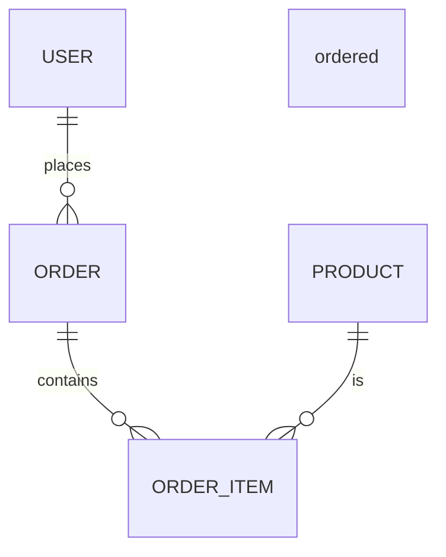
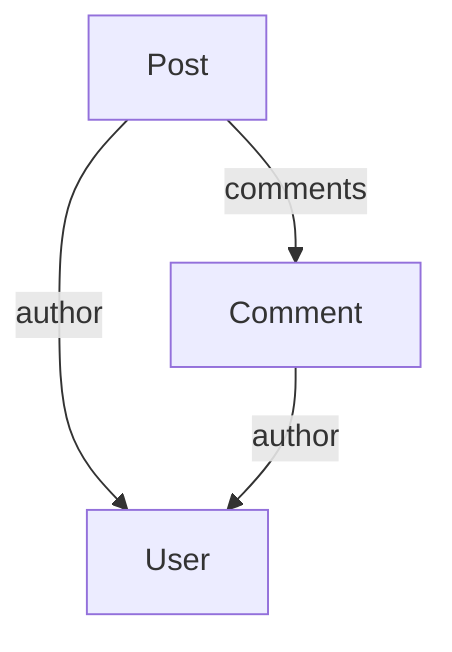
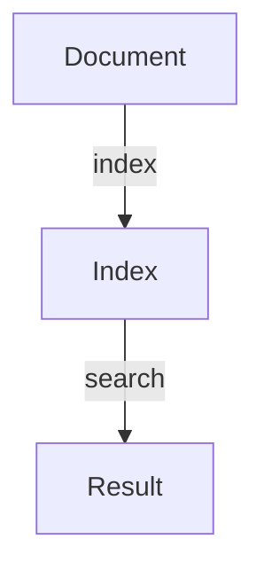

## Relational SQL Databases

### Background Theory

Relational SQL databases are the most widely used type of database systems. They are based on the relational model, which organizes data into tables with rows and columns. Each row represents a record, and each column represents a field. The relationships between different tables are defined using keys, such as primary keys and foreign keys.

### Use Cases

Relational SQL databases are ideal for applications that require structured data and complex queries. They are commonly used in enterprise environments for managing financial transactions, customer information, and inventory management. Some popular examples of relational SQL databases include MySQL, PostgreSQL, and Oracle.

### Example: Recommendation Engines

Recommendation engines are a prime example of applications that benefit from relational SQL databases. These systems analyze user behavior and preferences to provide personalized recommendations. For instance, Netflix uses a recommendation engine to suggest movies and TV shows to its users based on their viewing history and ratings.

#### Full Raw HTTP Request and Response

```http
GET /recommendations?userId=123 HTTP/1.1
Host: api.netflix.com
Authorization: Bearer <access_token>

HTTP/1.1 200 OK
Content-Type: application/json

{
  "recommendations": [
    {
      "title": "Stranger Things",
      "type": "TV Show",
      "rating": 4.8,
      "posterUrl": "https://image.tmdb.org/t/p/w500/kqJL4OyU110Ml91mC1T0KzYQ4yd.jpg"
    },
    {
      "title": "The Crown",
      "type": "TV Show",
      "rating": 4.7,
      "posterUrl": "https://image.tmdb.org/t/p/w500/jPZGtVYXcRyjNf9hE5W6v1fzBHr.jpg"
    }
  ]
}
```

### How to Prevent / Defend

To ensure the security and integrity of relational SQL databases, several measures can be taken:

1. **Input Validation**: Validate all inputs to prevent SQL injection attacks.
2. **Parameterized Queries**: Use parameterized queries to avoid SQL injection vulnerabilities.
3. **Access Control**: Implement strict access control policies to limit who can access the database.
4. **Encryption**: Encrypt sensitive data both at rest and in transit.

#### Vulnerable Code vs Secure Code

**Vulnerable Code:**
```sql
SELECT * FROM users WHERE username = '$username';
```

**Secure Code:**
```sql
PreparedStatement stmt = connection.prepareStatement("SELECT * FROM users WHERE username = ?");
stmt.setString(1, username);
ResultSet rs = stmt.executeQuery();
```

### Document-Oriented Databases

### Background Theory

Document-oriented databases store data in documents rather than tables. Each document is a self-contained unit of data, typically in a format like JSON or BSON. This allows for flexible schema design, making it easier to handle unstructured or semi-structured data.

### Use Cases

Document-oriented databases are well-suited for applications that require high scalability and flexibility. They are often used in content management systems, social media platforms, and e-commerce websites. MongoDB and CouchDB are popular examples of document-oriented databases.

### Example: Content Management Systems

Content management systems (CMS) often use document-oriented databases to store and manage content. For example, WordPress can be configured to use MongoDB for storing posts, pages, and other content.

#### Full Raw HTTP Request and Response

```http
GET /posts HTTP/1.1
Host: api.wordpress.com
Authorization: Bearer <access_token>

HTTP/1.1 200 OK
Content-Type: application/json

{
  "posts": [
    {
      "id": 1,
      "title": "Welcome to WordPress",
      "content": "This is your first post.",
      "author": "admin",
      "date": "2023-10-01T12:00:00Z"
    },
    {
      "id": 2,
      "title": "Second Post",
      "content": "Here is some more content.",
      "author": "editor",
      "date": "2023-10-02T12:00:00Z"
    }
  ]
}
```

### How to Prevent / Defend

To secure document-oriented databases, consider the following best practices:

1. **Authentication and Authorization**: Ensure that only authorized users can access the database.
2. **Data Encryption**: Encrypt sensitive data to protect it from unauthorized access.
3. **Regular Backups**: Perform regular backups to recover data in case of loss or corruption.
4. **Monitoring and Auditing**: Monitor database activity and log access to detect and respond to suspicious activities.

#### Vulnerable Code vs Secure Code

**Vulnerable Code:**
```javascript
db.posts.find({ author: req.query.author });
```

**Secure Code:**
```javascript
const author = req.query.author;
if (!author) {
  return res.status(400).send('Author is required');
}
db.posts.find({ author: author }, (err, posts) => {
  if (err) {
    return res.status(500).send(err);
  }
  res.json(posts);
});
```

### Search Databases

### Background Theory

Search databases are designed to efficiently handle full-text searches across large datasets. They create indexes of individual words and phrases, allowing for quick retrieval of relevant results. This makes them ideal for applications like search engines, where users expect fast and accurate results.

### Use Cases

Search databases are commonly used in web search engines, e-commerce platforms, and content discovery systems. Elasticsearch and Solr are two popular search databases.

### Example: Web Search Engine

Google is a prime example of a search engine that relies on a search database. When a user types a query, the search database quickly retrieves the most relevant results from its indexed data.

#### Full Raw HTTP Request and Response

```http
GET /search?q=best+books HTTP/1.1
Host: www.google.com

HTTP/1.1 200 OK
Content-Type: application/json

{
  "results": [
    {
      "title": "Best Books of All Time",
      "url": "https://www.goodreads.com/list/show/1.Best_Books_Ever",
      "snippet": "Discover the best books of all time, including classics, modern favorites, and more."
    },
    {
      "title": "Top 10 Best Books to Read",
      "url": "https://www.bookbub.com/best-books",
      "snippet": "Explore the top 10 best books to read, recommended by experts and readers alike."
    }
  ]
}
```

### How to Prevent / Defend

To secure search databases, follow these best practices:

1. **Access Control**: Limit access to the database to only authorized users.
2. **Data Encryption**: Encrypt sensitive data to protect it from unauthorized access.
3. **Regular Backups**: Perform regular backups to ensure data recovery in case of loss or corruption.
4. **Monitoring and Auditing**: Monitor database activity and log access to detect and respond to suspicious activities.

#### Vulnerable Code vs Secure Code

**Vulnerable Code:**
```json
{
  "query": {
    "match": {
      "content": "best books"
    }
  }
}
```

**Secure Code:**
```json
{
  "query": {
    "match": {
      "content": {
        "query": "best books",
        "operator": "and"
      }
    }
  }
}
```

### Mermaid Diagrams

#### Relational SQL Database Schema



#### Document-Oriented Database Schema



#### Search Database Schema



### Practice Labs

For hands-on experience with search databases, consider the following labs:

- **PortSwigger Web Security Academy**: Offers exercises on web application security, including search functionality.
- **OWASP Juice Shop**: A deliberately insecure web application for security training.
- **DVWA (Damn Vulnerable Web Application)**: Provides a range of web application vulnerabilities for practice.

By thoroughly understanding and implementing these concepts, you can effectively leverage different types of databases to meet the specific needs of your applications.

---
<!-- nav -->
[[05-Key-Value Databases|Key-Value Databases]] | [[DevOps/DevOps Bootcamp/11-Miscellaneous/18-Types Of Databases And Their Use Cases/00-Overview|Overview]] | [[07-Types of Databases and Their Use Cases|Types of Databases and Their Use Cases]]
