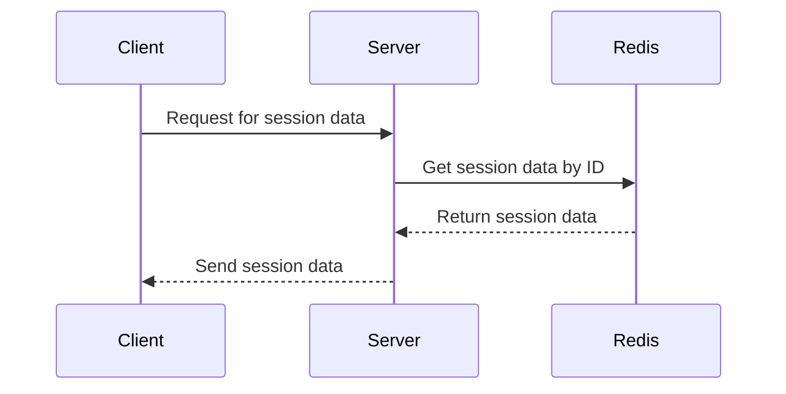
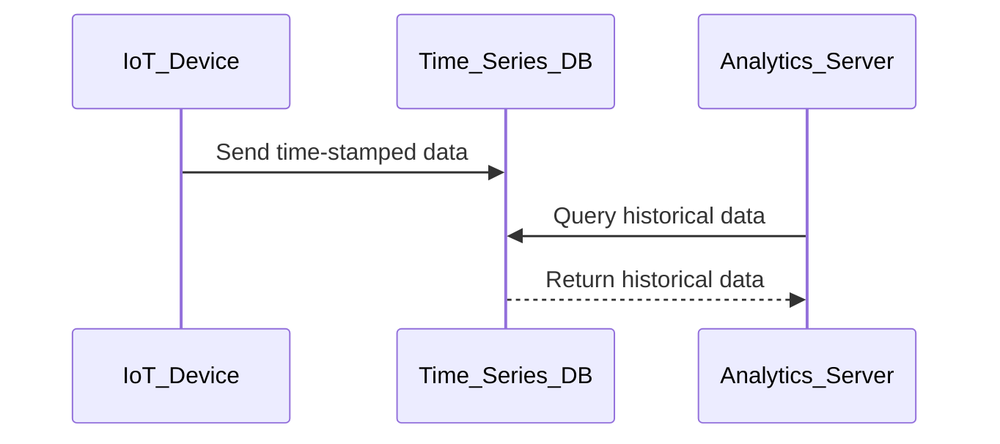
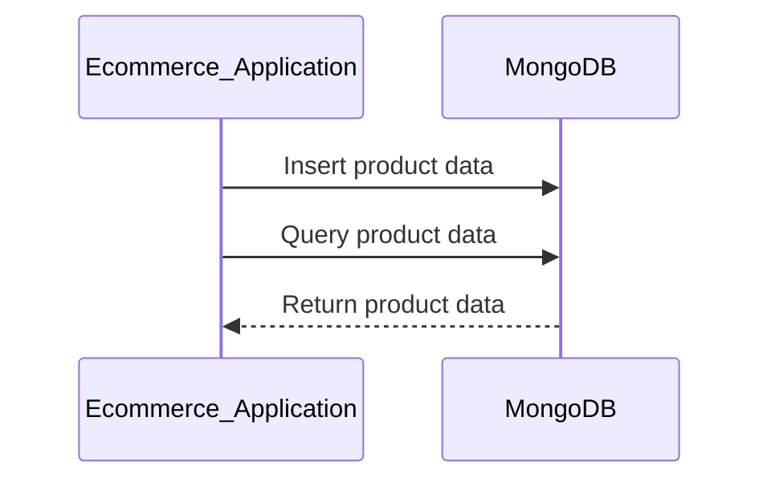

## Types of Databases and Their Use Cases

### Introduction to Database Types

Databases are essential components of modern software systems, providing structured storage and retrieval mechanisms for data. Different types of databases cater to various use cases, each with its own strengths and limitations. In this section, we will delve into three types of databases: Key-Value Databases, Time Series Databases, and Document-Oriented Databases. We will explore their characteristics, use cases, and provide detailed explanations, examples, and security considerations.

### Key-Value Databases

#### What Are Key-Value Databases?

Key-Value databases store data in a simple format where each piece of data is associated with a unique key. This structure allows for efficient retrieval and storage operations. Unlike relational databases, Key-Value databases do not enforce a rigid schema, making them highly flexible and scalable.

#### Why Use Key-Value Databases?

Key-Value databases are particularly useful for applications that require high performance and scalability. They excel in scenarios where data is frequently accessed by a unique identifier, such as session management, caching, and real-time analytics.

#### How Do Key-Value Databases Work?

In a Key-Value database, data is stored as a pair of key-value. The key is a unique identifier, and the value can be any type of data, including strings, numbers, or even complex objects. The database engine uses the key to quickly locate and retrieve the corresponding value.

#### Example: Redis Key-Value Store

Redis is a popular in-memory Key-Value store that supports various data structures, including strings, hashes, lists, sets, and sorted sets. Here’s an example of using Redis:
```python
import redis

# Connect to Redis server
r = redis.Redis(host='localhost', port=6379, db=0)

# Set a key-value pair
r.set('name', 'Alice')

# Retrieve the value using the key
value = r.get('name')
print(value.decode())  # Output: Alice
```

#### Use Case: Session Management

Key-Value databases are often used for session management in web applications. Each user session is stored as a key-value pair, where the key is a unique session ID, and the value contains session data.



#### Pitfalls and Security Considerations

One of the main limitations of Key-Value databases is the lack of support for complex queries and relationships between data. Additionally, since data is often stored in memory, it can be lost if the server crashes unless proper persistence mechanisms are implemented.

**How to Prevent / Defend:**

- **Persistence:** Ensure that the Key-Value store supports persistence to disk to avoid data loss.
- **Encryption:** Encrypt sensitive data stored in the Key-Value store.
- **Access Control:** Implement strict access control policies to prevent unauthorized access.

### Time Series Databases

#### What Are Time Series Databases?

Time Series Databases (TSDBs) are designed to handle time-stamped data efficiently. They are optimized for storing and querying large volumes of timestamped data, making them ideal for applications that deal with time series data, such as IoT devices, financial markets, and sensor networks.

#### Why Use Time Series Databases?

Time Series Databases are particularly useful for applications that require real-time analysis of time-stamped data. They provide efficient storage and retrieval mechanisms, allowing for fast querying and aggregation of historical data.

#### How Do Time Series Databases Work?

Time Series Databases store data points along with timestamps. They are optimized for range queries and aggregations over time intervals. Many TSDBs support compression techniques to reduce storage requirements and improve query performance.

#### Example: InfluxDB Time Series Database

InfluxDB is a popular open-source Time Series Database. Here’s an example of inserting and querying data using InfluxDB:

```sql
-- Insert data into InfluxDB
INSERT INTO sensor_data (time, temperature, humidity)
VALUES ('2023-10-01T12:00:00Z', 25.5, 60)

-- Query data from InfluxDB
SELECT * FROM sensor_data WHERE time >= '2023-10-01T12:00:00Z'
```

#### Use Case: IoT Device Monitoring

Time Series Databases are commonly used for monitoring IoT devices. Each device sends time-stamped data to the database, which can be queried to analyze device behavior over time.



#### Pitfalls and Security Considerations

One of the main challenges with Time Series Databases is managing large volumes of data over time. Proper retention policies must be implemented to ensure that old data is purged to maintain performance.

**How to Prevent / Defend:**

- **Retention Policies:** Implement retention policies to automatically delete old data.
- **Data Encryption:** Encrypt data at rest and in transit.
- **Access Control:** Enforce strict access control to prevent unauthorized access.

### Document-Oriented Databases

#### What Are Document-Oriented Databases?

Document-Oriented Databases store data in documents, typically in JSON or BSON format. Each document can contain nested data structures, making them highly flexible and suitable for storing unstructured data.

#### Why Use Document-Oriented Databases?

Document-Oriented Databases are ideal for applications that require flexibility in data modeling. They allow for schema-less data storage, making it easy to add new fields or modify existing ones without altering the entire database schema.

#### How Do Document-Oriented Databases Work?

Documents are stored in collections, which can be thought of as tables in a relational database. However, unlike relational databases, Document-Oriented Databases do not support joins, making them simpler but also more limited in terms of complex queries.

#### Example: MongoDB Document-Oriented Database

MongoDB is one of the most popular Document-Oriented Databases. Here’s an example of inserting and querying data using MongoDB:

```javascript
// Insert data into MongoDB
db.users.insertOne({
    name: "Alice",
    age: 30,
    address: {
        street: "123 Main St",
        city: "Anytown"
    }
})

// Query data from MongoDB
db.users.find({ name: "Alice" })
```

#### Use Case: E-commerce Applications

Document-Oriented Databases are commonly used in e-commerce applications where product data can vary widely. Each product can be stored as a document, containing various attributes and nested data structures.



#### Pitfalls and Security Considerations

One of the main challenges with Document-Oriented Databases is managing complex queries and relationships between documents. Since joins are not supported, alternative approaches such as embedding related data within documents or using separate collections must be employed.

**How to Prevent / Defend:**

- **Data Modeling:** Design documents carefully to minimize the need for complex queries.
- **Indexing:** Use indexes to improve query performance.
- **Data Encryption:** Encrypt sensitive data stored in the database.
- **Access Control:** Implement strict access control policies to prevent unauthorized access.

### Conclusion

In this chapter, we explored three types of databases: Key-Value Databases, Time Series Databases, and Document-Oriented Databases. Each type has its own strengths and use cases, and understanding their characteristics is crucial for selecting the right database for your application. By considering the specific requirements of your use case, you can choose the most appropriate database type and implement robust security measures to protect your data.

### Practice Labs

For hands-on experience with these database types, consider the following practice labs:

- **Key-Value Databases:** Use Redis to implement a session management system.
- **Time Series Databases:** Use InfluxDB to monitor and analyze IoT device data.
- **Document-Oriented Databases:** Use MongoDB to build an e-commerce application.

These labs will provide practical experience in designing, implementing, and securing database systems for various use cases.

---
<!-- nav -->
[[06-Relational SQL Databases|Relational SQL Databases]] | [[DevOps/DevOps Bootcamp/11-Miscellaneous/18-Types Of Databases And Their Use Cases/00-Overview|Overview]] | [[DevOps/DevOps Bootcamp/11-Miscellaneous/18-Types Of Databases And Their Use Cases/08-Practice Questions & Answers|Practice Questions & Answers]]
