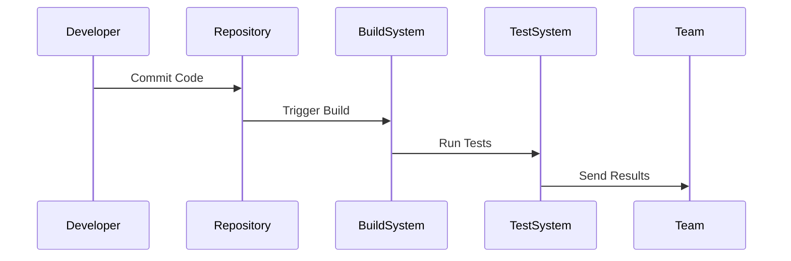
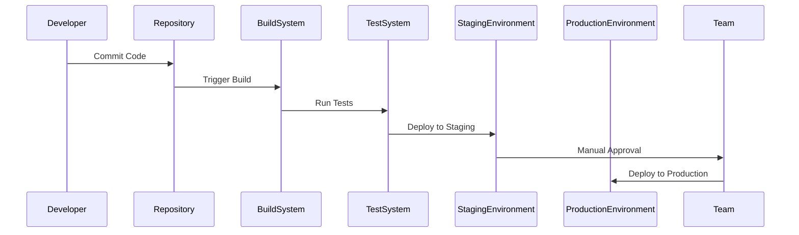
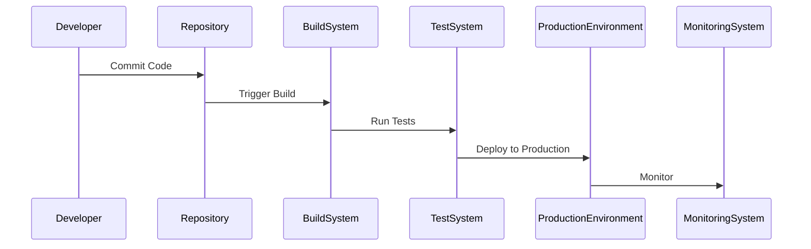

## Introduction to Roles in Software Development Lifecycle

In the modern software development landscape, the roles and responsibilities within the Software Development Lifecycle (SDLC) have evolved significantly. One of the most influential paradigms that have reshaped the traditional SDLC is DevOps. DevOps is a set of practices that emphasizes collaboration and communication between development and operations teams in order to improve the speed and quality of software releases. At the core of DevOps is the implementation of best practices from the Agile framework, which focuses on iterative development, continuous feedback, and rapid delivery.

### Continuous Integration (CI)

Continuous Integration (CI) is a practice where developers frequently merge their code changes into a central repository, after which automated builds and tests are run. This ensures that the codebase remains stable and that issues are identified and resolved quickly. The primary goal of CI is to detect integration problems as quickly as possible, allowing teams to address them promptly.

#### How CI Works

1. **Code Commit**: Developers commit their code changes to a shared repository.
2. **Automated Build**: An automated build system pulls the latest code and compiles it.
3. **Automated Tests**: Automated tests are run to ensure that the new code does not break existing functionality.
4. **Feedback Loop**: Results of the build and tests are communicated back to the team, often through notifications or dashboards.



#### Real-World Example

A recent example of CI in action can be seen in the development of open-source projects like Kubernetes. Kubernetes uses a comprehensive CI pipeline that includes static code analysis, unit tests, and integration tests. This ensures that any contribution to the project is thoroughly vetted before being merged into the main branch.

### Continuous Delivery (CD)

Continuous Delivery (CD) extends the principles of CI by ensuring that the software can be released to production at any time. In CD, the focus is on automating the release process so that the software can be deployed reliably and consistently. This means that the software should always be in a deployable state, and the only thing preventing a release is a decision to do so.

#### How CD Works

1. **Automated Deployment**: Once the code passes all tests, it is automatically deployed to a staging environment.
2. **Manual Approval**: A manual approval step may be required before deploying to production.
3. **Rollback Mechanism**: A rollback mechanism is in place to revert to a previous version if something goes wrong.



#### Real-World Example

Netflix is a well-known example of a company that has implemented CD effectively. Netflix uses a tool called Spinnaker, which automates the deployment process across multiple environments. This allows Netflix to release new features and updates to their streaming service quickly and reliably.

### Continuous Deployment (CDep)

Continuous Deployment (CDep) takes CD one step further by automating the entire deployment process, including the final step to production. In CDep, once the code passes all tests, it is automatically deployed to production without any manual intervention.

#### How CDep Works

1. **Automated Deployment**: Once the code passes all tests, it is automatically deployed to production.
2. **Monitoring**: Post-deployment monitoring is in place to detect any issues immediately.
3. **Rollback Mechanism**: A rollback mechanism is in place to revert to a previous version if something goes wrong.



#### Real-World Example

Amazon is a prime example of a company that has implemented CDep. Amazon deploys thousands of changes to its systems every day using an automated deployment pipeline. This allows Amazon to respond quickly to customer needs and market changes.

### Automation Tools

Automation tools play a crucial role in DevOps by replacing manual tasks with automated processes. These tools help in streamlining the development, testing, and deployment processes, making them faster and more reliable.

#### Common Automation Tools

1. **Jenkins**: An open-source automation server that provides hundreds of plugins to support building, deploying, and automating any project.
2. **GitLab CI/CD**: A built-in CI/CD platform that integrates seamlessly with GitLab repositories.
3. **CircleCI**: A cloud-based CI/CD platform that supports various programming languages and frameworks.
4. **GitHub Actions**: A CI/CD platform that allows you to automate your software workflows directly in your GitHub repository.

#### Example Configuration

Here is an example of a Jenkinsfile that defines a CI/CD pipeline:

```yaml
pipeline {
    agent any

    stages {
        stage('Checkout') {
            steps {
                git 'https://github.com/example/repo.git'
            }
        }

        stage('Build') {
            steps {
                sh 'mvn clean package'
            }
        }

        stage('Test') {
            steps {
                sh 'mvn test'
            }
        }

        stage('Deploy') {
            steps {
                script {
                    if (env.BRANCH_NAME == 'master') {
                        sh 'scp target/*.jar user@server:/path/to/deploy'
                    }
                }
            }
        }
    }
}
```

### Pitfalls and Best Practices

While DevOps offers significant benefits, there are also potential pitfalls that teams need to be aware of. Some common pitfalls include:

1. **Over-reliance on Automation**: While automation is beneficial, it should not replace human judgment entirely. Teams should still review and approve critical changes.
2. **Security Risks**: Automated deployments can introduce security risks if proper controls are not in place. Teams should implement security checks and validations throughout the pipeline.
3. **Complexity**: Managing a complex CI/CD pipeline can be challenging. Teams should keep the pipeline simple and modular to avoid unnecessary complexity.

#### How to Prevent / Defend

1. **Implement Security Checks**: Integrate security scans into the CI/CD pipeline to detect vulnerabilities early. For example, using tools like SonarQube or OWASP ZAP.

    ```yaml
    pipeline {
        agent any

        stages {
            stage('Checkout') {
                steps {
                    git 'https://github.com/example/repo.git'
                }
            }

            stage('Build') {
                steps {
                    sh 'mvn clean package'
                }
            }

            stage('Security Scan') {
                steps {
                    sh 'sonar-scanner'
                }
            }

            stage('Test') {
                steps {
                    sh 'mvn test'
                }
            }

            stage('Deploy') {
                steps {
                    script {
                        if (env.BRANCH_NAME == 'master') {
                            sh 'scp target/*.jar user@server:/path/to/deploy'
                        }
                    }
                }
            }
        }
    }
    ```

2. **Use Feature Flags**: Implement feature flags to control the rollout of new features. This allows teams to gradually roll out new features and monitor their impact before fully releasing them.

    ```mermaid
sequenceDiagram
        participant User
        participant FeatureFlagService
        participant Application

        User->>FeatureFlagService: Request Feature
        FeatureFlagService->>Application: Return Flag Status
        Application->>User: Serve Feature or Default
```

3. **Monitor and Log**: Implement comprehensive monitoring and logging to detect and respond to issues quickly. Use tools like Prometheus and Grafana for monitoring and ELK stack for logging.

    ```yaml
    pipeline {
        agent any

        stages {
            stage('Checkout') {
                steps {
                    git 'https://github.com/example/repo.git'
                }
            }

            stage('Build') {
                steps {
                    sh 'mvn clean package'
                }
            }

            stage('Security Scan') {
                steps {
                    sh 'sonar-scanner'
                }
            }

            stage('Test') {
                steps {
                    sh 'mvn test'
                }
            }

            stage('Deploy') {
                steps {
                    script {
                        if (env.BRANCH_NAME == 'master') {
                            sh 'scp target/*.jar user@server:/path/to/deploy'
                        }
                    }
                }
            }

            stage('Monitor') {
                steps {
                    sh 'prometheus --config.file=prometheus.yml'
                }
            }
        }
    }
    ```

### Hands-On Labs

To gain practical experience with DevOps concepts, consider the following hands-on labs:

- **PortSwigger Web Security Academy**: Focuses on web application security but also covers CI/CD pipelines.
- **OWASP Juice Shop**: A deliberately insecure web application for security training.
- **DVWA (Damn Vulnerable Web Application)**: Another web application for security training.
- **WebGoat**: An interactive web application security training tool.

These labs provide a controlled environment to practice and apply the concepts learned in this chapter.

### Conclusion

DevOps is a transformative approach to software development that emphasizes collaboration, automation, and continuous improvement. By implementing CI, CD, and CDep, teams can deliver high-quality software quickly and reliably. However, it is essential to be aware of the potential pitfalls and to implement best practices to ensure the success of DevOps initiatives. Through hands-on labs and practical experience, teams can master the skills needed to thrive in the DevOps paradigm.

---
<!-- nav -->
[[DevOps/DevOps Bootcamp/11-Miscellaneous/19-Understanding Roles in Software Development Lifecycle/00-Overview|Overview]] | [[02-Introduction to Roles in the Software Development Lifecycle|Introduction to Roles in the Software Development Lifecycle]]
