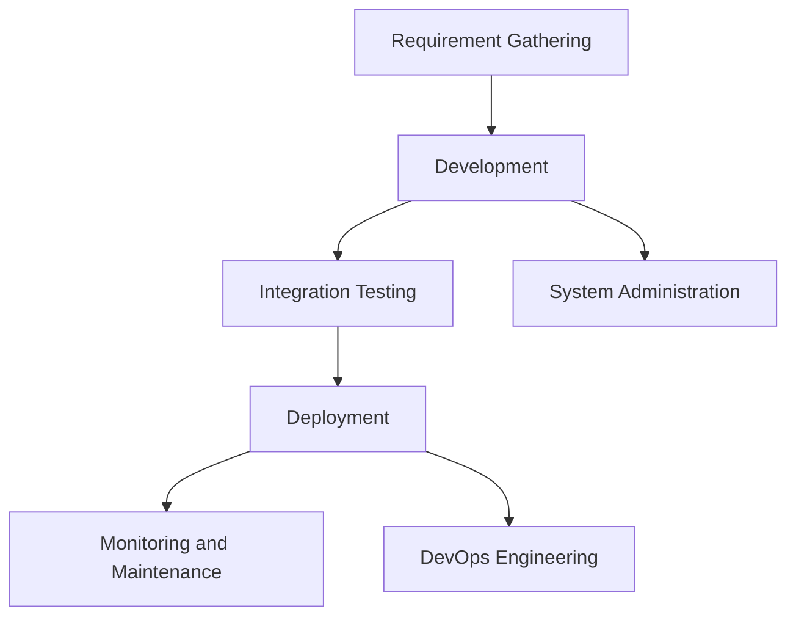

## Introduction to Roles in the Software Development Lifecycle

Understanding the various roles involved in the software development lifecycle (SDLC) is crucial for anyone working in the IT industry. Each role plays a distinct part in the creation, deployment, and maintenance of software applications. This chapter will delve into the responsibilities of key roles such as developers, system administrators, and DevOps engineers, providing a comprehensive overview of how these roles interact and contribute to the overall success of a project.

### Developers

Developers are responsible for writing, testing, and maintaining the codebase of an application. They work closely with product managers and other stakeholders to understand requirements and translate them into functional software. There are several types of developers, including:

- **Front-end Developers**: Focus on the user interface and experience (UI/UX). They use technologies like HTML, CSS, and JavaScript to create interactive and visually appealing interfaces.
- **Back-end Developers**: Handle server-side logic, databases, and APIs. They ensure that the application functions correctly and efficiently behind the scenes.
- **Full-stack Developers**: Possess skills in both front-end and back-end development, allowing them to work on all aspects of an application.

#### Responsibilities of Developers

- **Writing Code**: Developers write clean, maintainable, and efficient code using programming languages such as Python, Java, C++, etc.
- **Testing**: They perform unit tests, integration tests, and other forms of testing to ensure the quality of their code.
- **Debugging**: Identifying and fixing bugs in the codebase.
- **Collaboration**: Working with other team members, including designers, product managers, and other developers, to ensure the application meets the desired specifications.

#### Recent Real-World Example: CVE-2021-44228 (Log4Shell)

One of the most significant vulnerabilities in recent years was the Log4Shell vulnerability (CVE-2021-44228). This vulnerability affected the Apache Log4j library, which is widely used in Java applications for logging purposes. The vulnerability allowed attackers to execute arbitrary code on the server, leading to potential data breaches and system compromises.

**Code Example: Vulnerable Log4j Configuration**

```java
import org.apache.logging.log4j.LogManager;
import org.apache.logging.log4j.Logger;

public class VulnerableApp {
    private static final Logger logger = LogManager.getLogger(VulnerableApp.class);

    public void logMessage(String message) {
        logger.info(message);
    }
}
```

**Secure Code Example: Updated Log4j Configuration**

```java
import org.apache.logging.log4j.LogManager;
import org.apache.logging.log4j.Logger;

public class SecureApp {
    private static final Logger logger = LogManager.getLogger(SecureApp.class);

    public void logMessage(String message) {
        // Ensure the message does not contain malicious content
        if (!message.contains("${")) {
            logger.info(message);
        } else {
            logger.warn("Potential malicious input detected: {}", message);
        }
    }
}
```

#### How to Prevent / Defend

- **Update Dependencies**: Regularly update all dependencies, including libraries like Log4j, to the latest versions.
- **Input Validation**: Validate all inputs to prevent injection attacks.
- **Security Audits**: Conduct regular security audits and penetration testing to identify and mitigate vulnerabilities.

### System Administrators

System administrators are responsible for managing and maintaining the infrastructure that supports software applications. They ensure that servers, networks, and other systems are running smoothly and securely. Their duties include:

- **Server Management**: Configuring and maintaining servers, ensuring they are up-to-date and secure.
- **Network Administration**: Managing network infrastructure, including routers, switches, and firewalls.
- **Backup and Recovery**: Implementing backup strategies and recovery plans to protect against data loss.
- **Security**: Ensuring the security of the infrastructure, including implementing firewalls, intrusion detection systems, and other security measures.

#### Recent Real-World Example: SolarWinds Supply Chain Attack (CVE-2020-1014)

In December 2020, a sophisticated supply chain attack targeted SolarWinds, a company that provides network management software. The attackers inserted malicious code into SolarWinds' Orion software, which was then distributed to thousands of customers. This led to a widespread compromise of government agencies and private companies.

**Code Example: Malicious SolarWinds Configuration**

```xml
<!-- Malicious configuration snippet -->
<configuration>
    <settings>
        <setting name="updateUrl">http://malicious-server.com/update</setting>
    </settings>
</configuration>
```

**Secure Code Example: Updated SolarWinds Configuration**

```xml
<!-- Secure configuration snippet -->
<configuration>
    <settings>
        <setting name="updateUrl">https://trusted-solarwinds-server.com/update</setting>
    </settings>
</configuration>
```

#### How to Prevent / Defend

- **Supply Chain Security**: Implement strict controls over third-party software and dependencies.
- **Regular Audits**: Conduct regular audits of software configurations and dependencies.
- **Multi-Factor Authentication**: Use multi-factor authentication (MFA) for critical systems and services.

### DevOps Engineers

DevOps engineers bridge the gap between development and operations teams. They focus on automating and streamlining the software delivery process, ensuring that applications are deployed quickly and reliably. Key responsibilities include:

- **Continuous Integration/Continuous Deployment (CI/CD)**: Setting up and maintaining CI/CD pipelines to automate the build, test, and deployment processes.
- **Infrastructure as Code (IaC)**: Writing and maintaining infrastructure configurations using tools like Terraform, Ansible, and CloudFormation.
- **Monitoring and Logging**: Implementing monitoring and logging solutions to track the health and performance of applications and infrastructure.
- **Collaboration**: Facilitating communication and collaboration between development and operations teams.

#### Recent Real-World Example: Docker Hub Breach (CVE-2021-39123)

In August 2021, Docker Hub, a popular registry for Docker images, experienced a security breach. Attackers gained access to users' accounts and were able to push malicious images to the registry. This led to potential compromises of systems that relied on these images.

**Code Example: Vulnerable Dockerfile**

```Dockerfile
FROM python:3.9
COPY . /app
WORKDIR /app
RUN pip install -r requirements.txt
CMD ["python", "app.py"]
```

**Secure Code Example: Updated Dockerfile**

```Dockerfile
FROM python:3.9-slim
COPY . /app
WORKDIR /app
RUN pip install --no-cache-dir -r requirements.txt
CMD ["python", "app.py"]
```

#### How to Prevent / Defend

- **Image Scanning**: Use tools like Trivy or Clair to scan Docker images for vulnerabilities.
- **Access Controls**: Implement strict access controls and multi-factor authentication for Docker registries.
- **Regular Updates**: Keep all dependencies and libraries up-to-date to mitigate known vulnerabilities.

### Interaction Between Roles

To illustrate how these roles interact, consider a typical software development process:

1. **Requirement Gathering**: Product managers and developers collaborate to define the requirements for a new feature.
2. **Development**: Developers write the code for the feature, performing unit tests and debugging.
3. **Integration Testing**: The feature is integrated into the main codebase, and integration tests are performed.
4. **Deployment**: DevOps engineers set up the CI/CD pipeline to automate the deployment process.
5. **Monitoring and Maintenance**: System administrators monitor the application and infrastructure, ensuring everything runs smoothly.

#### Mermaid Diagram: Software Development Process



### Common Pitfalls and Best Practices

#### Common Pitfalls

- **Communication Breakdown**: Lack of effective communication between development and operations teams can lead to misunderstandings and delays.
- **Manual Processes**: Relying on manual processes for tasks like deployment and monitoring can introduce human error and slow down the development process.
- **Ignoring Security**: Failing to implement proper security measures can leave the application and infrastructure vulnerable to attacks.

#### Best Practices

- **Automate Everything**: Automate as many processes as possible using CI/CD pipelines and IaC tools.
- **Collaborate Effectively**: Foster a culture of collaboration and open communication between all teams.
- **Prioritize Security**: Implement robust security measures, including regular audits and updates.

### Hands-On Labs

For practical experience, consider the following labs:

- **PortSwigger Web Security Academy**: Offers a wide range of web security challenges and labs.
- **OWASP Juice Shop**: A deliberately insecure web application for practicing web security skills.
- **DVWA (Damn Vulnerable Web Application)**: A PHP/MySQL web application that demonstrates web application vulnerabilities.
- **WebGoat**: An interactive training application designed to teach web application security lessons.

These labs provide real-world scenarios and challenges that help reinforce the concepts learned in this chapter.

### Conclusion

Understanding the roles in the software development lifecycle is essential for anyone working in the IT industry. By comprehending the responsibilities of developers, system administrators, and DevOps engineers, and how they interact, you can better navigate the complexities of modern software development. This chapter has provided a detailed overview of each role, along with recent real-world examples, code snippets, and best practices to help you master the subject.

---
<!-- nav -->
[[01-Introduction to Roles in Software Development Lifecycle|Introduction to Roles in Software Development Lifecycle]] | [[DevOps/DevOps Bootcamp/11-Miscellaneous/19-Understanding Roles in Software Development Lifecycle/00-Overview|Overview]] | [[03-Overview of Software Development Lifecycle Roles|Overview of Software Development Lifecycle Roles]]
