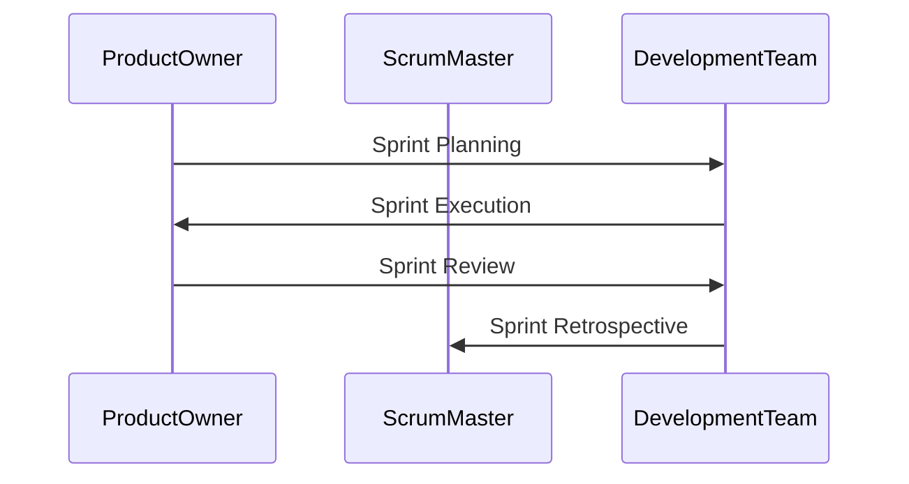

## Agile Methodology

Recognizing the limitations of the Waterfall model, the Agile methodology was developed to address these shortcomings. Agile emphasizes flexibility, collaboration, and rapid iteration, allowing teams to respond quickly to changing requirements and feedback.

### Key Principles of Agile

1. **Individuals and Interactions Over Processes and Tools**
2. **Working Software Over Comprehensive Documentation**
3. **Customer Collaboration Over Contract Negotiation**
4. **Responding to Change Over Following a Plan**

### Agile Frameworks

Several frameworks have emerged under the Agile umbrella, including Scrum, Kanban, and Lean. Each framework has its own set of practices and principles but shares the core Agile values.

#### Scrum

Scrum is one of the most widely used Agile frameworks. It divides the development process into short cycles called sprints, typically lasting two to four weeks. Each sprint includes planning, execution, review, and retrospective meetings.



#### Kanban

Kanban is a visual system for managing work. It uses a board to represent the workflow, with columns for different stages of work (e.g., To Do, In Progress, Done). Work items are represented as cards that move through the columns as they progress.


### Benefits of Agile

1. **Faster Time-to-Market**: Agile allows teams to deliver working software more quickly.
2. **Improved Quality**: Frequent testing and feedback loops help catch issues early.
3. **Increased Flexibility**: Teams can adapt to changing requirements and market conditions.
4. **Better Collaboration**: Cross-functional teams work together closely, reducing communication gaps.

### Real-World Example: Netflix

Netflix is a prime example of a company that has successfully adopted Agile methodologies. They use a combination of Scrum and Kanban to manage their development process. Their focus on continuous delivery and rapid iteration has enabled them to quickly respond to user feedback and stay ahead of competitors.

### How to Prevent / Defend

To effectively implement Agile methodologies, organizations should:

1. **Train Teams**: Provide training on Agile principles and practices.
2. **Adopt Cross-functional Teams**: Encourage collaboration and shared responsibility.
3. **Implement Continuous Integration and Delivery**: Automate testing and deployment processes.
4. **Regularly Review and Adapt**: Conduct regular retrospectives to identify areas for improvement.

### Code Example: Agile Workflow

An Agile workflow might involve using tools like Jira or Trello to manage tasks and sprints. Here’s an example of how a task might be managed in Jira:

```json
{
  "fields": {
    "summary": "Implement user authentication",
    "description": "Add functionality to authenticate users using OAuth.",
    "issuetype": { "name": "Task" },
    "priority": { "name": "Medium" },
    "assignee": { "name": "alice" },
    "labels": ["security", "authentication"]
  }
}
```

This task card provides clear details about the work to be done, who is responsible, and any relevant labels for categorization.

---
<!-- nav -->
[[03-Overview of Software Development Lifecycle Roles|Overview of Software Development Lifecycle Roles]] | [[DevOps/DevOps Bootcamp/11-Miscellaneous/19-Understanding Roles in Software Development Lifecycle/00-Overview|Overview]] | [[05-Configuration|Configuration]]
