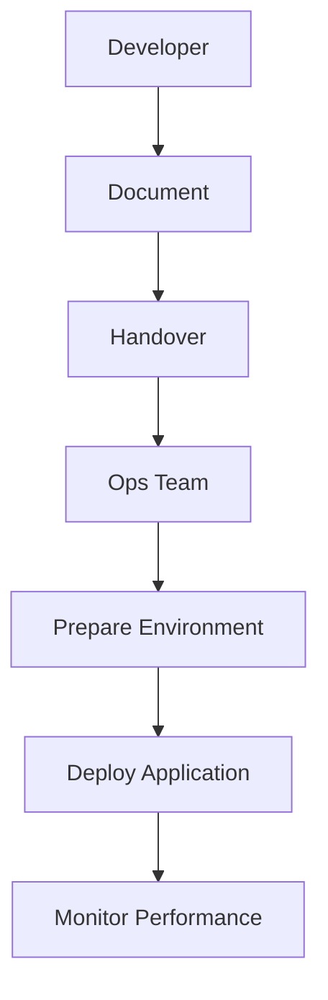

## Deployment Steps

1. Clone the repository:
   ```
   git clone https://github.com/example/app.git
   cd app
   ```
2. Build the Docker image:
   ```
   docker build -t myapp .
   ```
3. Run the Docker container:
   ```
   docker run -d --name myapp -v $LOG_PATH:/var/log/app.log myapp
   ```
```

### Pitfalls and Common Mistakes

#### Incomplete Documentation

One of the most common issues is incomplete or ambiguous documentation. If the documentation does not cover all necessary configurations and dependencies, the ops team might encounter errors during deployment.

#### Assumptions

Developers might make assumptions about the environment, such as the presence of specific tools or configurations. These assumptions can lead to unexpected issues when the application is deployed.

#### Lack of Testing

If the application is not thoroughly tested in an environment similar to production, it might fail when deployed. This can result in downtime and frustrated users.

### How to Prevent / Defend

#### Comprehensive Documentation

Ensure that the documentation covers all necessary configurations and dependencies. Include detailed steps and examples to avoid ambiguity.

#### Automated Testing

Implement automated testing to verify that the application works correctly in an environment similar to production. This can help catch issues before deployment.

#### Continuous Integration/Continuous Deployment (CI/CD)

Use CI/CD pipelines to automate the build, test, and deployment processes. This ensures consistency and reduces the risk of human error.

#### Example of CI/CD Pipeline

Here’s an example of a CI/CD pipeline using Jenkins:

```yaml
pipeline {
    agent any
    stages {
        stage('Build') {
            steps {
                sh 'docker build -t myapp .'
            }
        }
        stage('Test') {
            steps {
                sh 'docker run myapp ./test.sh'
            }
        }
        stage('Deploy') {
            steps {
                sh 'docker push myapp'
                sh 'ssh user@server "docker pull myapp && docker run -d --name myapp -v /var/log/app.log:/var/log/app.log myapp"'
            }
        }
    }
}
```

### Real-World Examples

#### Recent Breaches and CVEs

Consider the case of the Log4j vulnerability (CVE-2021-44228). This vulnerability affected many applications and systems due to incomplete documentation and testing. Many organizations did not realize that their applications were using Log4j until the vulnerability was exploited.

#### Secure Coding Practices

To prevent such vulnerabilities, implement secure coding practices. For example, use dependency management tools like `npm audit` or `pip-audit` to identify and fix vulnerabilities in dependencies.

### Mermaid Diagrams

#### Deployment Flow

A mermaid diagram can help visualize the deployment process:



### Conclusion

Effective communication and collaboration between developers and ops teams are essential for a smooth deployment process. By ensuring comprehensive documentation, implementing automated testing, and using CI/CD pipelines, you can reduce the risk of deployment failures and ensure a successful release.

### Practice Labs

For hands-on practice, consider the following labs:

- **PortSwigger Web Security Academy**: Focuses on web application security and includes labs on secure coding practices.
- **OWASP Juice Shop**: A deliberately insecure web application for practicing web security skills.
- **DVWA (Damn Vulnerable Web Application)**: Another web application for learning web security.

These labs provide practical experience in securing applications and understanding the challenges of deployment and maintenance.

---
<!-- nav -->
[[05-Configuration|Configuration]] | [[DevOps/DevOps Bootcamp/11-Miscellaneous/19-Understanding Roles in Software Development Lifecycle/00-Overview|Overview]] | [[07-Prerequisites|Prerequisites]]
