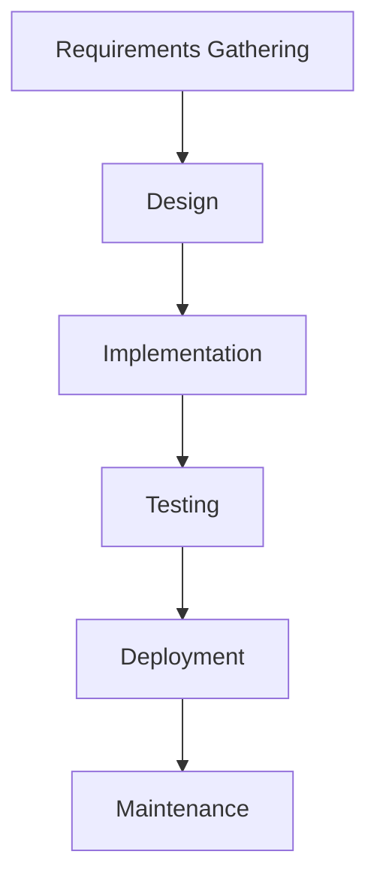

## Traditional Software Development Lifecycle

In traditional software development lifecycles, the roles and responsibilities of different teams were often siloed and sequential. This approach, commonly referred to as the Waterfall model, involves distinct phases where each phase must be completed before moving on to the next. Let's break down the key components and understand why this approach can be problematic.

### Phases in the Waterfall Model

1. **Requirements Gathering**: The initial phase where stakeholders define what the system should do.
2. **Design**: Based on the requirements, a detailed design is created.
3. **Implementation**: The actual coding phase where the design is turned into a working product.
4. **Testing**: The product is rigorously tested to ensure it meets the requirements.
5. **Deployment**: The final product is released to the end-users.
6. **Maintenance**: Post-deployment support and updates.

### Siloed Teams and Communication Gaps

In the Waterfall model, each phase is typically handled by a different team:
- **Development Team**: Focuses on coding and implementing the software.
- **Testing Team**: Ensures the software meets the specified requirements.
- **Operations Team**: Prepares the infrastructure and deploys the software.

#### Example Scenario

Consider a scenario where a development team completes their phase and hands over the application to the operations team. The operations team then spends several months preparing the infrastructure to run the application. During this process, issues might arise due to mismatches between the application and the infrastructure, leading to a feedback loop where the operations team needs to go back to the development team for adjustments. This iterative process can take years, resulting in significant delays and inefficiencies.



### Problems with the Waterfall Model

1. **Long Feedback Loops**: Issues discovered late in the process require going back to earlier stages, causing significant delays.
2. **Communication Breakdown**: Each team works in isolation, leading to misunderstandings and miscommunications.
3. **Rigidity**: Once a phase is completed, it is difficult to make changes, even if new requirements emerge.
4. **High Risk**: The entire project is at risk if critical issues are discovered late in the process.

### Real-World Example: Heartbleed Bug (CVE-2014-0160)

The Heartbleed bug is a classic example of how traditional development processes can fail. This vulnerability in OpenSSL allowed attackers to read sensitive information from the memory of systems using the affected versions of OpenSSL. The bug was introduced due to a lack of proper validation checks in the implementation, which could have been caught earlier with more rigorous testing and continuous integration practices.

### How to Prevent / Defend

To mitigate the risks associated with the Waterfall model, organizations can adopt the following strategies:

1. **Continuous Integration (CI)**: Implement automated testing and integration processes to catch issues early.
2. **Continuous Delivery (CD)**: Ensure that the software can be deployed to production at any time.
3. **Cross-functional Teams**: Encourage collaboration between development, testing, and operations teams to reduce communication gaps.

### Code Example: Continuous Integration Pipeline

A typical CI pipeline might look like this:

```yaml
# .github/workflows/ci.yml
name: CI

on:
  push:
    branches: [ main ]
  pull_request:
    branches: [ main ]

jobs:
  build:
    runs-on: ubuntu-latest

    steps:
    - uses: actions/checkout@v2
    - name: Set up Node.js
      uses: actions/setup-node@v2
      with:
        node-version: '14'
    - name: Install dependencies
      run: npm install
    - name: Run tests
      run: npm test
    - name: Build application
      run: npm run build
```

This pipeline ensures that every commit to the `main` branch is automatically built and tested, reducing the likelihood of issues slipping through.

---
<!-- nav -->
[[07-Prerequisites|Prerequisites]] | [[DevOps/DevOps Bootcamp/11-Miscellaneous/19-Understanding Roles in Software Development Lifecycle/00-Overview|Overview]] | [[09-Understanding Roles in Software Development Lifecycle|Understanding Roles in Software Development Lifecycle]]
