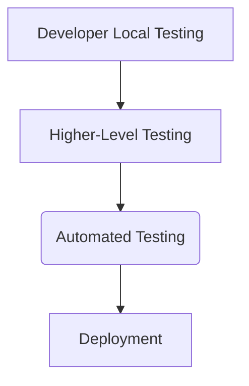

## Understanding Roles in Software Development Lifecycle

In the context of developing and maintaining complex applications, such as those found in large-scale social media platforms like Facebook, ensuring that new features and bug fixes do not break existing functionalities is paramount. This involves a rigorous testing process that spans various stages of the software development lifecycle (SDLC).

### Importance of Testing

Testing is crucial because it helps ensure that the application remains stable and functional even after introducing new features or fixing bugs. Without thorough testing, the risk of releasing a version that breaks existing functionalities is high, leading to user dissatisfaction and potential loss of trust.

#### Manual Testing

Manual testing involves human testers who verify that the application functions correctly. This includes checking that new features work as intended and that existing functionalities remain unaffected. For instance, in the case of Facebook, manual testers would ensure that users can still log in, chat, upload pictures, and perform other essential actions even after a new feature is added.

However, manual testing can be extremely time-consuming and resource-intensive, especially for large and complex applications. Consider the scale of Facebook, which has millions of active users and numerous features. Manually testing every aspect of the application would require a significant amount of effort and time.

### Automated Testing

To address the challenges associated with manual testing, automated testing is employed. Automated testing involves using software tools to run tests automatically, reducing the need for manual intervention. This approach significantly speeds up the testing process and ensures consistency across multiple test runs.

#### Types of Automated Tests

Automated tests can be categorized into several types:

1. **Unit Tests**: These tests focus on individual units of code, such as functions or methods, to ensure they behave as expected.
2. **Integration Tests**: These tests verify that different components of the application work together correctly.
3. **System Tests**: These tests evaluate the entire system to ensure it meets the specified requirements.
4. **Acceptance Tests**: These tests confirm that the application satisfies the end-user requirements.

#### Example: Unit Test in Python

Here is an example of a unit test written in Python using the `unittest` framework:

```python
import unittest
from myapp import Calculator

class TestCalculator(unittest.TestCase):
    def setUp(self):
        self.calc = Calculator()

    def test_addition(self):
        result = self.calc.add(2, 3)
        self.assertEqual(result, 5)

    def test_subtraction(self):
        result = self.calc.subtract(5, 3)
        self.assertEqual(result, 2)

if __name__ == '__main__':
    unittest.main()
```

This test suite checks the addition and subtraction methods of a `Calculator` class.

### Testing Process Flow

The testing process typically follows these steps:

1. **Local Testing**: Developers test their code locally to ensure it works as expected.
2. **Higher-Level Testing**: Once local testing is successful, a higher-level testing is performed to ensure that the new feature integrates correctly with the rest of the application.
3. **Automated Testing**: Automated tests are run to verify that the application remains stable and functional.
4. **Deployment**: If all tests pass, the new feature is deployed to production.

#### Mermaid Diagram: Testing Process Flow



### Real-World Examples

Consider the following real-world examples where testing played a critical role:

1. **Facebook**: In 2019, Facebook faced a major outage due to a bug in their internal systems. This incident highlighted the importance of robust testing practices to prevent such issues.
2. **GitHub**: In 2021, GitHub experienced a service disruption due to a misconfiguration in their infrastructure. This event underscores the need for comprehensive testing, including configuration management and infrastructure testing.

### How to Prevent / Defend

To ensure that your application remains stable and functional, follow these best practices:

1. **Implement Continuous Integration/Continuous Deployment (CI/CD)**: Automate the build, test, and deployment processes to catch issues early.
2. **Use Code Coverage Tools**: Ensure that your tests cover a significant portion of your codebase.
3. **Perform Regular Security Audits**: Conduct regular security assessments to identify and mitigate vulnerabilities.
4. **Document Testing Processes**: Maintain detailed documentation of your testing processes and results for future reference.

#### Secure Coding Practices

Here is an example of a vulnerable code snippet and its secure counterpart:

**Vulnerable Code:**

```python
def login(username, password):
    if username == "admin" and password == "password":
        return True
    return False
```

**Secure Code:**

```python
import hashlib

def hash_password(password):
    return hashlib.sha256(password.encode()).hexdigest()

def login(username, password):
    stored_password_hash = get_stored_password_hash_from_db(username)
    if hash_password(password) == stored_password_hash:
        return True
    return False
```

In the secure version, passwords are hashed before being compared, enhancing security.

### Conclusion

Understanding the roles and processes involved in the software development lifecycle is crucial for ensuring the stability and functionality of complex applications. By leveraging both manual and automated testing techniques, organizations can minimize the risk of introducing bugs and ensure a smooth user experience.

### Practice Labs

For hands-on practice in testing and DevOps, consider the following labs:

- **PortSwigger Web Security Academy**: Offers extensive training on web application security, including testing.
- **OWASP Juice Shop**: Provides a vulnerable web application for practicing security testing.
- **DVWA (Damn Vulnerable Web Application)**: Another popular tool for learning web application security through practical exercises.

These resources will help you gain practical experience in testing and DevOps practices.

---
<!-- nav -->
[[08-Traditional Software Development Lifecycle|Traditional Software Development Lifecycle]] | [[DevOps/DevOps Bootcamp/11-Miscellaneous/19-Understanding Roles in Software Development Lifecycle/00-Overview|Overview]] | [[DevOps/DevOps Bootcamp/11-Miscellaneous/19-Understanding Roles in Software Development Lifecycle/10-Conclusion|Conclusion]]
