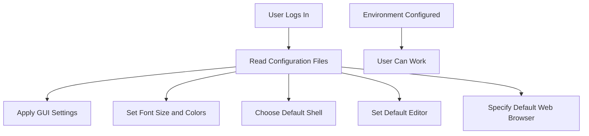

## User Environments and Configuration in Multi-User Systems

In a multi-user system, such as Linux, Windows, or macOS, each user has their own environment where they can work and execute tasks independently of other users. This environment includes various configurations and settings that allow users to personalize their experience according to their preferences. Understanding how these environments are managed and configured is crucial for both individual users and system administrators.

### What is a User Environment?

A user environment encompasses all the settings and configurations that define how a user interacts with the operating system. This includes:

- **Graphical User Interface (GUI) Layout**: Users can customize the appearance of their desktop, including the size and style of icons, the arrangement of windows, and the overall theme.
- **Font Size and Colors**: Users can adjust the font size and color schemes to suit their visual preferences.
- **Shell Program**: Users can choose a specific shell program to interact with the command line. Common shells include `bash`, `zsh`, and `fish`.
- **Default Editor**: Users can specify a default text editor for opening and editing files. Popular editors include `nano`, `vim`, and `emacs`.
- **Web Browser**: Users can set a default web browser for opening links and browsing the internet.

### Why Separate User Environments Matter

Separating user environments ensures that each user's settings and configurations do not interfere with those of others. This is particularly important in shared environments, such as corporate networks or educational institutions, where multiple users may share the same physical machine or access the same server.

#### Example: Corporate Network

Consider a corporate network where employees share a pool of computers. Each employee might prefer different settings for their GUI, font sizes, and default applications. Without separate user environments, one user's settings could overwrite another's, leading to confusion and frustration.

### How User Environments Are Managed

User environments are typically managed through configuration files stored in the user's home directory. These files contain settings and preferences that are applied when the user logs in.

#### Configuration Files

- **Linux**: 
  - `.bashrc` and `.bash_profile`: Configuration files for the `bash` shell.
  - `.zshrc`: Configuration file for the `zsh` shell.
  - `.Xresources`: Configuration file for X Window System resources.
  - `.config`: Directory containing configuration files for various applications.
  
- **Windows**:
  - `HKEY_CURRENT_USER` registry key: Contains user-specific settings.
  - `%APPDATA%` directory: Contains application data and settings.

- **macOS**:
  - `~/Library/Preferences`: Directory containing preference files for various applications.
  - `~/.bash_profile`: Configuration file for the `bash` shell.

### Example: Configuring a User Environment in Linux

Let's walk through an example of configuring a user environment in Linux. Suppose a user wants to change their default shell to `zsh` and set `nano` as their default text editor.

#### Step 1: Change Default Shell

To change the default shell to `zsh`, the user needs to update their shell entry in the `/etc/passwd` file. However, this requires root privileges. A safer approach is to install `zsh` and then set it as the default shell using the `chsh` command.

```bash
# Install zsh
sudo apt-get install zsh

# Set zsh as the default shell
chsh -s $(which zsh)
```

#### Step 2: Configure `zsh` Settings

The user can then configure `zsh` settings by editing the `.zshrc` file in their home directory.

```bash
# Open .zshrc in nano
nano ~/.zshrc

# Add customizations
export PS1="%n@%m %~ %# "
autoload -U compinit && compinit
```

#### Step 3: Set Default Text Editor

To set `nano` as the default text editor, the user can modify the `EDITOR` environment variable in their `.bashrc` or `.zshrc` file.

```bash
# Open .zshrc in nano
nano ~/.zshrc

# Add the following line
export EDITOR=nano
```

### Real-World Example: CVE-2021-44228 (Log4j)

The Log4j vulnerability (CVE-2021-44228) is a critical security flaw that affects Java applications using the Apache Log4j logging library. This vulnerability allows attackers to execute arbitrary code on affected systems, potentially compromising the entire environment.

#### Impact on User Environments

In a multi-user environment, if one user's application is vulnerable to Log4j, it could potentially affect other users' environments. For instance, if a user runs a vulnerable Java application, an attacker could exploit the vulnerability to gain unauthorized access to the system and compromise other users' data.

#### How to Prevent / Defend

1. **Detection**:
   - Use tools like `grep` to search for vulnerable versions of Log4j in the system.
   ```bash
   grep -r "log4j" /path/to/application
   ```

2. **Prevention**:
   - Update all Java applications to the latest version of Log4j.
   - Apply security patches and updates regularly.
   - Use a firewall to restrict access to sensitive ports and services.

3. **Secure Coding Fix**:
   - Before:
     ```java
     import org.apache.logging.log4j.LogManager;
     import org.apache.logging.log4j.Logger;

     public class VulnerableApp {
         private static final Logger logger = LogManager.getLogger(VulnerableApp.class);

         public void logMessage(String message) {
             logger.info(message);
         }
     }
     ```
   - After:
     ```java
     import org.apache.logging.log4j.LogManager;
     import org.apache.logging.log4j.Logger;

     public class SecureApp {
         private static final Logger logger = LogManager.getLogger(SecureApp.class);

         public void logMessage(String message) {
             logger.info(message.replaceAll("\\$\\{", ""));
         }
     }
     ```

4. **Configuration Hardening**:
   - Disable unnecessary features in Log4j.
   - Use a security-focused logging framework like SLF4J.

### Mermaid Diagram: User Environment Configuration Flow



### Pitfalls and Common Mistakes

- **Overwriting Configuration Files**: Accidentally overwriting configuration files can lead to loss of custom settings.
- **Insufficient Permissions**: Not having the necessary permissions to modify configuration files can result in errors.
- **Outdated Software**: Using outdated software versions can expose the system to vulnerabilities.

### Practice Labs

For hands-on practice with user environments and configuration in multi-user systems, consider the following labs:

- **PortSwigger Web Security Academy**: Offers exercises on securing web applications, including user environment configurations.
- **OWASP Juice Shop**: Provides a vulnerable web application for practicing security configurations.
- **DVWA (Damn Vulnerable Web Application)**: Allows users to practice configuring and securing web applications.

By thoroughly understanding and managing user environments, you can ensure a secure and personalized experience for each user in a multi-user system.

---
<!-- nav -->
[[DevOps/DevOps Bootcamp/11-Miscellaneous/20-User Environments and Configuration in Multi-User Systems/00-Overview|Overview]] | [[DevOps/DevOps Bootcamp/11-Miscellaneous/20-User Environments and Configuration in Multi-User Systems/02-Practice Questions & Answers|Practice Questions & Answers]]
