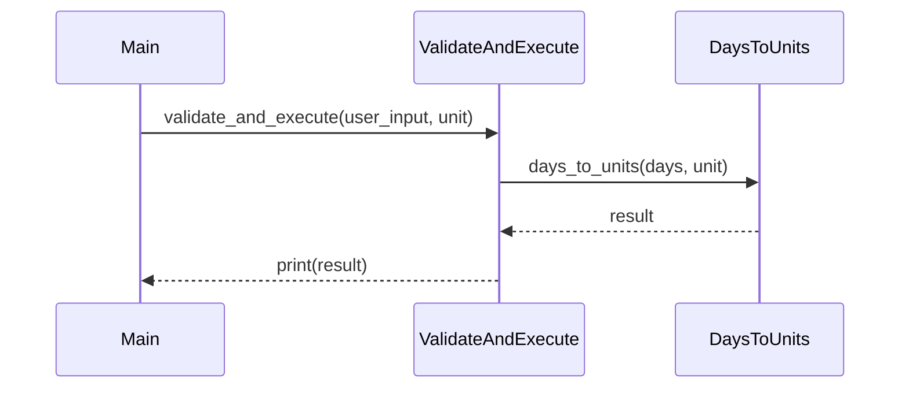

## Introduction to Conditional Statements and Function Design

In the realm of programming, conditional statements play a crucial role in controlling the flow of execution based on certain conditions. One of the most commonly used conditional statements is the `if` statement, which allows us to execute specific blocks of code only when certain conditions are met. This lecture focuses on using conditionals to validate user input and organize code into logical functions.

### Understanding Conditionals

Conditionals are fundamental constructs in programming that allow us to make decisions based on the evaluation of boolean expressions. The basic structure of an `if` statement is:

```python
if condition:
    # Code to execute if the condition is true
```

The `condition` is a boolean expression that evaluates to either `True` or `False`. If the condition is `True`, the code within the `if` block is executed; otherwise, it is skipped.

#### Nested Conditionals

Nested conditionals occur when an `if` statement contains another `if` statement within its block. This allows for more complex decision-making processes. The structure looks like this:

```python
if outer_condition:
    if inner_condition:
        # Code to execute if both conditions are true
```

### Importance of Function Design

Functions are reusable blocks of code that perform specific tasks. Properly designed functions enhance code readability, maintainability, and reusability. Functions should ideally have a single responsibility and be named descriptively to reflect their purpose.

### Example: Validating User Input

Let's consider a scenario where we need to validate user input and perform calculations based on the input. We will break down the process into smaller functions to ensure clarity and maintainability.

#### Initial Code Structure

Suppose we have a program that converts days into units (like hours, minutes, etc.). Initially, the validation and calculation might look like this:

```python
def days_to_units(days, unit):
    if unit == "hours":
        return days * 24
    elif unit == "minutes":
        return days * 24 * 60
    else:
        return "Invalid unit"

def main():
    user_input = input("Enter the number of days: ")
    if user_input.isdigit():
        days = int(user_input)
        unit = input("Enter the unit (hours/minutes): ")
        result = days_to_units(days, unit)
        print(result)
    else:
        print("Invalid input")

main()
```

### Refactoring for Clarity

To improve the code structure, we can refactor it by separating the validation logic from the calculation logic. This makes the code more modular and easier to understand.

#### Refactored Code Structure

We will create a new function called `validate_and_execute` that handles all the validation logic. The `days_to_units` function will then only handle the calculation.

```python
def validate_and_execute(user_input, unit):
    if user_input.isdigit():
        days = int(user_input)
        if days > 0:
            result = days_to_units(days, unit)
            print(result)
        elif days == 0:
            print("You entered zero.")
    else:
        print("Invalid input")

def days_to_units(days, unit):
    if unit == "hours":
        return days * 24
    elif unit == "minutes":
        return days * 24 * 60
    else:
        return "Invalid unit"

def main():
    user_input = input("Enter the number of days: ")
    unit = input("Enter the unit (hours/minutes): ")
    validate_and_execute(user_input, unit)

main()
```

### Detailed Explanation of the Refactored Code

#### `validate_and_execute` Function

This function takes `user_input` and `unit` as parameters and performs the following steps:

1. **Check if the input is a digit**: Using `isdigit()`, we verify if the input consists only of digits.
2. **Convert the input to an integer**: If the input is valid, we convert it to an integer.
3. **Validate the integer value**:
   - If the integer value is greater than zero, we proceed with the calculation.
   - If the integer value is exactly zero, we print a message indicating that zero was entered.
4. **Handle invalid input**: If the input is not a digit, we print an error message.

#### `days_to_units` Function

This function takes `days` and `unit` as parameters and returns the calculated value based on the unit provided. It handles the following cases:

- **Hours**: Multiplies the number of days by 24.
- **Minutes**: Multiplies the number of days by 24 * 60.
- **Invalid unit**: Returns an error message.

### Mermaid Diagrams for Code Flow

To visualize the flow of the refactored code, we can use a sequence diagram:



### Real-World Examples and Security Implications

#### Real-World Example: CVE-2021-3116

CVE-2021-3116 is a vulnerability in the Apache Log4j library that allows remote code execution due to improper validation of user input. This highlights the importance of thorough input validation to prevent security breaches.

#### Security Best Practices

1. **Input Validation**: Always validate user input to ensure it meets expected criteria.
2. **Error Handling**: Provide meaningful error messages to guide users and prevent misuse.
3. **Secure Coding Practices**: Use secure coding practices to prevent common vulnerabilities such as SQL injection, cross-site scripting (XSS), and buffer overflows.

### How to Prevent / Defend

#### Detection

- **Static Analysis Tools**: Use tools like SonarQube, Fortify, or Veracode to detect potential issues in code.
- **Dynamic Analysis Tools**: Use tools like Burp Suite, OWASP ZAP, or Nessus to test applications for runtime vulnerabilities.

#### Prevention

- **Input Validation**: Ensure all user inputs are validated against expected patterns.
- **Sanitization**: Sanitize inputs to remove potentially harmful characters or patterns.
- **Parameterized Queries**: Use parameterized queries to prevent SQL injection attacks.

#### Secure-Coding Fixes

##### Vulnerable Code

```python
def days_to_units(days, unit):
    if unit == "hours":
        return days * 24
    elif unit == "minutes":
        return days * 24 * 60
    else:
        return "Invalid unit"
```

##### Secure Code

```python
def days_to_units(days, unit):
    if unit == "hours":
        return days * 24
    elif unit == "minutes":
        return days * 24 * 60
    else:
        raise ValueError("Invalid unit")
```

### Complete Example with HTTP Requests and Responses

#### HTTP Request

```http
POST /convert HTTP/1.1
Host: example.com
Content-Type: application/json

{
    "days": "5",
    "unit": "hours"
}
```

#### HTTP Response

```http
HTTP/1.1 200 OK
Content-Type: application/json

{
    "result": 120
}
```

### Common Pitfalls and Best Practices

#### Common Pitfalls

- **Incomplete Validation**: Failing to validate all aspects of user input can lead to security vulnerabilities.
- **Hardcoding Values**: Hardcoding values instead of using dynamic inputs can limit flexibility and introduce errors.

#### Best Practices

- **Use Descriptive Function Names**: Name functions based on their primary responsibility.
- **Document Functions**: Add docstrings to describe the purpose, parameters, and return values of functions.
- **Test Thoroughly**: Write unit tests to ensure functions behave as expected under various scenarios.

### Hands-On Labs

For practical experience with validating user input and organizing code into functions, consider the following labs:

- **PortSwigger Web Security Academy**: Offers interactive labs to practice web security concepts.
- **OWASP Juice Shop**: A deliberately insecure web application for practicing security testing.
- **DVWA (Damn Vulnerable Web Application)**: A PHP/MySQL web application that demonstrates common web application vulnerabilities.

By following these guidelines and practices, you can ensure that your code is robust, secure, and maintainable.

---
<!-- nav -->
[[01-Introduction to Conditional Statements and Boolean Data Types|Introduction to Conditional Statements and Boolean Data Types]] | [[DevOps/DevOps Bootcamp/11-Miscellaneous/21-Validating User Input With Conditionals/00-Overview|Overview]] | [[03-Introduction to Conditional Statements in Programming|Introduction to Conditional Statements in Programming]]
