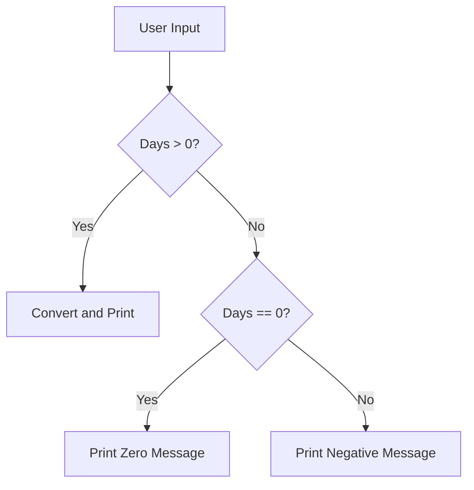

## Introduction to Conditional Statements in Programming

Conditional statements are fundamental constructs in programming that allow developers to execute different blocks of code based on certain conditions. These conditions are typically boolean expressions that evaluate to either `true` or `false`. The most common conditional statements are `if`, `else if`, and `else`.

### Why Use Conditional Statements?

Conditional statements are crucial for controlling the flow of a program. They enable the program to make decisions and take different actions based on the data it processes. This is particularly important in user input validation, where the program needs to ensure that the input meets certain criteria before proceeding with further operations.

### Basic Syntax of Conditional Statements

The basic structure of an `if` statement in many programming languages is as follows:

```python
if condition:
    # Code to execute if the condition is true
```

For more complex scenarios, you can use `else if` and `else` clauses:

```python
if condition1:
    # Code to execute if condition1 is true
elif condition2:
    # Code to execute if condition2 is true
else:
    # Code to execute if none of the above conditions are true
```

### Example: Validating User Input

Let's consider a scenario where a user inputs the number of days, and the program converts these days into other time units such as hours, minutes, and seconds. However, the program should handle invalid inputs like negative numbers and zero.

#### Initial Code

Here is a simple Python script that takes user input and performs the conversion:

```python
def convert_days_to_units(days):
    hours = days * 24
    minutes = hours * 60
    seconds = minutes * 60
    return f"{days} days is {hours} hours, {minutes} minutes, and {seconds} seconds."

def main():
    user_input = input("Enter the number of days: ")
    days = int(user_input)
    if days > 0:
        print(convert_days_to_units(days))
    else:
        print("You entered a non-positive value, so no conversion for you.")

if __name__ == "__main__":
    main()
```

### Handling Negative Numbers and Zero

In the initial code, the program checks if the input is greater than zero. If the input is zero or negative, it prints a generic error message. However, we can improve this by providing specific messages for zero and negative inputs.

#### Improved Code

We can modify the `main` function to handle zero and negative inputs separately:

```python
def main():
    user_input = input("Enter the number of days: ")
    days = int(user_input)
    if days > 0:
        print(convert_days_to_units(days))
    elif days == 0:
        print("You entered zero days, which does not make sense for conversion.")
    else:
        print("You entered a negative value, which is not valid for conversion.")

if __name__ == "__main__":
    main()
```

### Explanation of the Code

1. **User Input**: The program prompts the user to enter the number of days.
2. **Conversion Function**: The `convert_days_to_units` function calculates the equivalent hours, minutes, and seconds.
3. **Condition Checks**:
   - **Positive Days**: If the input is greater than zero, the program calls the conversion function and prints the result.
   - **Zero Days**: If the input is exactly zero, the program prints a specific message indicating that zero days do not make sense for conversion.
   - **Negative Days**: If the input is less than zero, the program prints a specific message indicating that negative values are not valid for conversion.

### Diagram: Flow of Control

A mermaid diagram can help visualize the flow of control in the program:



### Real-World Examples and Security Implications

Handling user input correctly is crucial for the security and robustness of an application. Incorrect handling can lead to various vulnerabilities, such as:

- **Input Validation Bypass**: If the program does not properly validate user input, it may accept malicious input that could lead to unexpected behavior or security issues.
- **Denial of Service (DoS)**: Invalid input can cause the program to crash or become unresponsive, leading to a denial of service.

#### Recent CVE Example: CVE-2021-44228 (Log4j)

The Log4j vulnerability (CVE-2021-44228) is a classic example of how improper handling of user input can lead to severe security issues. The vulnerability allowed attackers to inject malicious input into log messages, leading to remote code execution.

### How to Prevent / Defend

#### Detection

To detect potential issues with user input handling, you can use static analysis tools and code reviews. These tools can identify places where user input is not properly validated or sanitized.

#### Prevention

1. **Input Validation**: Always validate user input to ensure it meets the expected format and constraints.
2. **Sanitization**: Sanitize user input to remove any potentially harmful characters or patterns.
3. **Error Handling**: Provide meaningful error messages to guide users on correct input formats.

#### Secure Coding Fixes

Here is a comparison of the insecure and secure versions of the code:

**Insecure Version**

```python
def main():
    user_input = input("Enter the number of days: ")
    days = int(user_input)
    if days > 0:
        print(convert_days_to_units(days))
    else:
        print("You entered a non-positive value, so no conversion for you.")
```

**Secure Version**

```python
def main():
    user_input = input("Enter the number of days: ")
    days = int(user_input)
    if days > 0:
        print(convert_days_to_units(days))
    elif days == 0:
        print("You entered zero days, which does not make sense for conversion.")
    else:
        print("You entered a negative value, which is not valid for conversion.")
```

### Hands-On Practice

To practice validating user input with conditionals, you can use the following labs:

- **PortSwigger Web Security Academy**: This lab provides exercises on handling user input securely.
- **OWASP Juice Shop**: This lab includes challenges related to input validation and sanitization.

By thoroughly understanding and implementing these concepts, you can ensure that your applications are robust and secure against various types of input-related vulnerabilities.

---
<!-- nav -->
[[02-Introduction to Conditional Statements and Function Design|Introduction to Conditional Statements and Function Design]] | [[DevOps/DevOps Bootcamp/11-Miscellaneous/21-Validating User Input With Conditionals/00-Overview|Overview]] | [[04-Introduction to Conditional Statements in Python|Introduction to Conditional Statements in Python]]
