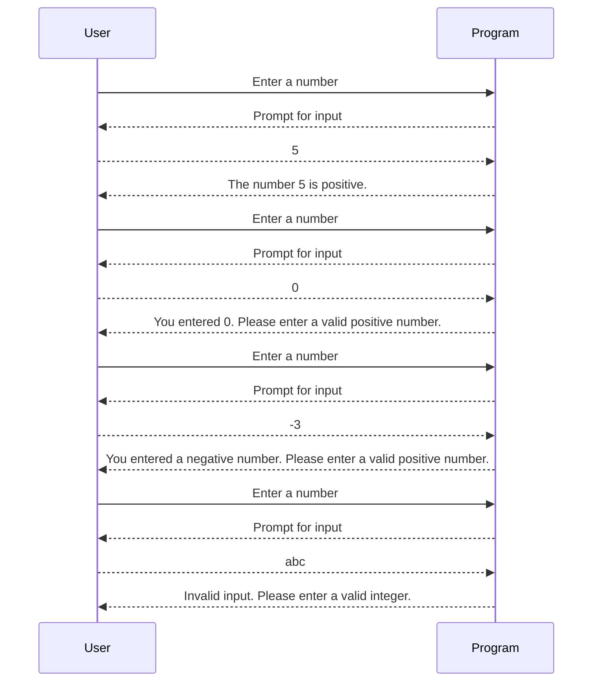

## Introduction to Conditional Statements in Python

Conditional statements are fundamental constructs in programming that allow us to make decisions based on certain conditions. In Python, the primary conditional statements are `if`, `elif` (short for "else if"), and `else`. These statements enable us to execute different blocks of code depending on whether a specified condition evaluates to `True` or `False`.

### Understanding the Basics of Conditional Statements

#### The `if` Statement

The `if` statement is used to execute a block of code only if a specified condition is `True`. Here’s the basic syntax:

```python
if condition:
    # Code to execute if the condition is True
```

For example, consider the following code snippet:

```python
age = 18
if age >= 18:
    print("You are eligible to vote.")
```

In this example, the condition `age >= 18` checks if the variable `age` is greater than or equal to 18. If the condition is `True`, the code inside the `if` block is executed, printing "You are eligible to vote."

#### The `elif` Statement

The `elif` statement allows you to check additional conditions if the previous conditions were `False`. This is particularly useful when you have multiple conditions to evaluate. Here’s the syntax:

```python
if condition1:
    # Code to execute if condition1 is True
elif condition2:
    # Code to execute if condition1 is False and condition2 is True
```

For instance:

```python
score = 75
if score >= 90:
    print("Grade: A")
elif score >= 80:
    print("Grade: B")
elif score >= 70:
    print("Grade: C")
```

In this example, the program checks the `score` against multiple conditions and prints the corresponding grade.

#### The `else` Statement

The `else` statement is used to specify a block of code to execute if none of the preceding conditions are `True`. Here’s the syntax:

```python
if condition1:
    # Code to execute if condition1 is True
elif condition2:
    # Code to execute if condition1 is False and condition2 is True
else:
    # Code to execute if both condition1 and condition2 are False
```

For example:

```python
number = 0
if number > 0:
    print("Positive number")
elif number == 0:
    print("Zero")
else:
    print("Negative number")
```

In this example, the program checks if `number` is greater than 0, equal to 0, or less than 0, and prints the appropriate message.

### Equality Checks in Python

When comparing values in Python, it’s important to distinguish between assignment (`=`) and equality comparison (`==`). 

- **Assignment (`=`)**: This operator assigns a value to a variable. For example:
  
  ```python
  x = 10  # Assigns the value 10 to the variable x
  ```

- **Equality Comparison (`==`)**: This operator checks if two values are equal. For example:
  
  ```python
  if x == 10:
      print("x is equal to 10")
  ```

Using a single equal sign (`=`) for comparison would result in a syntax error because it is interpreted as an assignment operation.

### Example: Validating User Input with Conditionals

Let’s consider a scenario where we need to validate user input to ensure it is a positive number. We will use `if`, `elif`, and `else` statements to handle different cases.

#### Problem Statement

We want to prompt the user to enter a number and validate the input to ensure it is a positive number. If the input is not a positive number, we should provide appropriate feedback.

#### Solution

Here’s the complete code to achieve this:

```python
def validate_input():
    try:
        number = int(input("Enter a number: "))
        
        if number > 0:
            print(f"The number {number} is positive.")
        elif number == 0:
            print("You entered 0. Please enter a valid positive number.")
        else:
            print("You entered a negative number. Please enter a valid positive number.")
    except ValueError:
        print("Invalid input. Please enter a valid integer.")

validate_input()
```

### Explanation

1. **Prompting User Input**: 
   - We use `input()` to get user input and convert it to an integer using `int()`.
   
2. **Checking Conditions**:
   - **Positive Number**: If `number > 0`, we print a message indicating the number is positive.
   - **Zero**: If `number == 0`, we print a message asking the user to enter a valid positive number.
   - **Negative Number**: If `number < 0`, we print a message asking the user to enter a valid positive number.
   
3. **Handling Invalid Input**:
   - We use a `try-except` block to catch `ValueError` exceptions that occur if the user enters non-integer input.

### Diagramming the Flow

To better understand the flow of the program, we can use a sequence diagram:



### Real-World Examples and Security Implications

While this example focuses on validating user input, similar principles apply to various security contexts. For instance, in web applications, input validation is crucial to prevent SQL injection attacks, cross-site scripting (XSS), and other vulnerabilities.

#### Example: SQL Injection

Consider a web application that accepts user input to perform database queries. If input validation is not properly implemented, an attacker could inject malicious SQL code. For example:

```sql
SELECT * FROM users WHERE username = 'admin' OR '1'='1';
```

This query bypasses authentication by evaluating `'1'='1'` to `True`, allowing unauthorized access.

### How to Prevent / Defend

#### Secure Coding Practices

1. **Input Validation**: Always validate user input to ensure it meets expected criteria.
2. **Use Parameterized Queries**: In web applications, use parameterized queries to prevent SQL injection.
3. **Sanitize Inputs**: Sanitize inputs to remove potentially harmful characters.

#### Example: Secure Input Handling

Here’s a secure version of the user input validation:

```python
def secure_validate_input():
    try:
        number = int(input("Enter a number: "))
        
        if number > 0:
            print(f"The number {number} is positive.")
        elif number == 0:
            print("You entered 0. Please enter a valid positive number.")
        else:
            print("You entered a negative number. Please enter a valid positive number.")
    except ValueError:
        print("Invalid input. Please enter a valid integer.")

secure_validate_input()
```

### Conclusion

Understanding and implementing conditional statements correctly is essential for developing robust and secure applications. By validating user input and handling different scenarios appropriately, we can ensure our programs behave as expected and prevent potential security vulnerabilities.

### Practice Labs

For hands-on practice with conditional statements and input validation, consider the following labs:

- **PortSwigger Web Security Academy**: Offers interactive labs to learn about web security concepts, including input validation.
- **OWASP Juice Shop**: A deliberately insecure web application for practicing web security skills.
- **DVWA (Damn Vulnerable Web Application)**: A PHP/MySQL web application that contains numerous security vulnerabilities.

These labs provide practical experience in applying the concepts learned in this chapter.

---
<!-- nav -->
[[03-Introduction to Conditional Statements in Programming|Introduction to Conditional Statements in Programming]] | [[DevOps/DevOps Bootcamp/11-Miscellaneous/21-Validating User Input With Conditionals/00-Overview|Overview]] | [[05-Introduction to Conditional Statements|Introduction to Conditional Statements]]
